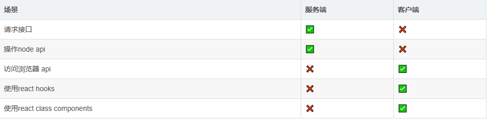

# next.js 服务端组件 -客户端组件

### Next.js 概述

Next.js是一个基于React的框架，具有服务器端渲染能力。 它非常快速和SEO友好。

使用Next.js，您可以轻松创建强大的基于React的应用程序并对其进行测试。 以下是Next.js的主要功能。

- 热代码重新加载 Next.js服务器检测到修改的文件并自动重新加载它们。

- 自动路由 无需为路由配置任何URL。 文件应放置在pages文件夹中。 所有URL将映射到文件系统。 可以进行自定义。

- 组件特定样式 styled-jsx提供对全局和组件特定样式的支持。

- 服务器端呈现 React组件在服务器上预渲染，因此在客户端加载速度更快。

- 节点生态系统 Next.js是基于React的，与Node生态系统很好地结合在一起。

- 自动代码拆分 Next.js使用它们需要的库来渲染页面。 Next.js不是创建单个大型javascript文件，而是创建多个资源。 加载页面时，只会加载所需的javascript页面。

- 预取 Next.js提供了Link组件，用于链接多个支持预取页面资源的组件。

- 动态组件 Next.js允许动态导入JavaScript模块和React组件。

- 导出静态站点 Next.js允许从您的Web应用程序中导出完整的静态站点。

- 内置TypeScript支持 Next.js是用TypeScript编写的，并提供出色的TypeScript支持。

### 服务端组件
next.js 提供了服务端组件，它允许你在服务端渲染组件, 而不依赖与浏览器环境。服务端组件可以分为两种模式：

- 静态渲染
- 动态渲染

静态渲染​

默认情况下，所有服务端组件都是静态渲染的。 使用静态渲染时，next.js会将渲染结果缓存起来，并可以推送到CDN、redis等缓存中，以提高性能。

动态渲染​

所谓的动态渲染其实就是在渲染之前进行了数据请求，或者使用到了next.js的server api, 比如：

- fetch()，使用fetch()获取数据
- headers(), 使用headers()获取请求头中的信息
- cookies()，使用cookies()获取cookie中的信息
- searchParams，使用searchParams获取url中的query参数 这些api后续会单独讲解，这里先简单了解一下即可。


由于这些数据是运行时才能获取到的，并不能在编译阶段获取，所以这些数据没办法被静态缓存。

### 服务端渲染的优势​

- 缓存：在服务器端渲染的结果获取请求的数据，都可以缓存并在后续请求和用户之间重复使用。这可以通过复用重复的请求和渲染结果来提高性能。
- bundle的大小，由于服务端组件不需要使用浏览器api，也就是没有额外的js文件，所以bundle的大小会小很多。
- seo：服务端组件会将数据渲染到html中，所以可以更好的被搜索引擎收录。
- 流式渲染：服务器组件允许你将内容拆分为多个块，并在渲染完成之后将它们流式传输到客户端。这其实就是允许用户更早地看到页面的某些部分，而不必等待整个页面在服务器上呈现。


**避免使用浏览器api​**

虽然next.js支持组件在服务端进行渲染，但是如果你在服务端组件中使用了浏览器api，那么会导致服务端组件无法正常渲染。

这一点在开发中很容易被忽略，各位小伙伴可以多注意一下。

**use server​**

next.js默认就是server component，但是并不会在编写代码时提示错误使用api的风险。为了避免我们使用浏览器api，next.js提供了use server关键字，它可以帮助我们检测到不安全的api使用。

```js
"use server"
 
export default function Home() {
    const [count, setCount] = useState(0);
    // 由于server端不允许使用react/client 相关的api，所以这里会报错
 
    useEffect(() => {
    }, [])
 
    return <div>{count}</div>;
}
```

### 客户端组件
客户端组件允许您在服务器上编写可交互的 UI，并可以使用浏览器api.

客户端渲染的特点​

- 交互性：客户端组件可以使用useState、useEffect等 React Hook。
- 浏览器 API：客户端组件可以访问浏览器 API，例如 window、document 等。
- hydrate：由于服务端渲染的组件是静态的，因此在客户端渲染时，还需要加载js文件，使得组件能够与进行交互。

**use client​**

"use client" 用于声明当前组件为客户端组件。

在客户端组件中，你可以使用react/client相关的的api, 同时你也可以使用浏览器 api。

但是， "use client" 的文件中所有的模块都会被打包进 bundle 中。因此，我们应该尽可能地减少客户端组件的使用，进而减少bundle的体积。

```js
'use client'
 
import { useState } from 'react'
 
export default function Counter() {
  const [count, setCount] = useState(0)
 
  return (
    <div>
      <p>You clicked {count} times</p>
      <button onClick={() => setCount(count + 1)}>Click me</button>
    </div>
  )
}
```

**避免嵌套服务端组件​**

客户端组件中是禁止嵌套服务端组件的，但是服务端组件中是可以嵌套客户端组件。

### 混合组件模式
在构建 next.js 应用程序时，您需要区分代码应该编造在服务端还是客户端。

服务端组件和客户端组件的使用时机



混合使用

```js
import { useState } from 'react'
import { Carousel } from 'acme-carousel'
 
export default function Gallery() {
    let [isOpen, setIsOpen] = useState(false)
    
    return (
        <div>
            <button onClick={() => setIsOpen(true)}>View pictures</button>
            {isOpen && <Carousel />}
        </div>
    )
}
```

上述的代码其实会报错，因为默认情况下，所有的组件都是服务端组件，由于服务端组件不能使用react hooks, 所以会报错。 因此我们需要对此进行改造

- Gallery
- Carousel

```js
import CarouselComponent from './CarouselComponent';
export default function Gallery() {
    return (
        <div>
            <CarouselComponent />
        </div>
    )
}
```

上述的改造中，其实就是一种服务端组件嵌套客户端组件的模式，这种方式是允许的，相反客户端组件嵌套服务端组件不被允许。

```js
'use client'
 import ServerComponent from './Server-Component'
 
export default function ClientComponent({ children }) {
  const [count, setCount] = useState(0)
  return (
    <>
      <button onClick={() => setCount(count + 1)}>{count}</button>
      <ServerComponent />
    </>
  )
}
```

上述代码中，ServerComponent 是服务端组件，因此不能在客户端组件中引入，所以会报错。 我们也可以通过插槽的方式，将服务端组件嵌套在客户端组件中，这种方式是允许的。

- client-component
- server-component

```js
'use client'
import { useState } from 'react'
export default function ClientComponent({ children }) {
    const [count, setCount] = useState(0)
    return (
        <>
            <button onClick={() => setCount(count + 1)}>{count}</button>
            {children}
        </>
    )
}
```