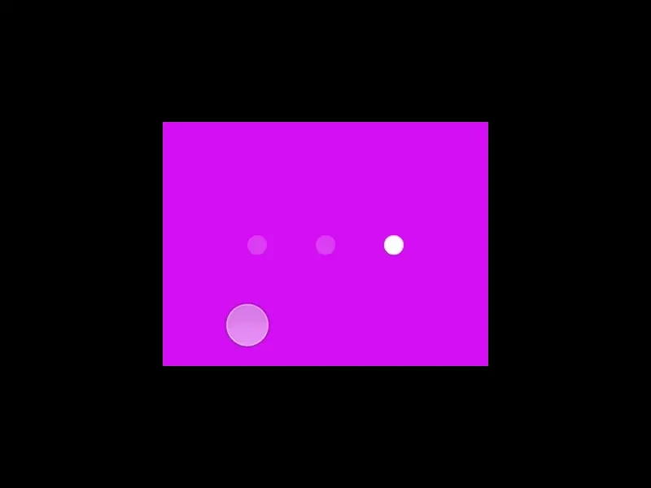
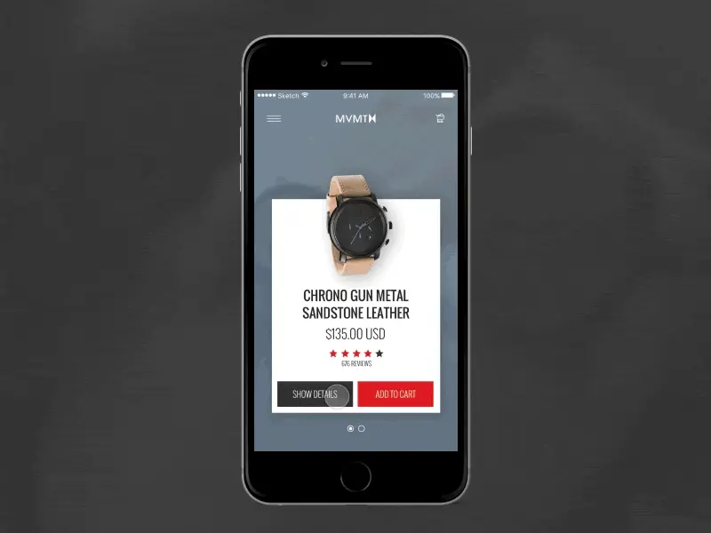

### 一、水平视差滚动效果
视差效果在数字系统设计中可以同时用于垂直面和水平面。视差效果首次应用是在视频游戏，数十年后它进入了网页设计应用中，然后渐渐的又进入了移动应用程序，使用静态或缓慢移动的背景图像与快速移动的前景图像，创建一个多层次的3D滚动效果。这使用户体验更加身临其境，以其微妙之处吸引用户。为什么这会让人眼前一亮-

- 数字屏幕是一个二维空间，但是设计师能在他们的平面像素屏幕上做有深度和广度的创意，这就是微妙视差效果能发挥作用的地方。
- 视差滚动效果在界面设计中采用不同的视觉元素并以不同的速度移动它们来增加动作和深度的错觉。

一起看一下在设计原则中的两个视差滚动效果实例。

手机游戏武器卡：

视差效果最佳位置之一是在移动应用程序或网站上水平或垂直滚动卡片，体验最流畅环节的感受，是在最后部分的一张卡片。类似于iphone在你滚动到特定列表的末尾时引入的橡皮筋效应。

耐克APP促销卡：

这个例子是耐克APP概念创作的视差滚动效果，来促进即将到来的产品发布。

这个设计通过突出前景元素—- 鞋子—- 将其提升了一个层次，从而超越了背景卡片的边缘。这个效果弥补滚动时发生的背景颜色改变。正如你看到的例子，精心制作的视差互动效果可以很容易帮助你从产品群中脱颖而出并为你的访客建立一个好的印象。不要认为视差是纯粹的装饰，像你使用的其他技术一样，它应该为你的用户增加真正有价值的体验方式被融合。

但是，需要注意的是在视差效应范围内过多的运动可能会对那些患有前庭疾病的人造成伤害。运动错觉和深度错觉可能导致眩晕或者迷失方向感，请切记这些设计准则：

- 将视差效果的数量保持在最低限度；
- 屏幕的一个小区域内限制过多移动效果；
- 不要让你的效果分散用户对重要信息的注意力；

### 二、动画搜素栏交互
搜索栏是用户在移动应用程序或网页设计中最常见的图形元素之一。在这种类型的动画中，界面通常只有一个搜索图标，当你点击它搜索输入字段时会显示一个弹性动画。通过在搜索元素中添加一个微妙的动画，设计师可以实现两个基本目标:

查询和搜索数据是数字产品中最常见的交互方式之一，为他们增添乐趣；
只有当用户需要搜索输入时，通过扩展搜索栏有效利用空白区。
让我们看一下这个交互的例子：

这个设计展示了放大镜（搜素栏）作为圆形图标，点击该图标时它会有动效，变成药丸形状的搜索框。这是一个非常轻量级的交互设计，在 Principle 上只需要不到5个页面就可以实现，并且在开发应用程序或网站时也同样简单。

### 三、提交按钮启动消息
用户填写表单或在应用程序中进行某些选择按下提交按钮之后就会出现这个动画。一个应用程序首次启动并且所有序缓存和数据都被提取时，启动(Splash) 动画也会被使用。启动动画通常包括 logo 和应用程序的名称，通常会在应用程序打开前在屏幕上出现片刻。为什么这会让人眼前一亮-

- 当应用程序进入加载阶段来获取或上传数据时，启动动画非常合适，提供一个为用户参与的锚点；
- 然而，理想情况是通过提供强烈影响用户体验的交互式体验，可以使用户走得更远。

让我们来看一个交互式启动画面的例子：

这个设计是用户在应用程序中完成提交交互之后的展示的动画。当数据被发送到数据库时，弹跳球创建了一个有趣的体验，接下来的勾号向用户提供反馈，告诉用户的操作是成功的，这是一个重要的体验实现。以下是启动画面时要遵循的一些最佳的方法：

- 将持续时间控制在2秒以内；
- 对于用户可能在应用程序中多次进行的交互将时间减少到1秒或更短（比如多次提交）；
- 在评估设计想法时要追求简单和大胆的想法而不是难懂的、错综复杂点子；
- 过于复杂的序列动画只会显得华而不实，可能会让用户觉得他们的时间被浪费；
- 强烈的背景色彩、背景图片都是不错的选择。假如启动画面有动画效果，那么在一个相对固定或渐变的背景上添加动画可能呈现的效果会更好。

### 四、页面间的分页动画
分页是一系列相互连接且内容相似的页面，需要注意的是即使页面中某一部分的内容可以分为不同的页面，我们仍然将这个概念定义为分页。其优点包括3个：更容易的导航、更好的用户体验、更流畅的购买过程。通常用在电子商务网站。

- 虽然大多数传统网站和应用程序使用单独的页面来分割内容，由于页面加载时间较长，导致用户体验不连贯，但新的设计系统已经开始使用更流畅的分页交互，从而降低了客户流失率，提高了客户留存率；
- 过去用一个流畅的分页动画需要通过几个页面进行导航，现在我们可以创建一个单页面的内容交互的效果。

让我们来看一个分页组件的例子，它可以在各个部分之间滑动并且可以通过动画创建一个令人愉快的用户体验：

当用户在不同部分之间切换时，它创造了一种流畅的用户体验。它可以用在应用程序中用户可以在各个部分之间快速滑动。例如浏览电子商务网站中的产品图片、阅读教育应用程序中的不同部分信息，或者按照步骤创建食品应用程序的配方。

### 五、用粘性元素展开卡片
在用户界面设计中，卡片列表是一个易于展示信息快的方法。借鉴现实世界中使用实物卡片记忆和组织信息的方法ーー例如抽屉卡或便利贴ーー卡片列表显示一系列卡片，每张卡片包含一小部分信息。因此，设计的真正的难点在于平衡信息的传递方式，而不是让使用者不知所措。

用户应该得到一个清晰的图片并准确传达信息，如果用户选择深入浏览时，可以选择扩展信息和更深入的展示。保持卡片展开的连续性、流动性应是平顺且感觉就像是一个连接在一起的感觉。

像上面所有的交互一样，看一个交互设计的例子：

这个设计是用在一个电子商务的应用程序，购买手表显示卡的项目。主要的信息如价格和等级需要显示在每张卡片。扩展卡片可以显示额外的信息，例如使用特点和推荐。在消费购买决策时，这款手表的粘性扩展视图创造了一个更好的体验。直观的使用和-正确的操作-通常美学上也是令人舒适的。扩展卡片列表可以构建响应式布局设计，也是提高可用性的绝佳方案。目的是提高浏览内容或者信息量大的应用程序。

原文：https://www.wednesday.is/writing-articles/5-easy-ui-interactions-in-principle

[http://www.woshipm.com/ucd/5368988.html?utm_source=tuicool&utm_medium=referral](http://www.woshipm.com/ucd/5368988.html?utm_source=tuicool&utm_medium=referral)