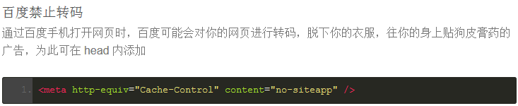
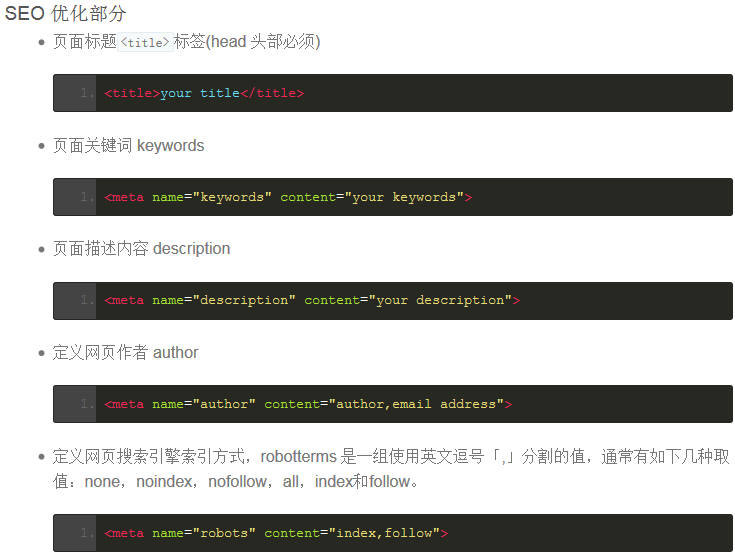

### 规范目的
为提高团队协作效率,便于后台人员添加功能及前端后期优化维护,输出高质量的文档,特制订此文档.本文档如有不对或者不合适的地方请及时提出,经讨论决定后方可更改.

### 基本准则
- 符合web标准,
- 语义化html,
- 结构表现行为分离,
- 兼容性优良.
- 页面性能方面,
- 代码要求简洁明了有序,
- 尽可能的减小服务器负载,
- 保证最快的解析速度.

### 前端开发核心思想
- 表现、内容和行为的分离
- 标记应该是结构良好、语义正确 以及 普遍合法 。
- Javascript应该起到渐进式增强用户体验的作用 。

### 文件目录规范
```
|----doc
|----build
|----node_modules
|----test
|----	file
|----public
	|----css
	|----img
	|----js
		|----lib
		|----plugin
		|----component
		|----module
	|----font
	|----template
|----views
```
（1）JS

英文命名，尽量简单，见名知意，若多个单词组成使用驼峰命名法；

JS目录和html页面目录命名一致，并且JS文件和对应的HTML页面命名一致
jquery插件等放至lib（或common）文件夹下；

（2）CSS文件命名

英文命名；

公用base.css；

其他页面所有样式：style.css

（3）HTML文件命名

英文命名，尽量简单，见名知意，若多个单词组成使用峰驼命名规则；

JS目录和html页面目录命名一致，并且JS文件和对应的HTML页面命名一致

JSP通用页面模板如下:
```html
<%@ page language="java" import="java.util.*" pageEncoding="utf-8"%>
<%
	String path = request.getContextPath();
	String basePath = request.getScheme()+"://"+request.getServerName()+":"+request.getServerPort()+path+"/";
%>
<!DOCTYPE html>
<html lang="zh-CN">
<head>
<meta charset="UTF-8" />
<meta http-equiv='X-UA-Compatible' content='IE=Edge,chrome=1' />
<meta name="renderer" content="webkit"> 
<meta name="keywords" content="中小微,p2p,供应链金融" />
<meta name="description" content="北京中小微企业金融服务平台"/>
<meta name="author" content="fh">
<meta name="robots" content="index,follow">
<base href="<%=basePath%>"/>
<title>页面模板</title>
<link href="images/favicon.ico" type="image/x-icon" rel="shortcut icon" /> 
<link rel="bookmark" href="images/favicon.ico" type="image/x-icon" />
<link rel="stylesheet" type="text/css" href="css/base.css"/>
</head>
<body>

<script type="text/javascript" src="admin/js/lib/jquery-1.11.1.min.js"></script>
</body>
</html>
```




 
移动端的头部标签和meta
```html
<!DOCTYPE html> <!-- 使用 HTML5 doctype，不区分大小写 -->
<html lang="zh-cmn-Hans"> <!-- 更加标准的 lang 属性写法 http://zhi.hu/XyIa -->
<head>
<!-- 声明文档使用的字符编码 -->
<meta charset='utf-8'>
<!-- 优先使用 IE 最新版本和 Chrome -->
    <meta http-equiv="X-UA-Compatible" content="IE=edge,chrome=1"/>
    <!-- 页面描述 -->
    <meta name="description" content="不超过150个字符"/>
    <!-- 页面关键词 -->
    <meta name="keywords" content=""/>
    <!-- 网页作者 -->
    <meta name="author" content="name, email@gmail.com"/>
    <!-- 搜索引擎抓取 -->
    <meta name="robots" content="index,follow"/>
    <!-- 为移动设备添加 viewport -->
    <meta name="viewport" content="initial-scale=1, maximum-scale=3, minimum-scale=1, user-scalable=no">
    <!-- `width=device-width` 会导致 iPhone 5 添加到主屏后以 WebApp 全屏模式打开页面时出现黑边 http://bigc.at/ios-webapp-viewport-meta.orz -->
 
    <!-- iOS 设备 begin -->
    <meta name="apple-mobile-web-app-title" content="标题">
    <!-- 添加到主屏后的标题（iOS 6 新增） -->
    <meta name="apple-mobile-web-app-capable" content="yes"/>
    <!-- 是否启用 WebApp 全屏模式，删除苹果默认的工具栏和菜单栏 -->
 
    <meta name="apple-itunes-app" content="app-id=myAppStoreID, affiliate-data=myAffiliateData, app-argument=myURL">
    <!-- 添加智能 App 广告条 Smart App Banner（iOS 6+ Safari） -->
    <meta name="apple-mobile-web-app-status-bar-style" content="black"/>
    <!-- 设置苹果工具栏颜色 -->
    <meta name="format-detection" content="telphone=no, email=no"/>
    <!-- 忽略页面中的数字识别为电话，忽略email识别 -->
    <!-- 启用360浏览器的极速模式(webkit) -->
    <meta name="renderer" content="webkit">
    <!-- 避免IE使用兼容模式 -->
    <meta http-equiv="X-UA-Compatible" content="IE=edge">
    <!-- 针对手持设备优化，主要是针对一些老的不识别viewport的浏览器，比如黑莓 -->
    <meta name="HandheldFriendly" content="true">
    <!-- 微软的老式浏览器 -->
    <meta name="MobileOptimized" content="320">
    <!-- uc强制竖屏 -->
    <meta name="screen-orientation" content="portrait">
    <!-- QQ强制竖屏 -->
    <meta name="x5-orientation" content="portrait">
    <!-- UC强制全屏 -->
    <meta name="full-screen" content="yes">
    <!-- QQ强制全屏 -->
    <meta name="x5-fullscreen" content="true">
    <!-- UC应用模式 -->
   <meta name="browsermode" content="application">
   <!-- QQ应用模式 -->
   <meta name="x5-page-mode" content="app">
  <!-- windows phone 点击无高光 -->
	   <meta name="msapplication-tap-highlight" content="no">
    <!-- iOS 图标 begin -->
  <link rel="apple-touch-icon-precomposed" href="/apple-touch-icon-57x57-precomposed.png"/>
  <!-- iPhone 和 iTouch，默认 57x57 像素，必须有 -->
 <link rel="apple-touch-icon-precomposed" sizes="114x114" href="/apple-touch-icon-114x114-precomposed.png"/>
  <!-- Retina iPhone 和 Retina iTouch，114x114 像素，可以没有，但推荐有 -->
 <link rel="apple-touch-icon-precomposed" sizes="144x144" href="/apple-touch-icon-144x144-precomposed.png"/>
 <!-- Retina iPad，144x144 像素，可以没有，但推荐有 -->
<!-- iOS 图标 end -->
 <!-- iOS 启动画面 begin -->
<link rel="apple-touch-startup-image" sizes="768x1004" href="/splash-screen-768x1004.png"/>
 <!-- iPad 竖屏 768 x 1004（标准分辨率） -->
<link rel="apple-touch-startup-image" sizes="1536x2008" href="/splash-screen-1536x2008.png"/>
<!-- iPad 竖屏 1536x2008（Retina） -->
<link rel="apple-touch-startup-image" sizes="1024x748" href="/Default-Portrait-1024x748.png"/>
<!-- iPad 横屏 1024x748（标准分辨率） -->
<link rel="apple-touch-startup-image" sizes="2048x1496" href="/splash-screen-2048x1496.png"/>
<!-- iPad 横屏 2048x1496（Retina） -->
<link rel="apple-touch-startup-image" href="/splash-screen-320x480.png"/>
<!-- iPhone/iPod Touch 竖屏 320x480 (标准分辨率) -->
<link rel="apple-touch-startup-image" sizes="640x960" href="/splash-screen-640x960.png"/>
<!-- iPhone/iPod Touch 竖屏 640x960 (Retina) -->
<link rel="apple-touch-startup-image" sizes="640x1136" href="/splash-screen-640x1136.png"/>
<!-- iPhone 5/iPod Touch 5 竖屏 640x1136 (Retina) -->
<!-- iOS 启动画面 end -->
<!-- iOS 设备 end -->
<meta name="msapplication-TileColor" content="#000"/>
<!-- Windows 8 磁贴颜色 -->
<meta name="msapplication-TileImage" content="icon.png"/>
<!-- Windows 8 磁贴图标 -->
<link rel="alternate" type="application/rss+xml" title="RSS" href="/rss.xml"/>
<!-- 添加 RSS 订阅 -->
<link rel="shortcut icon" type="image/ico" href="/favicon.ico"/>
<!-- 添加 favicon icon -->
<title>标题</title>
</head>
```

### html书写规范
1.文档类型声明及编码:

统一为html5声明类型`<!DOCTYPE html>`;

编码统一为`<meta charset="UTF-8"/>`,

书写时利用IDE实现层次分明的缩进;

2.非特殊情况下CSS样式文件必须外链至`<head>...</head>`之间;非特殊情况下JavaScript文件必须外链至页面底部;

3.引入样式文件或JavaScript文件时,须略去默认类型声明,写法如下:
```html
<link rel="stylesheet" href="..."/>
<style>...</style>
<script src="..."></script>
```
4.引入JS库文件,文件名须包含库名称及版本号及是否为压缩版,比如jquery-1.4.1.min.js;引入插件,文件名格式为库名称+插件名称,比如jQuery.cookie.js;

5.所有编码均遵循xhtml标准,标签&属性&属性命名必须由小写字母及下划线数字组成,且所有标签必须闭合, （br、input等除外）;属性值必须用双引号包括;

6.充分利用无兼容性问题的html自身标签,比如span,em,strong,optgroup,label,等等;需要为html元素添加自定义属性的时候,首先要考虑下有没有默认的已有的合适标签去设置,如果没有,可以使用须以"data-"为前缀来添加自定义属性，避免使用"data:"等其他命名方式;

7.语义化html,如标题根据重要性用h*(同一页面只能有一个h1),段落标记用p,列表用ul,内联元素中不可嵌套块级元素;

8.尽可能减少div嵌套,如
```html
<div class="box">
<div class="welcome">欢迎访问XXX,您的用 户名是
<div class="name">用户名</div>
</div>
</div>
```
完全可以用以下代码替代:
```html
<div class="box">
<p>欢迎 访问XXX,您的用户名是<span>用户</span></p>
</div>;
```
9.书写链接地址时,必须避免重定向，例如：href="http://itaolun.com/",即须在URL地址后面加上“/”；

10. 表现与结构完全分离，代码中不涉及任何的表现元素，如style、font、bgColor、border等，在页面中尽量避免使用style属性,即style="…";

11.必须为含有描述性表单元素(input,textarea)添加label,如
`<p>姓 名:<input type="text" id="name" name="name"/></p>`
须写成:
`<p><label for="name">姓 名:</label><input type="text" id="name"/></p>`

12.能以背景形式呈现的图片,尽量写入css样式中;

13.重要图片必须加上alt属性;给重要的元素和截断的元素加上title;

14.给区块代码及重要功能(比如循环)加上注释,方便后台添加功能;

15.特殊符号使用:尽可能使用代码替代:比如<(小于)、>(大于)、空格等等;

16.书写页面过程中,请考虑向后扩展性;

17.class&id参见css书写规范.

18.不允许使用属性简写。以前 HTML 允许写成如：`<input checked>`、`<option selected>`等，但 XHTML 规定所有属性必须被赋值。正确的写法是：`<input checked="checked" />`、`<option selected="selected" />`。

19、属性加双引号，如：
```html
<div class=”header”>
<a name=”username”>XXX</a>
```

20、正确闭合HTML标签

HTML中所有的自闭合标签
area、base, br, col, command, embed, hr, img, input, keygen, link, meta, param, source, track, wbr

21、停止使用不标准的标签和属性

不推荐使用单纯设置样式的标签，如：basefont、big、center、font等。

不推荐在HTML标签中添加样式属性，如： iframe 、 img 、 input 、 div 等标签中的 align 属性， body 标签上的 background 属性， td 和 tr 标签上的 height 、 width 、 nowrap 、 bgcolor 、 valign 等属性， iframe 标签中的 frameborder 、 marginheight 、 scrolling 等属性

### css书写规范
1.编码统一为utf-8;

2.注释
```css
/*注释内容*/
.selector {
}
```
3.缩进

4.空格

强制选择器与（{）直接有一个空格}
```css
.selector {
	height:20px;
}
```
5.选择器

当一个样式包含多个selector时，每个选择器声明独占一行
```css
.header，
.footer {
	background:#e8e8e8;
}
```
6.分号

每条样式后面必须有分号结束(;)

7.属性缩写：

在可以使用缩写的情况下，尽量使用缩写
```css
body {
font: 12px/1.5 arial, sans-serif;
}
a {
	color:#ccc;
}
```
比如：
```css
margin-top:10px;margin-bottom:20px;margin-left:30px;margin-right:40px
```
可以写成：
```css
margin：10px 40px 20px 30px
```
8.所有属性值使用双引号，不使用单引号

9.禁止使用expression

10.css属性书写顺序,建议遵循: 布局定位属性-->自身属性-->文本属性-->其他属性.

此条可根据自身习惯书写,但尽量保证同类属性写在一起.

属性列举:布局定位属性主要包括:

display&list-style&position（相应 的?top,right,bottom,left）＆float&clear＆visibility＆overflow；
自身属性主要包括:width&height&margin&padding&border&background; 

文本属性主要包括：color&font&text-decoration&text-align&vertical-align&white- space&其他&content; 
我所列出的这些属性只是最常用到的,并不代表全部;

11.书写代码前,考虑并提高样式重复使用率;

12.充分利用html自身属性及样式继承原理减少代码量,

比如:
```html
<ul class="list"><li>这儿是标题列表<span>2010-09- 15</span></ul>
```
定义
```css
ul.list li{position:relative}
ul.list li span{position:absolute;right:0}
```
即可实现日期居右显示

13.样式表中中文字体名,请务必转码成unicode码,以避免编码错误时乱码;

14.背景图片请尽可能使用sprite技术,减小http请求,考虑到多人协作开发,sprite按模块制作;

15.使用table标签时(尽量避免使用table标签),请不要用width/height/cellspacing/cellpadding等table属性直接定义表现,应尽可能的利用table自身私有属性分离结构与表现 ,如thead,tr,th,td,tbody,tfoot,colgroup,scope; (cellspaing及cellpadding的css控制方法: 
table{border:0;margin:0;border-collapse:collapse;}
table th, table td{padding:0;} ,
base.css文件中我会初始化表格样式)

16.杜绝使用<meta http-equiv="X-UA-Compatible"?content="IE=7"/> 兼容 ie8;

17.用png图片做图片时,要求图片格式为png-8格式,若png-8实在影响图片质量或其中有半透明效果,请为ie6单独定义背景:
_background:none;_filter:progid:DXImageTransform.Microsoft.AlphaImageLoader (sizingMethod=crop,?src=’img/bg.png’);

18.避免兼容性属性的使用,比如text-shadow||css3的相关属性;

19.减少使用影响性能的属性,比如position:absolute||float;

20、明确定义单位，除非为0值

比如margin：0px必须写成margin：0

21、从外部文件加载CSS，尽可能减少文件数。加载标签必须放在文件的 HEAD 部分。永远不要用@import

18、IE Bugs

不可避免地，当所有其他浏览器看起来都正常工作的时候，各种版本的IE浏览器就会冒出一些莫名其妙的bug，让部署一拖再拖。虽然我们鼓励排除问题，产出无需打补丁就能在所有浏览器上运行的代码，有时候为了在样式表中使用CSS钩子，还是有必要用到CSS if IE 条件注释。
修复 IE 
```
1.<!--[if lt IE 7 ]> <body class="ie6"> <![endif]-->
2.<!--[if IE 7 ]>    <body class="ie7"> <![endif]-->
3.<!--[if IE 8 ]>    <body class="ie8"> <![endif]-->
4.<!--[if IE 9 ]>    <body class="ie9"> <![endif]-->
5.<!--[if !IE]><!--> <body> <!--<![endif]-->
1..box { float: left; margin-left: 20px; }
2..ie6 .box { margin-left: 10px; }
```
如果你在用HTML5（以及 HTML5 Boilerplate）， 我们推荐使用 Modernizer JavaScript库和下列模式：
```
1.<!--[if lt IE 7]> <html class="no-js ie ie6" lang="en"> <![endif]-->
2.<!--[if IE 7]>    <html class="no-js ie ie7" lang="en"> <![endif]-->
3.<!--[if IE 8]>    <html class="no-js ie8" lang="en"> <![endif]-->
4.<!--[if IE 9]>    <html class="no-js ie9" lang="en"> <![endif]-->
5.<!--[if gt IE 9]><!--><html class="no-js" lang="en"><!--<![endif]-->
```

### JavaScript书写规范
1.文件编码统一为utf-8,书写过程过,每行代码结束必须有分号;原则上所有功能均根据XXX项目需求原生开发,以避免网上down下来的代码造成的代码污染(沉冗代码||与现有代码冲突||...);

2.库引入:商讨觉定;

3.变量命名:驼峰式命名.原生JavaScript变量要求是纯英文字母,首字母须小写,如iTaoLun;
jQuery变量要求首字符为'_',其他与原生JavaScript规则相同,如:_iTaoLun;
另,要求变量集中声明,避免全局变量.

4.类命名:首字母大写,驼峰式命名.如ITaoLun;

5.函数命名:首字母小写驼峰式命名.如iTaoLun();

6.命名语义化,尽可能利用英文单词或其缩写;

7.尽量避免使用存在兼容性及消耗资源的方法或属性,比如eval()&innerText;

8.后期优化中,JavaScript非注释类中文字符须转换成unicode编码使用,以避免编码错误时乱码显示;

9.代码结构明了,加适量注释.提高函数重用率;

10.注重与html分离,减小reflow,注重性能.

11. 不要在页面包含不必要的 javascript 代码，尽可能将其外部化。

12. 尽可能使用语义化名称来表达函数方法，并且写上相应的注释。

13. 减少冗余代码，将可共用的部分独立出来实现重用。

14. 代码的缩进和换行

15、不要使用 document.write()

16、所有布尔变量的命名必须用 "is" 开头

17、给变量和函数的命名要有逻辑意义：例如： popUpWindowForAd 就比 myWindow 好多了。

18、不要人为缩短命名到最小。除了传统的 for 循环中的计数器 i 等简化的情况，变量命名必须长到有明确意义

19、文档必须遵循 NaturalDocs 结构

20、常量或配置变量（例如动画持续时间等）必须放在文件的顶部

21、尽力编写可通用化的函数，让它接受参数并返回值。这样有利于充分的代码重用，而且一旦与引入及外部脚本配合起来，能在脚本需要修改时减少开销。例如，相比硬编码一个带有窗口大小、选项和url的弹出式窗口，不如编写一个接受大小、url和选项作为变量的函数

22、给代码添加注释！这会有利于减少在调试Javascript函数上花费的时间

23、把你的代码组织成一套 对象常量/单例，按照 模块化模式，或做成 带构造器的对象

24、最小化全局变量 - 你创建的全局变量越少越好。一般来说，用于你的应用命名空间，1会是个好的数字。
在描述任何全局变量的时候要明确指认。 
1.window.globalVar = { ... }

25、优化 JavaScript 的特征
•	编写可维护的代码
•	单变量模式
•	Hoisting：把所有变量声明统一放到函数的起始位置 （在后部声明的变量也会被JS视为在头部定义，由此会产生问题）
•	不要扩充内置原型（虽然给Object(), Function()之类的内置原型增加属性和方法很巧妙，但是会破坏可维护性）
•	不要用隐含的类型转换
•	不要用 eval()
•	用 parseInt() 进行数字转换
•	（规范）左大括号的位置
•	构造器首字母大写
•	写注释
•	不要用 void
•	不要用 with 语句
•	不要用 continue 语句
•	尽量不要用位运算

### 图片规范
1.所有页面元素类图片均放入img文件夹,测试用图片放于test文件夹;
2.图片格式仅限于gif||png||jpg;
3.命名全部用小写英文字母||数字||_的组合，其中不得包含汉字||空格||特殊字符；尽量用易懂的词汇,便于团队其他成员理解;另,命名分头尾两部分,用-线隔开,比如ad-left01.gif||btn-submit.gif;
4.在保证视觉效果的情况下选择最小的图片格式与图片质量,以减少加载时间;
5.尽量避免使用半透明的png图片(若使用,请参考css规范相关说明);
6.运用css sprite技术集中小的背景图或图标,减小页面http请求,但注意,请务必在对应的sprite psd源图中划参考线,并保存至img目录下.

### 注释规范
1.html注释:注释格式<!--这儿是注释-->,'--'只能在注释的始末位置,不可置入注释文字区域;
2.css注释:注释格式/*这儿是注释*/;
3.JavaScript注释,单行注释使用'//这儿是单行注释',多行注释使用/*这儿有多行注释*/;

开发及测试工具约定
可以使用Aptana||Dw||Vim ,但须遵循如下原则:
1.不可利用IDE的视图模式'画'代码;
2.不可利用IDE生成相关功能代码,比如Dw内置的一些功能js;
3.编码必须格式化,比如缩进;
测试工具:前期开发仅测试FireFox& Chrome,后期优化时加入IE和360;
建议测试顺序:FireFox -->Chrome-->Safari-->IE -->Opera,建议安装firebug
其他规范
1、开发过程中严格按分工完成页面,以提高css复用率,避免重复开发;
2、减小沉冗代码,书写所有人都可以看的懂的代码.简洁易懂是一种美德.为用户着想,为服务器着想.
3、单词什么的一定要写正确：比如message不要写成mesage（少个s）等等
JS编程建议：
1、使用===判断相等
if(1 === '1') //Returns false
if(1 == '1') //Returns true

if(0 === '') //Returns false
if(0 == '') //Returns true

if(1 !== '1') //Returns true
if(1 != '1') //Returns false

if(0 !== '') //Returns true
if(0 != '') //Returns false
2、使用命名空间
var cost = 5;
//...time goes by...
console.log(cost);
可以写成：
var MyNamespace = {};
MyNamespace.cost = 5;
//...time goes by...
console.log(MyNamespace.cost);
3、避免使用eval()方法
The Eval function allows us to pass a string to the JavaScript compiler and have it execute as JavaScript. In simple terms, anything you pass in at runtime gets executed as if it were added at design time. Here is an example of what that might look like:
eval("alert('Hi');");
4、Use Decimals Cautiously
When is 0.1 + 0.2 not equal to 0.3? When you do the calculation in JavaScript. The actual value of 0.1 + 0.2 comes out to be something like 0.30000000000000004. The reason for this (nope, not a bug) is because JavaScript uses Binary Floating Point numbers. To get around this issue, you can multiply your numbers to remove the decimal portion. For instance, if you were to be adding up the cost of two items, you could multiply each price by 100 and then divide the sum by 100. Here is an example:
var hamburger = 8.20;
var fries = 2.10;
var total = hamburger + fries;
console.log(total); //Outputs 10.299999999999999

hamburger = hamburger * 100;
fries = fries * 100;
total = hamburger + fries;
total = total / 100;
console.log(total); //Outputs 10.3
5、Start Blocks on the Same Line
if(myState === 'testing') 
{
   console.log('You are in testing');
} 
else 
{
   console.log('You are in production');
}
改成：
if(myState === 'testing') {
   console.log('You are in testing');
} else {
   console.log('You are in production');
}
6、Use Explicit Blocks
if (i > 3)
   doSomething();
改成：
if (i > 3) {
   doSomething();
}
7、不使用with
with (myNamespace.parent.child.person) {
   firstName = 'Jon';
   lastName = 'Smyth';
}
改成：
myNamespace.parent.child.person.firstName = 'Jon';
myNamespace.parent.child.person.lastName = 'Smyth';
或
var p = myNamespace.parent.child.person;
p.firstName = 'Jon';
p.lastName = 'Smyth';
8、小心使用typeof
Again, the edge cases here will bite you if you aren't careful. Normally, typeof returns the string representation of the value type ('number', 'string', etc.) The problem comes in when evaluating NaN ('number'), null ('object'), and other odd cases. For example, here are a couple of comparisons that might be unexpected:
var i = 10;
i = i - 'taxi'; //Here i becomes NaN

if (typeof(i) === 'number') {
   console.log('i is a number');
} else {
   console.log('You subtracted a bad value from i');
}
The resulting alert message would be "i is a number", even though clearly it is NaN (or "Not a Number"). If you were attempting to ensure the passed in value (here it is represented by 'taxi') subtracted from i was a valid number, you would get unexpected results.
While there are times when it is necessary to try to determine the type of a particular value, be sure to understand these (and other) peculiarities about typeof that could lead to undesirable results.
9、Treat parseInt With Care
Just like the typeof function, the parseInt function has quirks that need to be understood before it is used. There are two major areas that lead to unexpected results. First, if the first character is a number, parseInt will return all of the number characters it finds until it hits a non-numeric character. Here is an example:
parseInt("56");    //Returns 56
parseInt("Joe");   //Returns NaN
parseInt("Joe56"); //Returns NaN
parseInt("56Joe"); //Returns 56
parseInt("21.95"); //Returns 21
Note that last example I threw in there to trip you up. The decimal point is not a valid character in an integer, so just like any other character, parseInt stops evaluating on it. Thus, we get 21 when evaluating 21.95 and no rounding is attempted.
The second pitfall is in the interpretation of the number. It used to be that a string with a leading zero was determined to be a number in octal format. Ecmascript 5 (JavaScript is an implementation of Ecmascript) removed this functionality. Now most numbers will default to base 10 (the most common numbering format). The one exception is a string that starts with "0x". This type of string will be assumed to be a hexadecimal number (base 16) and it will be converted to a base 10 number on output. To specify a number's format, thus ensuring it is properly evaluated, you can include the optional parameter called a radix. Here are some more examples to illustrate these possibilities:
parseInt("08");     //Returns 8 - used to return 0 (base 8)
parseInt("0x12");   //Returns 18 - assumes hexadecimal
parseInt("12", 16); //Returns 18, since base 16 is specified
10、Do Not Use Switch Fall Through
When you execute a switch statement, each case statement should be concluded by a break statement like so：
switch(i) {
   case 1:
      console.log('One');
      break;
   case 2:
      console.log('Two');
      break;
   case 3:
      console.log('Three');
      break;
   default:
      console.log('Unknown');
      break;
}
If you were to assign the value of 2 to the variable i, this switch statement would fire an alert that says "Two". The language does permit you to allow fall through by omitting the break statement(s) like so:
switch(i) {
   case 1:
      console.log('One');
      break;
   case 2:
      console.log('Two');
   case 3:
      console.log('Three');
      break;
   default:
      console.log('Unknown');
      break;
}
Now if you passed in a value of 2, you would get two alerts, the first one saying "Two" and the second one saying "Three". This can seem to be a desirable solution in certain circumstances. The problem is that this can create false expectations. If you do not see that a break statement is missing, you may add logic that gets fired accidentally. Conversely, you may notice later that a break statement is missing and you might assume this is a bug. The bottom line is that fall through should not be used intentionally in order to keep your logic clean and clear.
11、Avoid For...In Loops
The For...In loop works as it is intended to work, but how it works surprises people. The basic overview is that it loops through the attached, enumeration-visible members on an object. It does not simply walk down the index list like a basic for loop does. The following two examples are NOT equivalent:
// The standard for loop
for(var i = 0; i < arr.length; i++) {}

// The for...in loop
for(var i in arr) {}
In some cases, the output will act the same in the above two cases. That does not mean they work the same way. There are three major ways that for...in is different than a standard for loop. These are:
1.	It loops through all of the enumeration-visible members, which means it will pick up functions or other items attached to the object or its prototype.
2.	The order is not predictable (especially cross-browser).
3.	It is slower than a standard for loop.
If you fully understand for...in and know that it is the right choice for your specific situation, it can be a good solution. However, for the other 99% of situations, you should use a standard for loop instead. It will be quicker, easier to understand, and less likely to cause weird bugs that are hard to diagnose.
12、Use Var to Declare Variables
When declaring a variable, always use the var keyword unless you are specifically attaching the variable to an object. Failure to do so attaches your new variable to the global scope (window if you are in a browser). Here is an example to illustrate how this works:
function carDemo() {
   var carMake = 'Dodge';
   carModel = 'Charger';
}

console.log(carMake);  
//Undefined, since carMake is defined inside the testing function scope
console.log(carModel); 
//Charger, since this variable has been implicitly attached to window
The declaration of the carModel variable is the equivalent of saying window.carModel = 'Charger';. This clogs up the global scope and endangers your other JavaScript code blocks, since you might inadvertently change the value of a variable somewhere else.
13、Avoid Reserved / Special Words
JavaScript is rather flexible with what it allows you to do. This isn't always a good thing. For instance, when you create a function, you can specify that one of the parameters be named arguments. This will overwrite the arguments object that every function is given by inheritance. This is an example of a special word that isn't truly reserved. Here is an example of how it would work:
// This function correctly accesses the inherited
// arguments parameter
function CorrectWay() {
   for(var i = 0; i < arguments.length; i++) {
      console.log(arguments[i]);
   }
}

// You should never name a parameter after 
// a reserved or special word like "arguments"
function WrongWay(arguments) {
   for(var i = 0; i < arguments.length; i++) {
      console.log(arguments[i]);
   }
}

// Outputs 'hello' and 'hi'
CorrectWay('hello', 'hi');

// Outputs 'h', 'e', 'l', 'l', and 'o'
WrongWay('hello', 'hi');
There are also reserved words that will cause you issues when you attempt to run your application. A complete listing of these words can be found at the Mozilla Developer Network. While there are work-arounds to use some of these words, avoid doing so if at all possible. Instead, use key words that won't conflict with current or potential future reserved or special words.

常见命名
•	头：header
•	内容：content/container
•	尾：footer
•	导航：nav
•	侧边：sidebar
•	栏目：column
•	页面外围控制整体布局宽度：wrapper
•	左右中：left right center
•	登录条：loginbar
•	标志：logo
•	广告：banner
•	页面主体：main
•	热点：hot
•	新闻：news
•	下载：download
•	子导航：subnav
•	菜单：menu
•	子菜单：submenu
•	搜索：search
•	友情链接：friendlink
•	页脚：footer
•	版权：copyright
•	滚动：scroll
•	内容：content
•	标签页：tab
•	文章列表：list
•	提示信息：msg
•	小技巧：tips
•	栏目标题：title
•	加入：joinus
•	指南：guild
•	服务：service
•	注册：regsiter
•	状态：status
•	投票：vote
•	合作伙伴：partner

