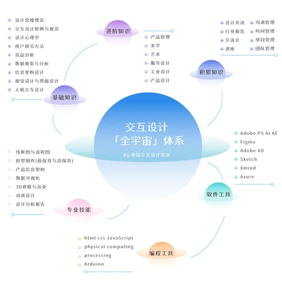
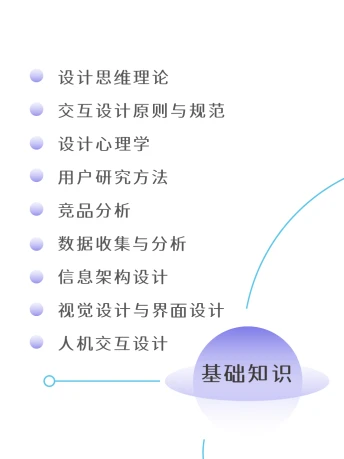
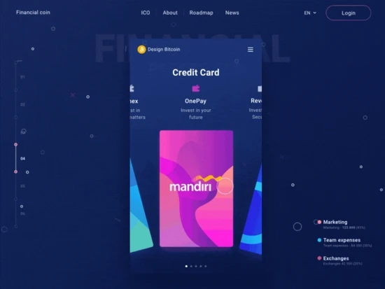
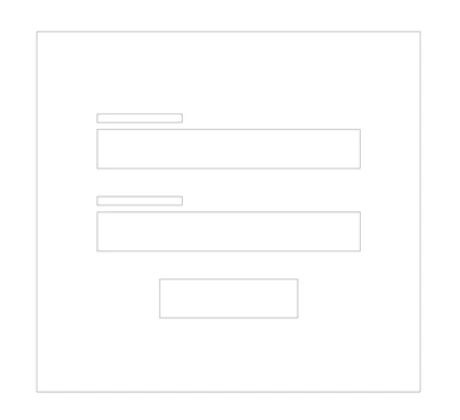
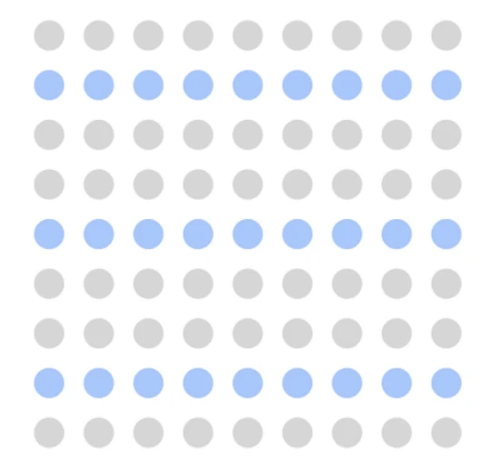
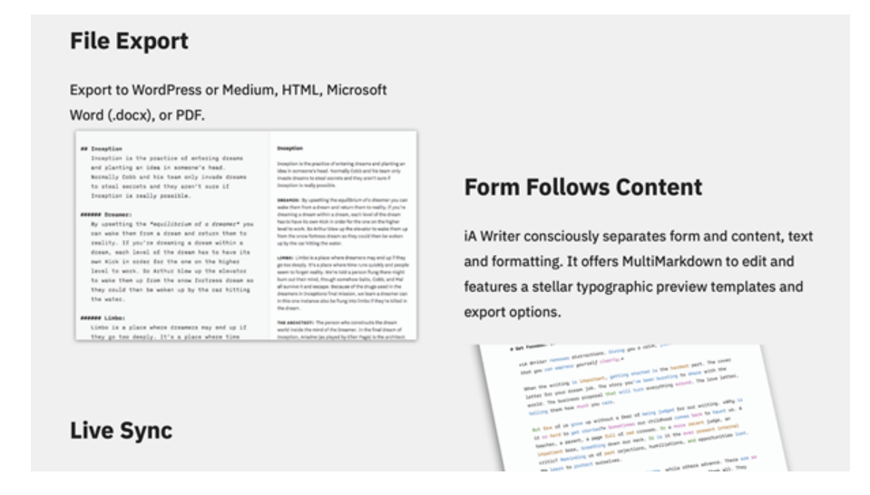
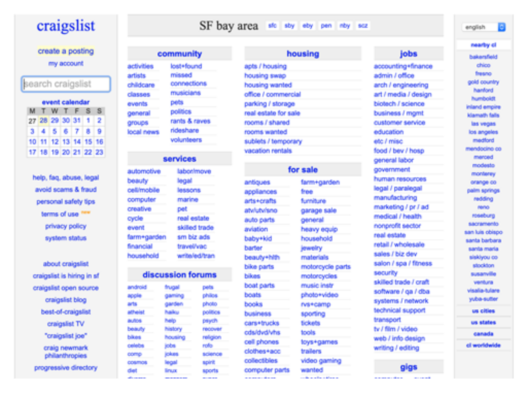
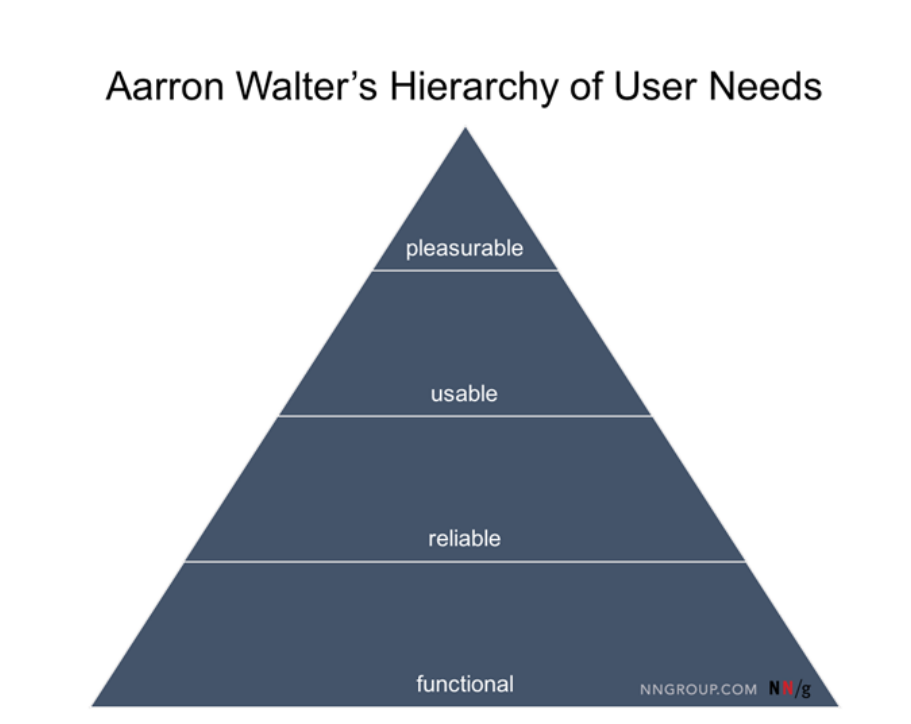

视觉设计是以增强设计或交互的方式实现文本、颜色和图像等设计内容，它与用户界面 (UI) 设计与平面设计等领域具有关联性。 

产品设计的首要目标是使界面可用，在使用过程中用户的眼睛应该被正确的信息和功能所吸引。为了实现这一点， 视觉设计师通过大小、颜色和负空间的使用来优先考虑页面上的内容。 一旦实现了这个目标，他们也可以在他们的应用程序设计中引入令人愉悦的元素，例如使 UI 更具吸引力的清晰插图的动画效果。

### 01.视觉设计元素 

数字产品中的任何页面或屏幕都可以分解为视觉外观的基本元素。 字体、线条、形状、颜色、纹理、体积和负空间是设计师使用的基本工具。 设计师的角色是将这些设计元素联系在一起，并从视觉角度构建最佳布局。

人们倾向于通过物体的基本形状来识别物体。单独使用线条，可以创建简单或复杂的对象。在下图中我们可能会看到一个输入表单，即使它只是一个简单的行的组合：

### 02.基本的视觉设计原则 

在上文中介绍了视觉设计元素描述了产品的美学效应，但设计原则可以告诉我们如何将这些元素结合使用以获得最佳效果。

如果要求视觉设计师定义最重要的设计原则，他们中的大多数会说“统一”。 统一是设计的基本原则，因为它是关于在页面中的所有元素之间创造一种和谐感。 设计缺乏统一性很容易导致混乱，并给与产品交互的人带来糟糕的视觉体验。

以下是需要考虑的一些重要的视觉设计原则：

**相似法则**

相似法则是格式塔原则的一部分，格式塔是一个德语单词，意思是“形状”或“形式”。 格式塔心理学由德国心理学家创立，专注于人们如何解读世界的研究，同时也建立了一些基本原则，称为“感知组织法则”。 这些原则描述我们感知世界的方式。人们倾向于感知所有部分的总和，而不是单个元素。因此，格式塔规则之一（相似法则）说，具有相似视觉外观的元素似乎更相关。

（相似法则：在此图像中，可能会将彩色圆圈的分组视为行，而不仅仅是单个圆圈的集合）

**对比**

视觉设计师使用对比使元素脱颖而出，可以通过操纵对象颜色的差异来创建对比度。当视觉设计师在网页上工作时，他们通常依靠对比色来为单个元素（例如号召性用语按钮）增加视觉重量。

（对比法则：将访问者的视线引向行动号召按钮“观看我们的品牌视频”）

**等级制度**

层次结构显示页面上各个元素的重要性。通常，设计人员通过更改单个对象的大小来创建层次结构。例如，页面的标题使用比单个部分的标题更大的字体。

（网站上的“关于”页面是使用文本和视觉元素创建的视觉层次结构的一个很好例子）

### 02.视觉设计与产品的成功 

如果视觉设计对于产品来说非常重要，我们该如何解释像Craigslist这样的产品的成功？

Craigslist是一个免费自由平台，所有信息的发布都是自由和免费的，对于恶意信息的监控，网站主要倚赖的是客户的反馈。

该网站上没有图片，只有密密麻麻的文字，标着各种生活信息，是个巨大无比的网上分类广告加BBS的组合。Craigslist 虽然看上去颇为乏味，可是却是美国人最喜欢的网站之一。有人在这里卖掉自己的旧车，有人在这里租到中意的房子，有人在这里找到工作，还有人在这里找到女朋友。

视觉外观并不是此类产品的重中之重，但是很多人都在使用它们。在使用者的眼中，产品的工作方式与外观同样重要。正如“苹果之父”乔布斯曾经说过的那样，“设计不仅仅是它的外观和感觉，设计就是它的运作方式。

### 03.可用性与视觉设计：什么更重要？ 

数字产品最重要的事情之一是用户必须投入的时间来完成一项任务。用户界面的设计应该对最终用户来说是直观和可预测的。这样的界面可以帮助用户快速实现他们的目标。这就是为什么功能性、可靠性和可用性在用户需求金字塔中创建三个基本层的原因。

（用户需求金字塔很像马斯洛的层次结构，因为它能够定义产品必须满足的基本用户需求，然后才能满足更高级的需求。）

当用户体验设计师致力于可用性时，他们专注于使用户旅程尽可能顺利。当整体设计方向获得批准后，需要专注于使UI设计易于实用以及令人愉悦。因此，他们需要布置视觉元素的位置并遵循良好的视觉设计原则。

但是，如果我们跳过可用性步骤并直接进行愉悦的视觉设计，会发生什么？最有可能的是，我们最终会造成糟糕的用户体验。出色的视觉设计并不能挽救糟糕的体验，如果特性或功能构造不佳，即使是最吸引人的视觉外观也不能阻止用户离开产品。

## 视觉设计师如何创造积极的用户体验

良好的视觉设计可以通过让用户感觉更好来改善产品的整体用户体验。以下方法是视觉设计师如何运用他们的视觉技能来创造更好的用户体验：

**01.力求一致的设计 **

不一致性会让用户投入更多的时间和精力来学习如何使用产品，而无论产品多么漂亮，如果用户在使用过程中感到困惑，它很快在用户眼中就会变得“丑陋”。这就是为什么视觉设计不仅要让 UI 看起来漂亮，还要创造和使产品的整体美学保持一致。

**02.每个页面/屏幕上的清晰视觉层次结构**

视觉层次是我们如何在页面/屏幕上显示项目以及我们如何引起对它们的注意。清晰的视觉层次有助于传达信息并将用户的注意力集中在重要的操作上。这条规则在网页设计中更为重要，如果用户在我们的网站上找不到他们想要的东西，他们将离开并永远不会回来。

**03.测试视觉概念**

人是视觉动物。我们大多数人都根据我们所看到的来处理信息，我们对视觉效果反应强烈。因此，我们为视觉设计选择的图像和颜色会影响用户对产品的喜爱程度。但不要只是假设人们会喜欢你的设计，设计团队可以与用户一起测试，并根据用户行为衡量成功。越早测试，我们对设计决策就越有信心。因此，不要等待开发结束——使用原型来测试我们的设计决策。

**04.注意设计趋势** 

结合设计趋势可以使我们的视觉设计看起来对用户有吸引力。同时，评估你看到的每一个趋势并尝试预测什么将是持久的趋势，什么将很快过时是至关重要的。设计师们可能不想花费时间和精力过于频繁地改变自己的视觉风格。

- [https://mp.weixin.qq.com/s?__biz=MzI4MDA0NzQ5NA==&mid=2247487108&idx=1&sn=fc2d2546897a317668a56a6247e52acc&utm_source=tuicool&utm_medium=referral](https://mp.weixin.qq.com/s?__biz=MzI4MDA0NzQ5NA==&mid=2247487108&idx=1&sn=fc2d2546897a317668a56a6247e52acc&utm_source=tuicool&utm_medium=referral)