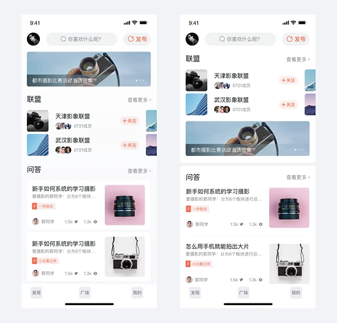

案例1: 个人中心

从提交的这张UI界面来分析，先看一下整体，我们利用模块覆盖法来将页面的内容区分一下：

我们发现顶部的内容在整体视觉上比较拥挤，并且信息比较散，所以我们要对顶部这块内容再拆分重组一下。这里他将数字部分内容整合到了左侧，但是这样会让左侧内容过于拥挤，而且右侧区域只有一个图标是达不到平衡的效果，虽然放了标签，但是标签和人的关联性还是差了一些，所以标签要么跟头像要么跟名字，而不要躲在角落里。

另外数字的字体使用也会有一种被挤扁的感受，这里不建议用这样很瘦的字体。并且这里其实他将点赞和收藏一起收了起来可能是因为左侧放不下了，那么我们直接就另一起一行放数字新信息即可。这样名字与头像和平衡对称，数字又可以水平平均铺开，这是一种常规的处理方法。

其次，整个版面白色区域较多，那么中间的开通会员卡片的色彩就过于重了，虽然我们需要引导用户去开通，但是视觉上给人感知太强烈，就感觉有点突兀。

个人中心其实更多的是展示与我相关的信息和内容，目前大部分产品的设计风格也都是以简洁为主，所以我们也尽可能的利用到这点。卡片插在中间是个不错的想法，但是一般我们在做UI设计的时候层级做出3层及3层以内即可，不要出现第四层。

3层指的是： 背景层、内容层、悬浮层/叠加层 ，如果一个界面中出现4层，会导致界面的层级过多，信息就较为复杂，所以这个界面中，收藏夹一栏的卡片是不需要加投影的，只需要图标加文字的上下排列即可。

接下去，下方的功能列表在浏览上效率过低，我们看到要浏览完这列信息我们视线需要折行，并且这些功能是不需要都放在页面下方去堆叠，其实顶部导航栏也是可以利用起来的，由于这是一款美食类的产品，用户很多时候也会在个人中心去搜索我创建的食谱、作品等内容，所以像搜索和消息可以直接放在导航栏，而设置和关于这些较低频的操作就可以合并起来，那么原来6行列表就变为了4行，那这四行内容我们可以直接用横向排列的形式去做了。

那么最后，如果要对界面做视觉上的优化，我们要对信息重新排版、图标进行重新设计，在原图中我觉得底部中间的图标还是具有品牌特征的，那么我们就把这个品牌特征拿过来，作为一个辅助图形，这个辅助图形就可以用在小标签和卡片背景的修饰中。

很多新人设计师在做UI界面的时候就会不知道应该放什么信息上去。所以要明白的是这个信息能告诉用户什么，用户能通过这个信息判断什么，用户的浏览顺序和重点在哪里？

好了，再强调一遍，当你设计完一个UI界面的时候，先问一下自己这4个问题：

- 这个界面告诉用户哪些信息
- 用户能否通过这些信息判断自己是否要继续任务流程
- 界面的浏览顺序是怎样的
- 信息展示的重点和次要点是否展示合理

接下来讲两个案例：

案例2: pc端迁移移动端案例

第一次从pc端迁移过来的同学会有这几个问题，同样的界面信息和内容如果要完全保留的迁移到移动端应该怎么设计，一个界面放不了那么多内容。比如我们先来看这个这个卡片列表：

这个列表的信息很有pc端的特点，这位同学其实是有意识的将重要信息强化了，但是pc端到移动端我们是可以 简化很多信息和细节的，另外在用户浏览的路径上也会有不同。

那我们看到这个卡片中的信息，从上往下依次浏览好像并没有问题，但就是因为没有问题，这才是问题。类似这样的信息卡片，其实如果按照这样排，那么用户就会浏览完所有信息再做决策，而我们知道的是 并不是所有信息都需要让用户去关注到 ，例如最终要的是标题、状态和查看轨迹，而不重要的是工单和创建时间。

怎么判断重不重要呢？一个是用户查看和操作的频率，另外就是业务侧的侧重点。这边为了隐藏一些敏感信息某些文案就处理了一下，大家可以看一下我们方案的前后对比。

这里没有删减任何信息，因为确实在业务方面需要某些信息， 但是像“创建时间”“查看轨迹”“当前状态”这些是没有必要的文案就可以省略。而卡片的状态一般在移动端上会放在右上角显示，并且在移动端中不需要加图标做修饰。

在原来的卡片中，如果我们要根据创建时间去找的话， 因为工单、创建、状态3行文字有点类似，所以会导致寻找效率不高，那么我们就讲工单还有时间分开放置， 在滚动浏览的时候可以更好的寻找。

而查看轨迹按钮我还是去掉了，考虑到的既然这里是轨迹轨迹订单列表那么用户就知道进来是要查看轨迹的，所以不需要全部在卡片中给按钮，这个也是web和移动端的区别， 移动端的卡片是可以整体点击的，就和电商的订单列表、提现记录等卡片列表一样的都可以点进详情，而web中的卡片则不行 ，所以用户在这里反正需要点击一次，那么这里就不需要给一个轨迹按钮，还显得更复杂。

再来讲个案例，相信很多同学在pc端的b端设计中遇到过这样的问题， 就是很多表格类的信息在web端可以一屏放下，到移动端就放不下了，那该怎么去做。 其实如果你们可以去参考阿里云的app，类似于这样pc端b端的移植到移动端来说，也只能部分移植。

因为移动端的导航太有限了，像pc端左侧和顶部的筛选控件可以放多层联动，并且横向可以展开更多的标签，但是移动端横线太受限了，大家可以看一下如果我们真的要整体迁移的话就会变成以下这样的情况，但是移动端的核心的方便快捷，并不适合那么复杂的内容在一个界面去进行交互流转，所以左侧纵向tab导航不会出现下拉展开的二级联动。

所以大家几乎没有看到过最后那样的终极形态，因为实在太复杂了，但是如果讲左侧的纵向导航去掉的话其实还是可以看一下。在这个表格中横向的筛选元素很多，那么就通过滑动或者点击来获取更多标签和表格内容，另外标签可以做排序但不能做展开筛选，类似的形式可以参考下汽车之家或者汽车配置界面。

案例3: 图文列表优化

这是一个比较典型的图文布局案例，需要注意的是很多小的细节，整体来看页面上半部分有效信息太少。什么是有效信息就和上文我们提到的4点是一样的，如果你的界面只是为了展示好看的图片和简单的标题来排版，那么这个界面一定是无效的。如下：

然后底部的左文右图区域的信息又比较密集，和上半部分形成了一个明显的反差。另外加上一些小细节的处理不到位：卡片投影太短太深，圆角不够统一，文字行间距不合理，功能位置摆放不合理，这样整体就感觉到很多瑕疵。另外如果只是自己做练习那么图片可以选择的更美观一些，而不需要收到产品业务的限制，那么我们花10分钟来重新调整一下整体的布局和优化一些细节。

- [https://www.tuicool.com/articles/fay2Uj7](https://www.tuicool.com/articles/fay2Uj7)