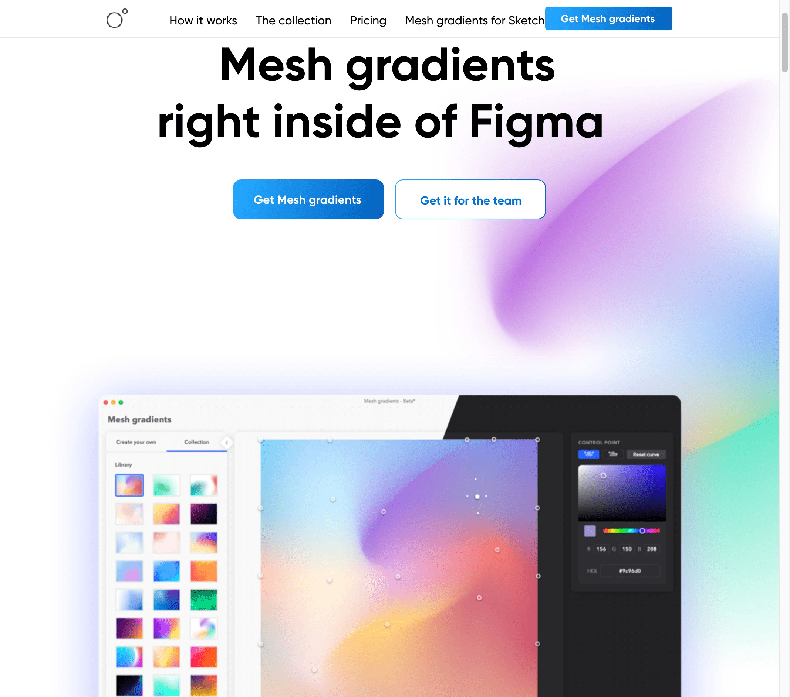
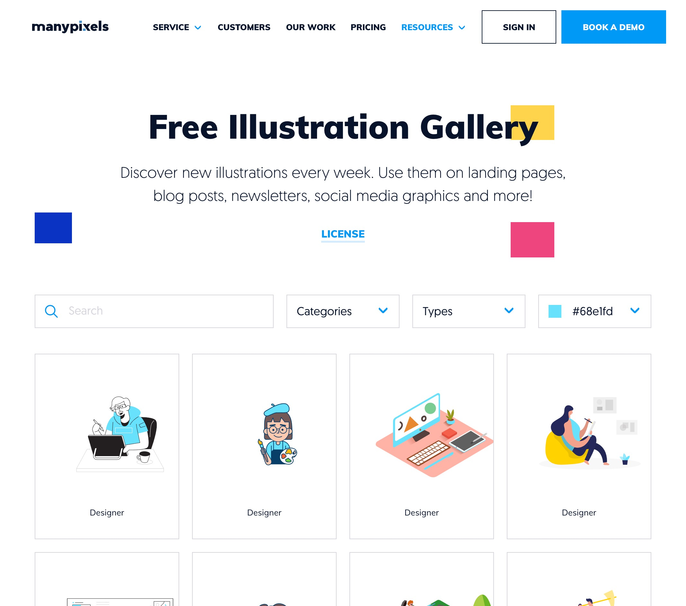
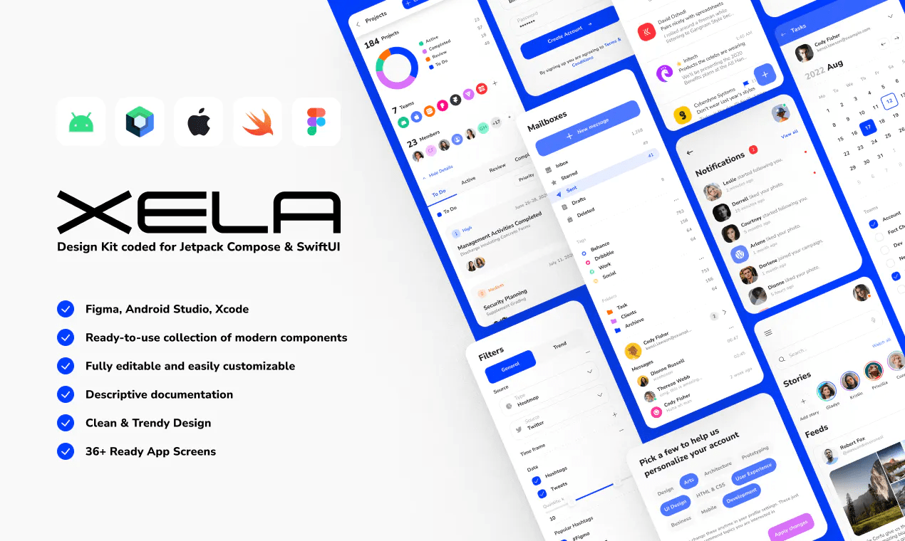
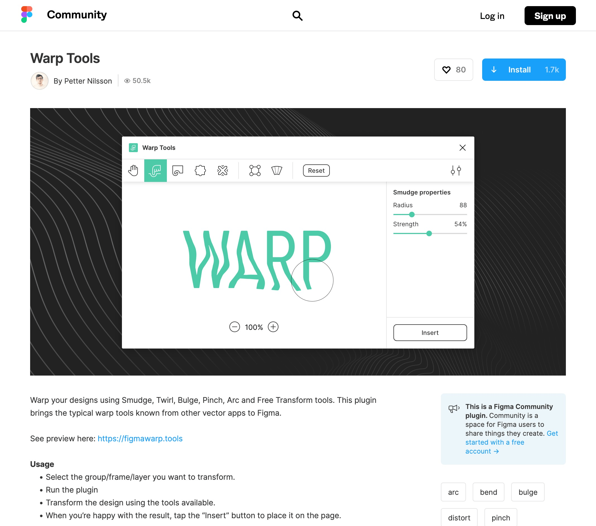
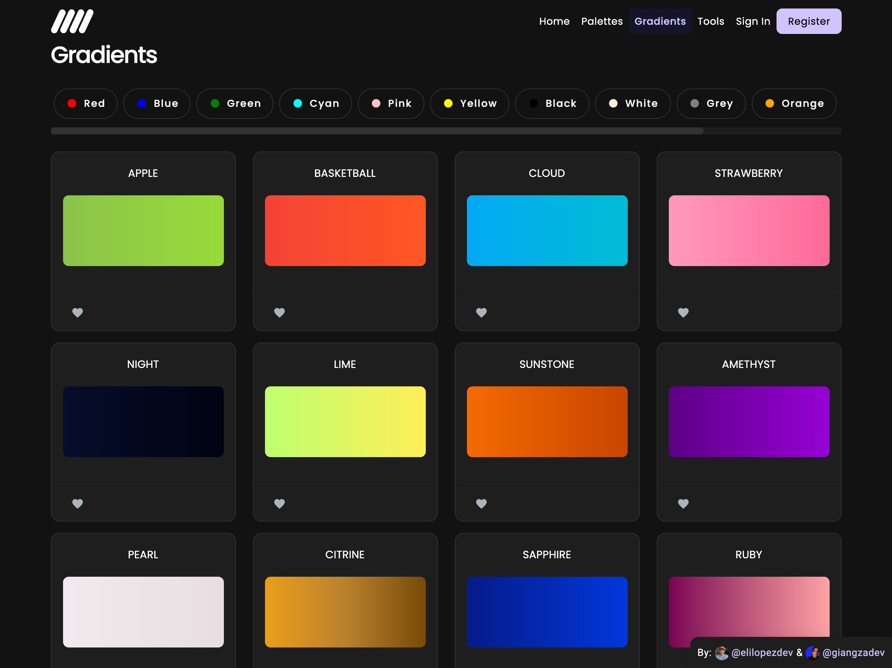
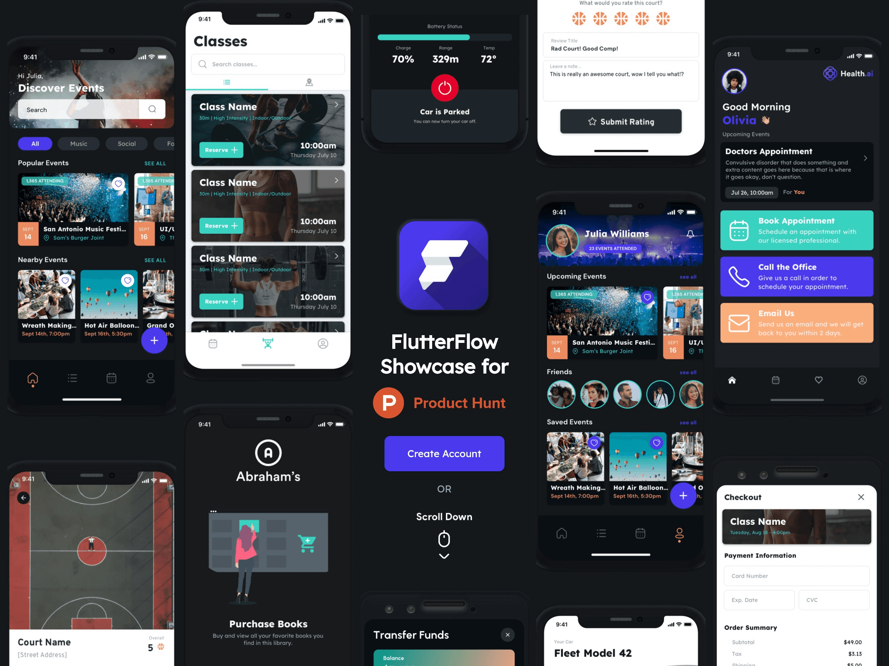
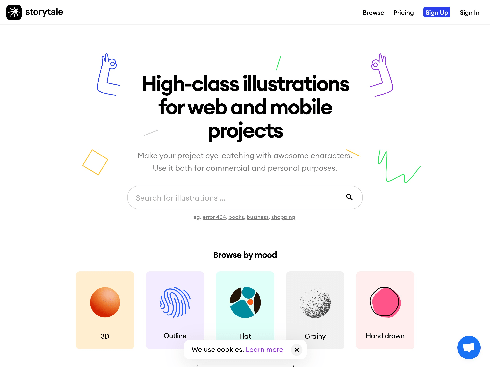
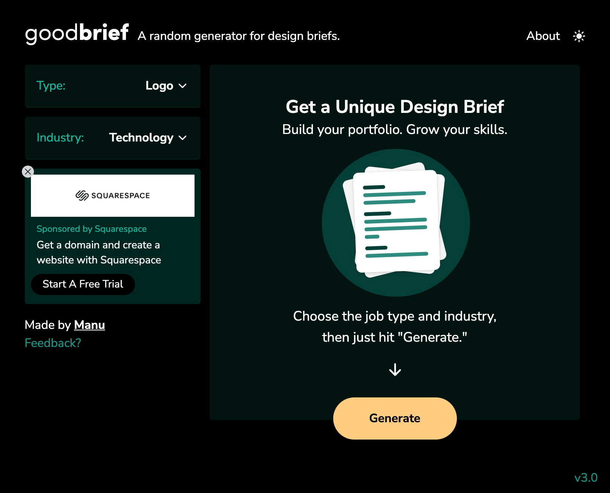
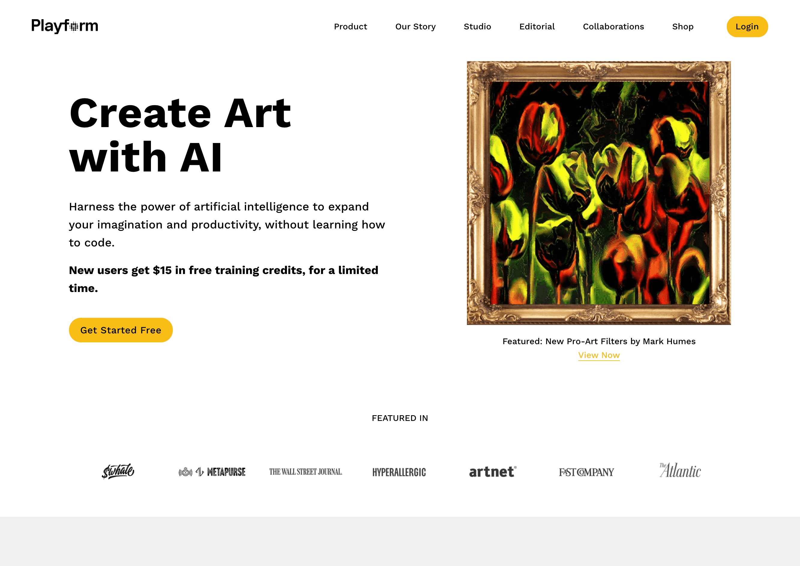

### 1、超强的弥散渐变 Figma 插件

[https://www.meshgradients.com/figma](https://www.meshgradients.com/figma)

弥散渐变大概是今年最好用最出效果的一种视觉设计趋势，这个名为 Mesh Gradients 的 Figma 插件能够极为轻松地创建出色彩丰富但是足够和谐的弥散渐变效果，而且它本身就自带大量的预设的渐变效果，可以基于这些现有的渐变效果来调整，达到你想要的视觉效果！

### 2、免费插画库 Manypixels

[https://www.manypixels.co/](https://www.manypixels.co/)

如果你正在寻找免费可商用的矢量插画，那么你可以来 Manypixels 找找看！这是一个每周更新的免费插画图库，这些插画大都是矢量的，并且每一幅都有着明确的主题，帮你确定可以用在哪些场合，这些插画都具有相当装饰性的小插画，特别适合拿来丰富 UI 界面和 H5或者网页。你可以从图库当中直接下载到 SVG 格式和 PNG 格式的文件，完全免费！

### 3、用户界面组件 XELA

[https://xelaui.com/](https://xelaui.com/)

这不仅是给设计师的一套工具，还是为开发人员所准备的，XELA Design Kit 提供完整的 UI 功能组件，还提供完整的可以自定义的功能和相应的代码，可以帮开发者和设计师快速搭建 iOS 和 Android 平台的本地应用，可以真正意义上无缝对接到正在研发的产品当中，实用性超强。

### 4、Figma 中的超强变形插件
[https://www.figma.com/community/plugin/1021499620946646699](https://www.figma.com/community/plugin/1021499620946646699)

没错，这是一个用来补全 Figma 功能的优质插件，它将我们在 PS 和 AI 中习惯的各种形变工具都迁移到 Figma 当中，将 Figma 这方面的短板都给填补上了。

### 5、渐变配色工具 Colorffy 2.0

[https://colorffy.com/](https://colorffy.com/)

Colorffy 也是一个新晋的渐变类配色工具，它同样是主要针对各种微妙的渐变色进行探索，以预设的一部分渐变色作为基底，进行更加深入的探索和发现，然后你可以将他们应用在自己的各种设计项目当中。

### 6、APP生成平台Flutterflow
[https://ph.flutterflow.io/](https://ph.flutterflow.io/)

你不需要懂得太多的编程知识，就可以借助 FlutterFlow 构建出一个原生的移动 APP，对于有一点代码基础的设计师而言是个福利。新出的 2.0 版当中，添加了地图、搜索、有推送通知，动画以及一键盘部署 APP Store 等功能，导出的代码也非常的干净。

### 7、独特插画平台 Storytale
[https://storytale.io/](https://storytale.io/)

Storytale 是一个全新的高素质插画内容平台，是付费订阅的模式，但是能够提供很多其他的插画图库所不具备的一些比较独特的插画作品，预算充足的设计项目可以试试这里的插画作品。

### 8、创意练习工具 GoodBrief
[https://goodbrief.io/](https://goodbrief.io/)

GoodBrife 其实是一个非常实用的设计需求简报生成工具，它能够根据一些常见的设计需求来生成简报，供你进行设计练习，你可以借此提升技能，构建属于你自己的作品集。

### 9、艺术作品机器学习平台 Playform
[https://www.playform.io/](https://www.playform.io/)

这是一个非常值得尝试的新工具，你可以借助这个平台来训练艺术作品，无需代码知识，可以无门槛地训练AI，让它基于已有的艺术作品，生成更多贴合你所需风格的艺术作品！