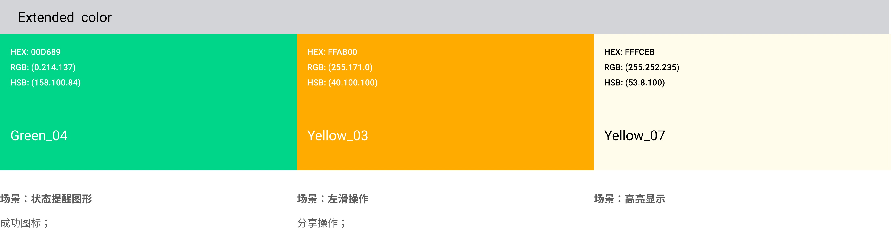
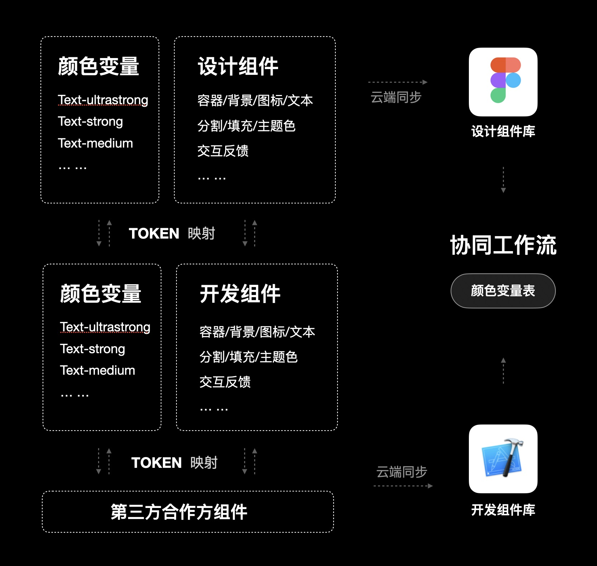

在设计系统的实际运行中，我们也需要着眼于如何应用调色板，建设协同工作流，并给各个角色提供有关色彩的扩展指导，以达到在腾讯文档中构建一致且有品牌感的数字界面并有效提升效率的目的。

在建设腾讯文档色彩系统的工作中，我们首先构建了一个包含品牌色、灰色、辅助色的调色板，但仅有这个调色板不足以支撑我们流畅、无障碍的协同工作。日常工作中，“这里我用哪个蓝色？”“这里我用哪个灰色？”“开发同学能否快速的变更某些元素的颜色？”等等问题层出不穷，建设系统的协同工作流迫在眉睫。

### 如何建设？
HIG 强调不要在 APP 中使用“硬代码”，即十六进制色值进行编码，但前期我们构建的调色板仅有色值，这种硬代码应用到 app 中导致项目效率低下，维护也会成本激增。

于是在腾讯文档中，我们开始采用颜色变量（color token）和主题（theme）来管理颜色，颜色变量（color token）基于任务（role）、主题（theme），为 UI 中的任务指定十六进制代码的色值（hex value），以弭平设计师之间、开发与设计师之间的沟壑，将颜色变量（color token）嵌入设计组件中与开发代码形成联动，便于开发利用程序中的变量来做全局修改，横向提升团队的协作效率。

所谓颜色变量，通俗的意思就是可以将一个颜色按任务用途去抽象，抽象成一个有命名的颜色样式，这个颜色样式就是颜色变量。

在设计或者代码中，可以通过修改这个颜色变量的值来进行全局颜色的更新。例如，我们现在需要给 button 一个颜色，不要将其写为 #1E6FFF 这样的色值，而是将 button 的颜色指定为命名是 Fill-01 的颜色变量， 如果有重大版本更新，仅需将颜色变量 Fill-01 的色值更新，即可实现全局颜色的高效更新。如果在不同的主题下（例如浅色/深色模式）button 有不同的颜色表现，颜色变量 Fill-01 可以在不同主题下，映射不同的十六进制色值。这就是我们建设协同工作流的的基础逻辑。

### 为调色板的基础色值命名
调色板的各个色值（hex value）是最底层的基础样式，我们将色板上的颜色进行规则化命名，以方便后期将其引用到颜色变量中。

腾讯文档包含核心蓝色、蓝灰色、中性灰色及其他辅助色，按照颜色属性，将其命名为：Primayblue、Gray、Grayblue、Purple、Indigoblue、Acidblue、Cyan、Greenblue、Yellow、Orange、Red，并在命名中加入色阶后缀。

### 定义颜色使用规则
1. 从调色板中选择合适的颜色并测试

从调色板中根据 UI 中的任务挑选合适的颜色并进行可用性测试，做具体任务中颜色选择的最优解。

腾讯文档的界面中，灰色系列占主导地位，起着至关重要的作用，为产品界面创造结构、表达边界、建立信息层次。在调色板中，我们选择了两种灰色：中性灰色和蓝灰色，来支撑系统的设计。蓝色系列是腾讯文档产品和体验的主要动作颜色。

例如，我们需要选择一个蓝色作为链接色，作为文本，对比度必须达到 4.5:1 以上才符合 WCAG2.0 的可用性标准。经过测试我们选择了 primayblue-02 作为链接色。

同时我们也使用了其他颜色以满足一些冲突性任务（警示等）的颜色使用，这些颜色需要谨慎、有目的地使用。

2. 根据任务定义颜色的使用规则

经常会有设计师问，“这里我能用这个灰色吗？”出现这种问题，根本上还是颜色使用规则定义的不够清晰，含混的口口相传的规则会导致更多的混乱。于是，需要我们根据任务和使用场景把颜色的使用规则清晰的定义。

首先定义在界面中占主导地位的灰色、蓝色的使用规则。

蓝灰色_Grayblue：

在腾讯文档中，蓝灰色与品牌蓝共同建立品牌印象，由此，蓝灰色主要应用于与风格相关的场景。包括：图标色、填充底色及大面积的背景色等。

中性灰色_Gray：

中性灰色主要应用于一些全局系统行为。如：文本、分割线及交互反馈 hover、press 等场景。

品牌蓝色_Primayblue：

品牌蓝色主要应用于系统中的各种行为，如蓝色图标、button、文本链接等。

其次定义在界面中用于警示、状态提醒的其他颜色的使用规则。

红色_Red：

红色主要应用于系统中需要警示的场景，如红色警示图形、错误文本、红色 tag 等。

其他颜色：

在腾讯文档中，会针对不同的任务应用不同的颜色，如左滑操作、成功提示、高亮显示等。

品类图标基准色：

在腾讯文档中，不同的品类有不同的基准色。

### 颜色变量的语义化命名
定义了颜色在系统设计中的使用规则后，我们需要根据颜色变量的使用用途对其进行语义化命名。一套好的语义化命名规则需要易于维护且具备可拓展性，如果只是将调色板的色值命名为 blue-01、blue-02… ，语义化的收益并不明显。哪天设计团队需要调整品牌风格，或是苹果又掀起什么新潮流，把所有命名为 blue_x 的变量改为 gradient_serenity， 对于开发来说也是巨大的灾难。

根据 HIG 的建议，语义化命名不应该描述外观或者色值，而是指明这个颜色的任务用途——标签 Labels，分割线 Sepatators 或者填充 Fill。

在思考如何赋予颜色语义化的命名时，设计师也需要用更概括和结构化的视角来看待界面设计，同时也需与开发同学达成一致，使用同样的命名，满足以更好地维护一套收敛和统一的设计语言。

在腾讯文档中，颜色的任务用途定义为为以下几种：背景色 Background、文本色 Text、图标色 Icon、分割线 Border、透明填充 Transparent fill、实色填充 Opaque fill、默认交互反馈 Feedback、语义 Intent。统一使用 ultrastrong、strong、medium、weak、ultraweak 作为后缀来表达颜色强度。在需要更明确的用途说明的任务中，直接描述其用途，例如：hover，pressed、disabled 等。

### 建设团队协同工作流
以上种种，最终目的在于建设团队的协同工作流，将颜色变量（color token）嵌入设计组件中与开发代码形成联动，便于设计利用变量及组件、开发利用程序中的变量来做全局修改，横向提升团队的协作效率。

1. 设计内协同：在 Figma 中生成颜色变量

在设计系统中，颜色变量属于底层的设计原子，需要将其生成为颜色变量并嵌入到设计组件中，便于设计内部使用。我们将已根据任务用途命名的色值，生成 figma 中的颜色样式（color style），后续无论是进行组件的设计，还是项目的设计，都可以直接赋予设计元素明确的颜色样式。

2. 设计组件与开发代码联动：利用颜色变量表进行信息同步

我们生成了一个面向内部、外部的颜色变量表，进行颜色变量的说明和信息的同步，沉淀落到实处的资料文档。（此处推荐使用腾讯文档，多人协作实时沟通～）

最终形成了设计组件库与开发组件库的联动，构建了一个协同工作流，横向提升工作效率。

[https://www.uisdc.com/tencentdocs-colors-2](https://www.uisdc.com/tencentdocs-colors-2)

