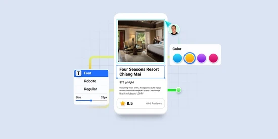
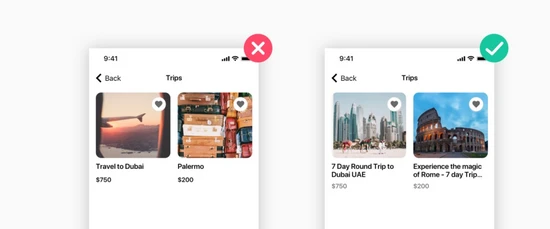
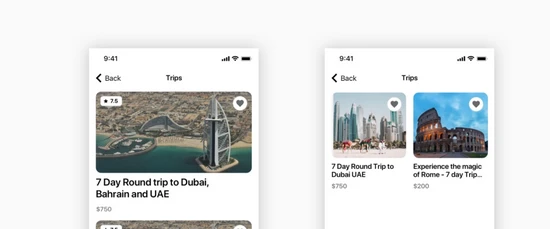
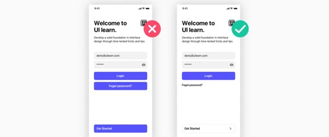
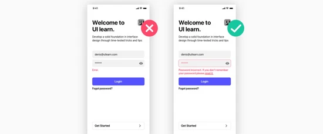
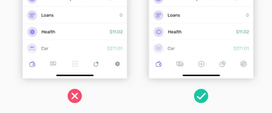
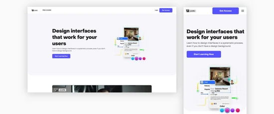
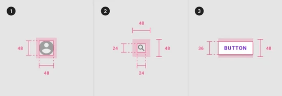

说到创造高质量的产品，所有的小细节都至关重要。‍

很多人争论什么更重要，是好的用户体验还是好的用户界面呢？我总是倾向于说 —— 两者兼而有之。如果其中某一个失败，你就不能对你的用户产生影响。然而，用户通常不会考虑用户体验是什么，而是根据产品的外观来评价产品。

### 忽略范围/规划不当
如果你想提高技能，设计一些是最终展示形态的产品。它实际上会展示什么图像，标题会有多长？完美的设计一旦被真正的内容填满，就会被打破。

具体来说，在开始进行 UI 设计之前，你需要知道页面的每个部分都会显示哪些内容。还需要知道内容尺寸的最大最小值。这些转折点被称为边缘情况，因为它们显示了界面何时以及如何变化。

**1. 选择图片**

还需要了解图像限制。如果客户没有任何自定义图片或不打算购买任何自定义照片，那么使用 Unsplash 提供的漂亮但毫无意义的照片是没有任何作用的。

为什么？照片往往是概念性的，使用漂亮的东西是不够的。相反，你需要选择创建叙事性更强的或更深层含义的图像。

无论做什么，不要使用不需要的照片。如今，人们被海量的信息淹没了。额外一点无用的视觉信息只会让他们恼火。

**2. 了解重复模块**

另一个极端情况与重复模块有关，例如，图像 + 文本、图标 + 文本、数字 + 文本等。应该考虑这些模块在两行文本和十行文本时的外观展示，以及它们是否会一一排列。

对于描述特征的小文本模块，可以轻松使用三栏布局。但是，如果有超过 5 行的文本，并且需要全部显示而不使用省略号省略，则必须想出另一种视觉解决方案。为什么？因为阅读长栏文本只对报纸有好处，对 Web 浏览不方便。解决方案可能包括使用水平滚动或两列布局。

**3. 规划扩展性**

了解内容的边缘情况将帮助你更有效地使用屏幕空间并为界面的每个部分选择正确的 UI 解决方案。但请记住，边缘情况不仅与你目前所看到的有关，一个好的设计师应该主动思考，考虑到客户将来可能需要扩展 UI 的可能性。

主次行动按钮没有区别

使用应用程序时，用户可以完成许多操作。重要的是对主要行动按钮给予视觉上的引导性。所有的导航都是通过按钮来实现的，所以你必须让用户更容易识别主要的按钮，让它们变得突出。如果用户正在寻找辅助动作，则辅助动作应该不那么突出，但仍然可见。

以下是区分主要和次要按钮的方法：

- 对主要和次要按钮使用不同的视觉权重。具有最强视觉权重的按钮将获得更多关注。
- 所以使用强烈的颜色、粗体文本和大小来为主要按钮赋予视觉重量。对次要动作做相反的事情。

### 令人沮丧的错误状态
在设计用户界面时，不要忘记任何用户界面的主要目的：在用户和服务之间提供尽可能流畅的交互。界面不允许存疑、没有答案的问题或任何类型的不确定性。

设计者应该向用户提供关于状态的明确反馈，特别是在错误状态的情况下。因此，错误通知应满足以下简单规则：

- 它们应该是可识别和引人注目的（例如，红色是表示错误的常见 UI 模式）。
- 他们应该清楚地解释发生了什么以及用户如何修复错误。
- 它们应该是与上下文相关的。最好在与它们相关的元素附近显示错误消息。
- 他们不应该有刺激性。明确用户是否已经被错误激怒了

设计人员还应注意意外错误（例如服务器错误、找不到页面）。任何错误消息都是用户流程的障碍。这就是为什么我们需要帮助用户处理它，提供任何可能的解决方案，并尝试消除这些糟糕的体验 —— 特别是非用户产生的错误。例如，一个好的解决方案可能是为 404 和 500 页设计插图或动画。

**1. 仔细设计表单校验**

在设计错误状态时，尽量不要惹恼你的用户。尤其要小心所有可能的表单校验规则。

例如，假设一个带有必填字段的表单。这意味着开发人员有一个相应的校验逻辑：“所有必填字段都不应该为空。” 假设用户尝试以随机顺序填写表单，当第一个必填字段失去焦点状态时，它返回一个错误：“请填写此字段。这是必填的！”

我们的用户惊呼，“等等，我只是在表单字段之间点击，还没有点击‘提交’！” 事情甚至可能变得更糟。例如，假设你有另一个表单需要填写，“提交” 按钮将被禁用，直到所有必填字段不再为空。

想一想，用户什么也没做，也无法提交表单，但你已经将几个错误归咎于他。这肯定会让用户感到不愉快，所以最好避免这种情况。

### 没有对齐
我承认，我是一个对齐狂。但这仅仅是因为一旦你发现了调整对齐的力量，就会意识到这是让布局看起来漂亮和平衡的关键。

许多设计师认为使用网格会限制创造力，在某种程度上，确实如此。但是，如果你作为 UI 设计师新手，我认为有必要在打破规则之前先学习这些规则。适当的填充和间距使布局看起来干净有序，同时使读者更容易阅读和理解信息。

应在不同模块周围设置相同大小的空间（例如，在顶部和底部，以及在左侧和右侧）。如果空间不均匀，页面看起来会很乱，用户可能不会对每个部分给予同等的考虑。

填充太小意味着用户无法将内容分解为不同模块。为了防止各模块混合在一起，请将其分开并在它们之间插入一个大空间。

维护视觉层次结构的一种简单方法是遵循以下简单规则：不同逻辑块之间的填充应该大于每个块内部标题和文本之间的填充。例如，假设有一个包含标题、副标题和段落的长文本模块：

- 将标题 padding-bottom 设置为 40px，然后跟随一段文本。
- 将段落 padding-bottom 设置为 10px。
- 如果段落后有小标题，padding-top 30px（即段落与小标题顶部的间距为 30px），padding-bottom 为 20px（即小标题底部与段落之间的间距将是 20px，这大于段落之间的空间）。

这将把重点放在最重要和最大的元素上。最大的文本 —— 标题 —— 周围有更大的空间。但是这个空间应该更接近它后面的相关元素。

### 低对比度
设计一个产品类似于建造一座公共建筑，比如图书馆或学校 —— 它需要包容所有人。这包括盲人、色盲和视障用户。

问问 Domino，因为无法访问该公司的网站，他们被一个盲人起诉。不要像 Domino 那样，要为可访问性而设计。

通常，我们试图设计看起来不错的东西，而忽略了将与我们的产品进行交互的各类用户。我作为设计师日渐成熟，已经接受了所有会破坏设计师对完美想法的各种限制。ADA 合规性就是此类限制之一。

将文本缩小到 8 像素，因为它更适合我们的水平空间，或者使用浅灰色，因为它看起来不错，这却忽略了我们视力受损的访客。当我们试图为 Dribbble 点赞时，我们可以避免这种情况，但在为真人开发产品时，这不是一个好习惯。Web 内容可访问性指南（WCAG）要求对比度至少为 4.5:1。还有针对运动、听觉和认知障碍的指南。

**1. 使用空白**

也就是说，如果将两个完全不同的元素彼此靠得很近，用户将无法理解哪个元素是 “主要” 元素。这就是为什么我们可以说对比不仅仅是将不同的视觉风格应用到元素上，而且是关于使用留白的艺术。这是因为，有时为了使元素形成对比，需要用空格分隔它们。

留白对于让用户轻松阅读内容很重要。当然，如果有太多的空白或将太多的内容塞进一个小区域时，空白可能会被不当使用。许多广告过多的网站也缺乏足够的空白空间。

**2. 确保文本和图像之间有足够的对比度**

避免放置在图像上的文本副本的对比度低。文字和背景之间应该有足够的对比度。要使副本突出，请在图像上放置对比过滤器。黑色是一种流行的颜色，但你也可以使用明亮的颜色，将它们混合搭配。

另一种选择是从一开始就使用对比图像。在这种情况下，你可以将副本放在照片或图像的暗部之上。

### 糟糕的图标
当你需要通过小符号表达含义或简要说明描述时，图标非常有用。它们也是现代界面的基本组成部分，尤其是在移动设备上。

在应用程序中，图标通常相当于按钮。可以看看 Instagram：你只会看到图标和文本。

这就是为什么选择正确的视觉图像以对应元素的含义非常重要。听起来很简单，对吧？不。找到合适的图标非常痛苦，但这就是我介绍这一点的原因。

你需要使用每个人都可以理解的极其简单和常见的图像来讲述故事，并且需要将这些图标与 UI 的整体风格相匹配。然后，你需要将它们以 SVG 格式提供给开发人员。

也许你已经搜索过免费图标，当为每个元素找到一个漂亮的图像时，你会很兴奋。你想，它们彼此之间是多么完美的对应！他们将被每个人理解！可悲的是，不知何故，你选择的图标集的整体印象感觉相当凌乱和不整洁。怎么能避免这种混乱？这里有一份简短的清单供你参考：

- 线宽 —— 调整大小后，所有图标的线宽都应该相等。否则，用户将会很明显看出差别。
- 角半径 —— 如果图标包含一些矩形形状，请比较你集合中每个图标的角半径。如果不同的图标不一样，最好修复它。
- 线帽形状（用于轮廓图标）—— 它可以是矩形或圆形。
- 角连接形状（用于轮廓图标）—— 它可以是矩形或圆形。

确实，不熟练的用户可能不会特别注意到不同的线宽或圆角半径。尽管如此，总体印象还是会出错，用户会感觉到。

换句话说，虽然使用免费图标没有错，但使用免费图标会使项目看起来很廉价，而且在某些情况下，显得不太专业。此外，还有许多免费图标可被人们立即识别。为什么？他们已经看到它们被使用在任何地方。

这就是为什么我的建议是严格选择免费图标，或者更好的做法是自己去设计图标。自定义图标始终提供卓越的体验。

### 未考虑跨平台情况
是的，理想情况下，这在当今世界不应再成为问题。我们都知道大多数用户从移动设备访问 Web 服务。不幸的是，许多设计师仍然倾向于忘记这一事实。（或者可能是客户不想花钱来创建移动优化的设计？）

然而，对于设计专业人士来说，不应该出现不针对多个设备进行优化的问题。在创建 UI 时，应该始终牢记广受赞誉的 “移动端优先” 方法。

专注于每种类型的用户将在每个页面上看到的内容。然后，问问自己，“我选择的用于显示此特定内容的 UI 控件是否方便？”

你可以选择一个很好的 UI 元素，它可以在桌面设备上完美运行，但它对智能手机用户来说不是很好。或相反亦然。这就是为什么始终牢记必须为当今设计的各种设备很重要的原因。

**1. 触控区域太小**

小的触摸区域令人沮丧，因为它们会使用户难以完成他们想要的操作。我们都经历过在智能手机上点击错误按钮而不得不等待加载错误屏幕的挫败感！

因此，在设计可点击元素时，请记住为用户配备不同大小的手指触控区域：

- 记住成人食指的平均宽度为 1.6 到 2 厘米，从而创建手指友好的目标。
- 让你的触摸目标至少有 45-57 像素宽。这将为 用户提供足够的空间来击中目标，而不必担心准确性。

