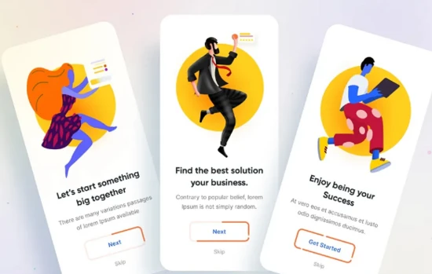

**区分重点**

若屏幕元素各自的功能不同，它们的外观理应也不同。反之，若功能相同或相近，则它们看起来就应该是一样的。为了保持一致性，新手设计师常常对应该加以区分的元素采用相同的视觉处理效果，其实采用不同的视觉效果才是最合适的。

**清晰度是首要工作**

清晰度是界面设计中的第一步也是最重要的工作。如果想使设计的界面有效并被人喜欢，首先必须让用户能够识别它并让用户知道为什么使用它。例如：用户在使用时，能够预料到发生什么，并成功地与它交互。有的界面设计得不是太清晰虽然可以满足用户一时的需求，但并不是长久之计，而清晰的界面能够吸引用户不断地重复使用。

**界面是为促进交互而存在的**

界面的存在，促进了用户和设计师之间的互动。优秀的界面不但能够提高做事效率，还能够加强设计师与这个世界的联动，让界面处在用户的掌控之中，人类通常对能够掌控自己和周围的环境而感到舒心。

不考虑用户感受的软件往往会让这种舒适感降低，迫使用户不得不进入计划外的交互，这会让用户感觉不舒服。保证界面处在用户的掌控之中，让用户自己决定系统状态，稍加引导，就会达到预期的目标。

**直接操作的感觉是最好的**

只有在能够直接操作物体时，用户的感觉才是最棒的，但这并不太容易实现，因为在界面设计时，增加的图标常常并不是必须的，比如：过多地使用按钮、图形选项、附件等其他繁琐的东西。在进行界面设计时，应尽可能多地了解一些人类自然手势。理想情况下，界面设计要简洁，让用户有一个直接操作的感觉。

**每个屏幕都需要一个主题**

设计的每一个画面都应该有单一的主题，这样不仅可以让用户了解其真正的价值，也使得用户上手容易，如果一个屏幕支持两个或两个以上的主题，就会让整个界面看起来混乱不堪。

**界面的存在必须有所用途**

在大多数设计领域，界面设计成功的标志就是有用户使用它。比如：一把漂亮的椅子，虽然精美但坐着不舒服，那么用户就不会使用它，它就属于失败的设计。因此，界面设计不仅仅是设计一个使用环境，还应是设计一个值得使用的艺术品。界面设计仅仅满足其设计师的虚荣心是不够的，它必须要实用。

**勿让次要动作喧宾夺主**

每个屏幕有一个主要动作的同时，也要有多个次要动作，但尽可能不要让它们喧宾夺主。在设计界面的时候，尽量减弱次要动作的视觉冲击力，或让次要动作在主要动作完成后再显示出来。

**自然过渡**

界面的交互都是环环相扣的，因此设计时要考虑交互的下一步，并通过设计将其实现。这就如同日常谈话要为深入交谈提供话题。当用户已经完成要执行的步骤后，就要给他们自然而然继续下去的方法，以达成目标。

**尊重用户的注意力**

在进行界面设计时，吸引用户的注意力是非常关键的，所以千万不要将应用的周围设计得乱七八糟，分散用户的注意力，谨记屏幕整洁才能够吸引注意力。如果非要显示广告，就应在用户阅读完毕之后再显示。尊重用户的注意力，不仅让用户快乐，也会使广告效果更佳。所以要想设计好的界面，尊重用户的注意力是先决。

**外观追随功能**

人总是对符合期望的行为最感舒适当其他人、动物、事物或软件的行为始终符合期望时，就会感到与之关系良好。这也是与人打交道的设计应该做到的。在实践中，这意味着用户只要看一眼即可知道接下来将会有什么动作发生。设计师不要在基本的交互问题上耍小聪明，要在更高层次的问题上发挥创造力。

如果要让屏幕的视觉元素具有清晰的浏览次序，就应该通过强烈的视觉层次感来实现，也就是说，如果用户每次都按照同样的顺序浏览相同的东西，视觉层次感不明显，用户不清楚停留的重点位置,只会让用户感到一团糟。

在不断变更设计的情况下，很难保持明确的层次关系，因为所有的元素层次关系都是相对的，如果所有的元素均突出显示，最后就相当于没有重点可言。如果想添加个需要特别突出的元素，为了再次实现明确的视觉层次，设计师可能需要重新考虑每一个元素的视觉重量。