### 1. 布局
通过硬件设备信息可以得到可视化的设计尺寸，基于尺寸新建设计画布后，第一件事就需考虑页面的整体布局。可视化大屏设计从信息布局到数据表达，都需要设计师对业务深入了解后才能用数据助力业务决策。

常见的大屏布局：居中结构、左右结构两种常见的布局形式以常规的 16：9 模板为例，下面列举的一些常见的布局形式，供大家参考。

居中结构

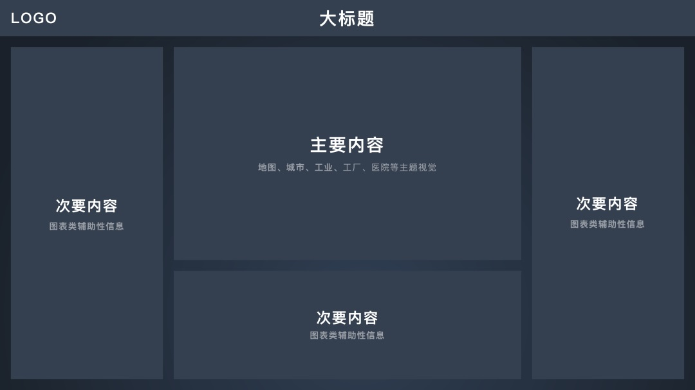

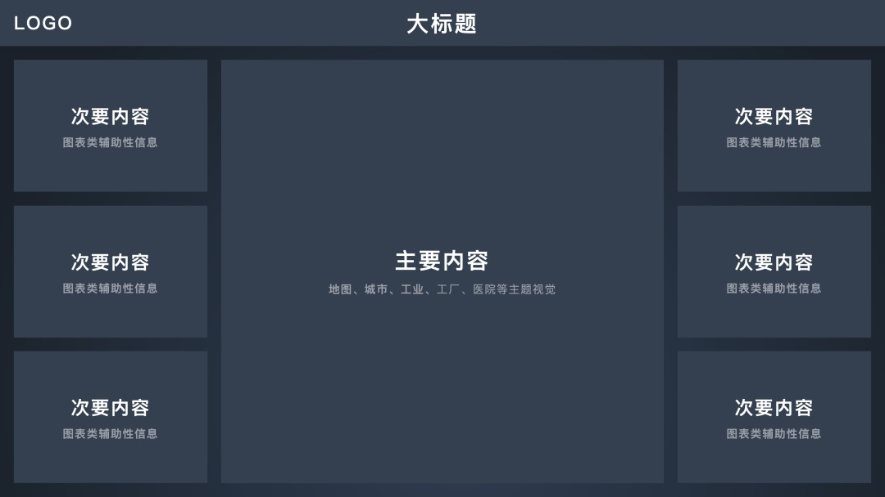

异形超宽拼接屏幕。

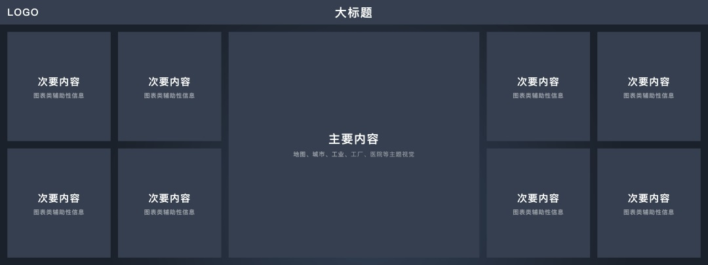

左右结构

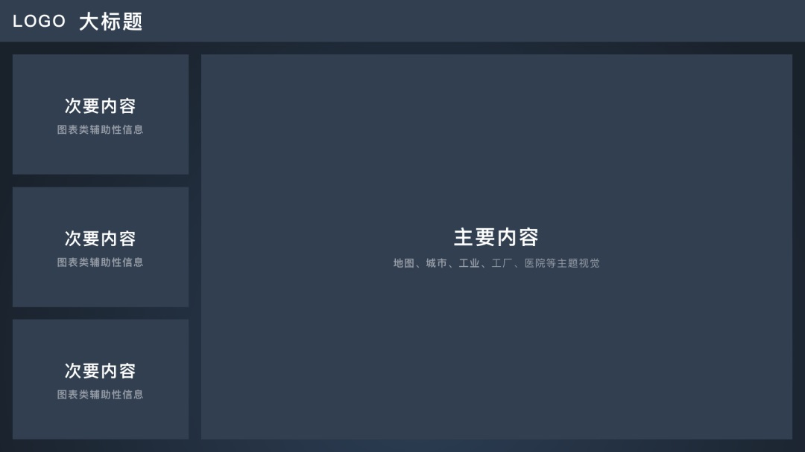

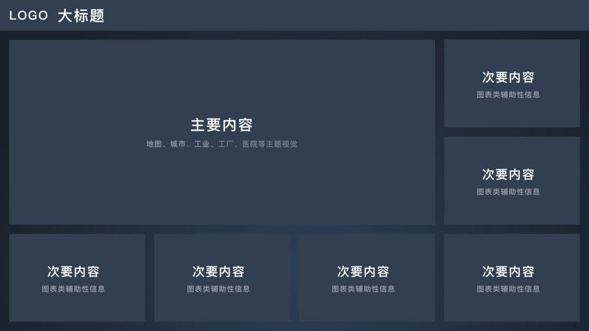

布局的原则一定要主次分明，根据业务需求抽取关键性的指标，提取主要信息。可以在纸上大概画一下，然后在软件里具体细化布局。避免次要信息的面积过大，喧宾夺主，影响整体的视觉效果。

### 2. 风格
提起可视化大屏，大家都会联想到：科技感、FUI、HUD 这些关键词，可以说可视化大屏跟科技、数据这两词是强关联的，风格上也基本是这一类方向。

定义设计风格：一般会基于业务需求场景去定义几个设计关键词，根据关键词去找一些参考图，推导出贴合业务的设计风格。

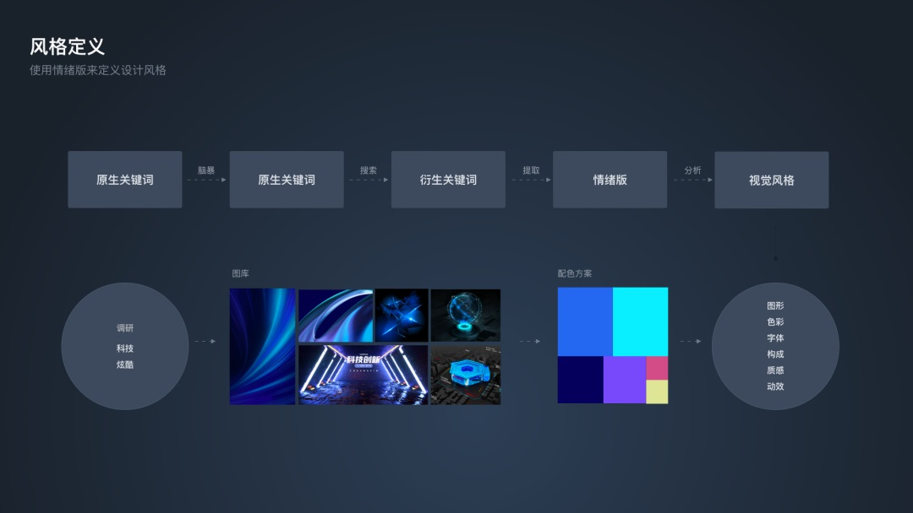

我们可以通过调整颜色、装饰细节、主视觉、字体等一些细节点控制区分不同的设计风。下面拿图表举例，我们在做设计的时候，只需调整卡片和标题的装饰，就能够展现出不同的设计风格。

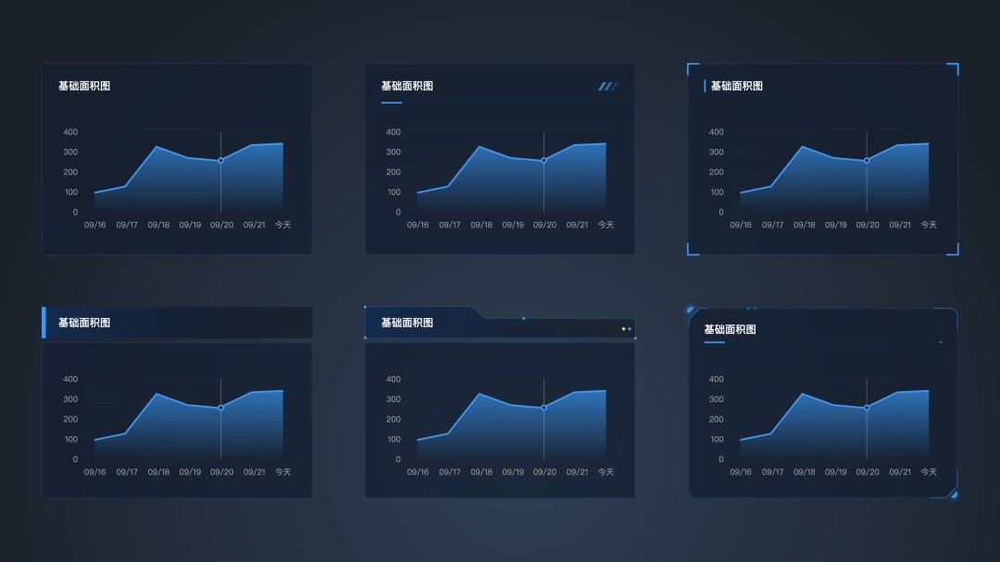

### 3. 主视觉
主视觉部分大致分为：地球、地图、智慧城市、行业类业务展示等。目前比较容易出效果的都会采用三维模型的处理方式。

地球：粒子地球、地图贴图、地球模型。

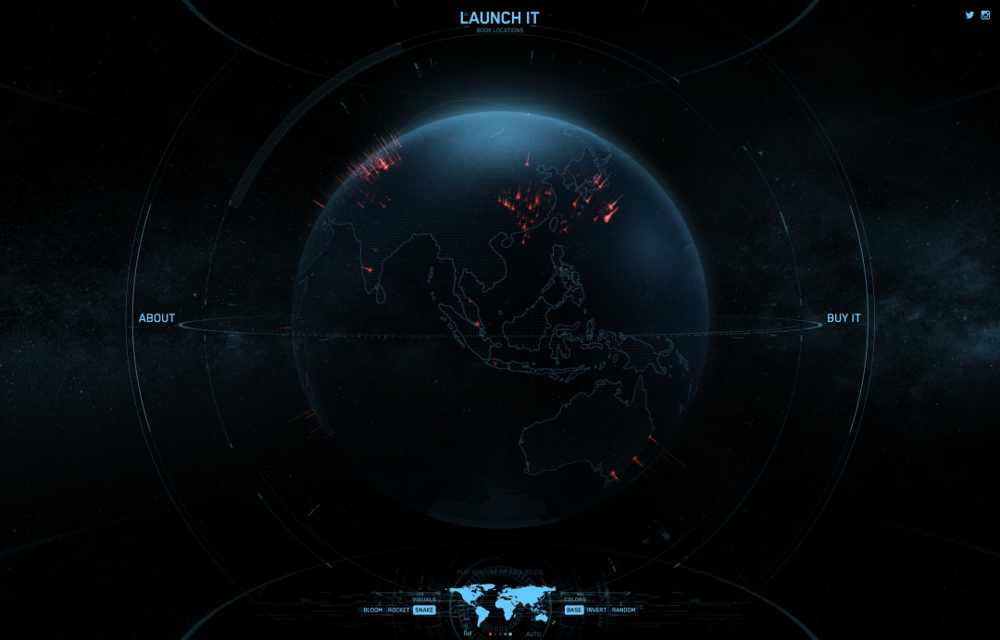

地图：第三方在线地图（百度、高德、腾讯、谷歌）基于地图开放平台进行个性化配置。或者通过地理位置数据建模：如全国和各个省份的轮廓模型。

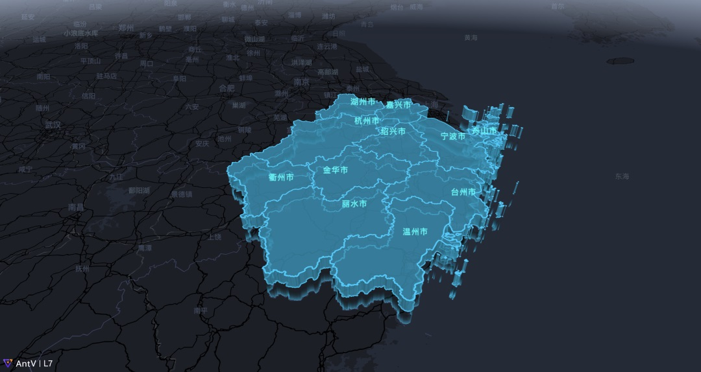

智慧城市：GIS 参数化生成简模和重点楼宇定制化建模。

行业类：多数为定制化建模。如工业类、医疗类、能源类、园区、学校、港口、工厂、仓储库房、零售、工程、安防、国防军工等。

以下图片源于 DATAV

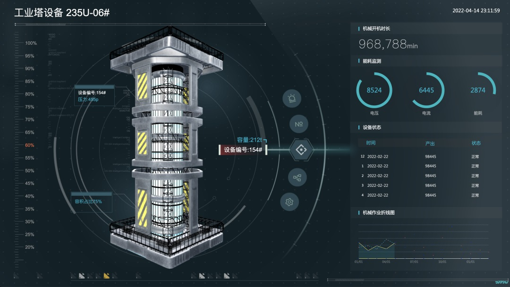

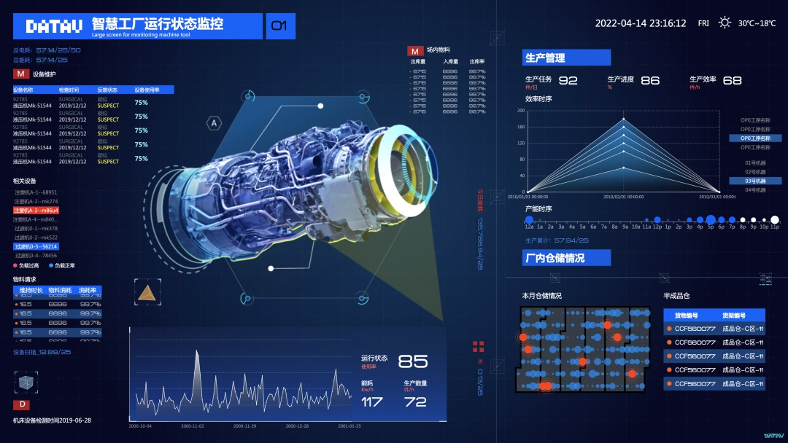

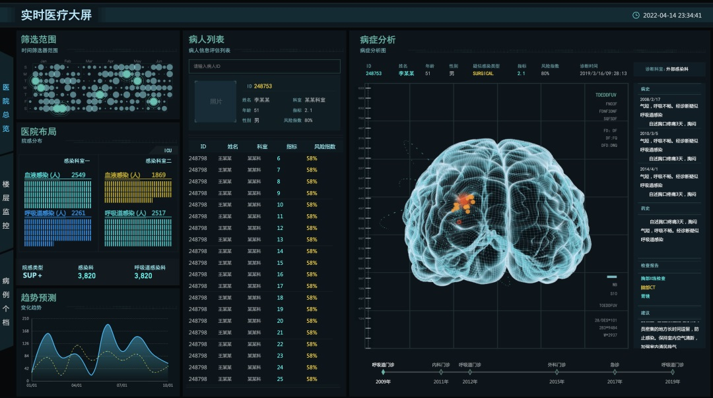

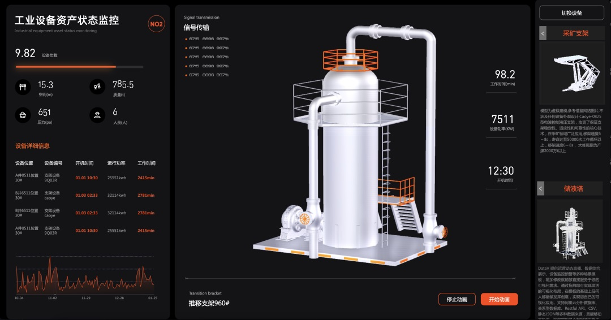

主视觉是可视化设计中的一大难点，不光是设计落地的时候也会有需要注意的点，这里建议大家在做之前一定要充分跟开发沟通，确认好技术选型，方便后期输出跟开发更加高效的对接。

### 4. 信息图表
图表的设计原则是易理解、可实现，能够准确表达数据意图，给用户传达明确信息。

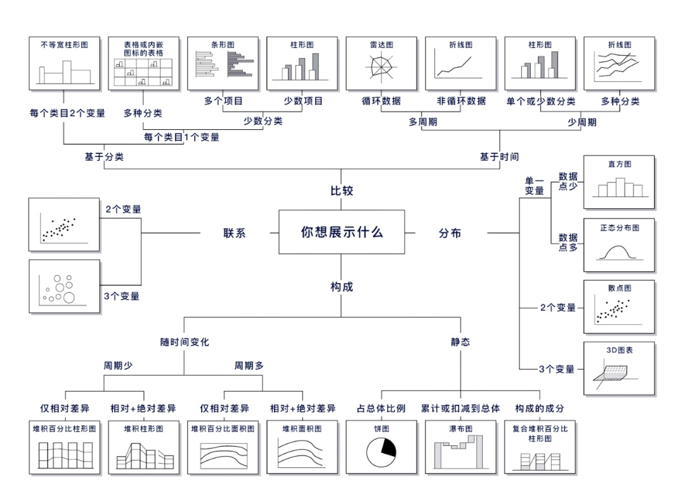

上图通过使用场景可分为比较、联系、构成、分布四个维度解释图表的不同属性类别。在做可视化大屏设计的时候可以参照上图，选择对应的数据图表。

比较

两个及以上变量数据，一是基于分类不同的对比，二是基于时间维度的对比。常见的图表：条形图、柱状图、雷达图、玫瑰图、桑基图等

联系

两个及以上数据之间的相关性，随时间变化比较关联。常见的图表：散点图、气泡图、多级饼图、热力图、力导向图等。

构成

指标里的数据都由哪几部分组成、每部分占比如何。常见的图表：饼图、环形图、堆积面积图、堆积柱状图、瀑布图等。

分布

指标里的数据主要集中在什么范围、表现出怎样的规律，想表达两个数据点之间数量的演变过程。常见的图表：阶梯折线图、面积图、直方图等。

基于图表的类型可分为：饼图、线形图、柱状图、混合图、面积图、散点图、极坐标图、关系图、树图、桑基图、漏斗图、热力图、还有其他图表类型等。

饼图
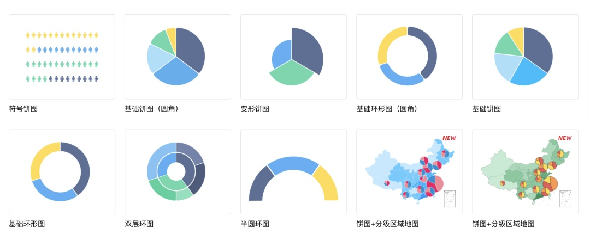

适合展示分类的占比情况，不适合展示分类过多（超过 9 条数据）或者差别不明显的场景。

线形图

折线图用于显示数据在一个连续的时间间隔或者时间跨度上的变化，它的特点是反映事物随时间或有序类别而变化的趋势。

当水平轴的数据类型为无序的分类或者垂直轴的数据类型为连续时间时，不适合使用折线图。同样，当折线的条数过多时不建议将多条线绘制在一张图上。

柱状图
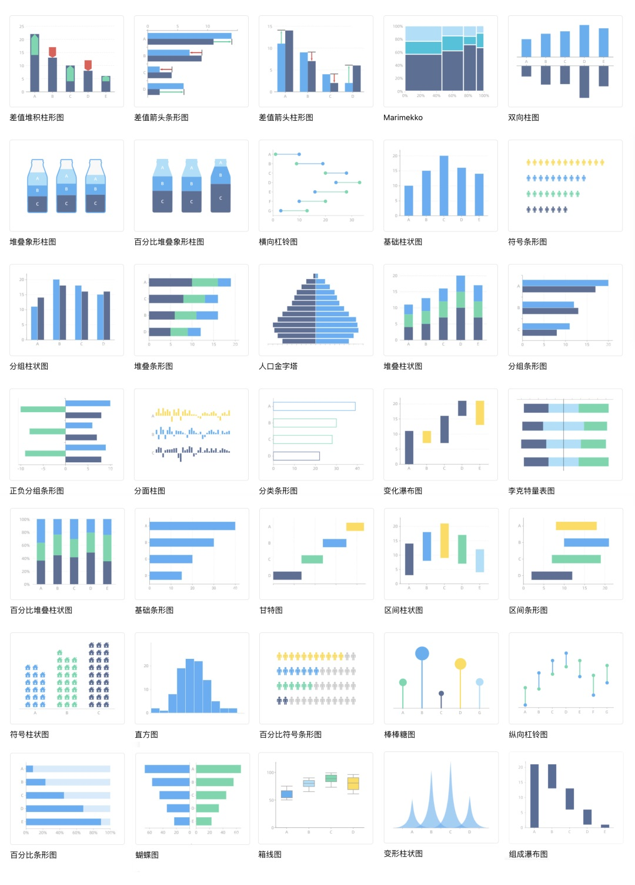

柱状图提供了分类数据的可视化展示，基于不同的数据类型有以上几种不同的形式。分类数据是将数据分组成离散的组，例如月份、年龄组、鞋码和动物。这些类别通常是定性的。图表上的条形图可以按任何顺序排列。

混合图

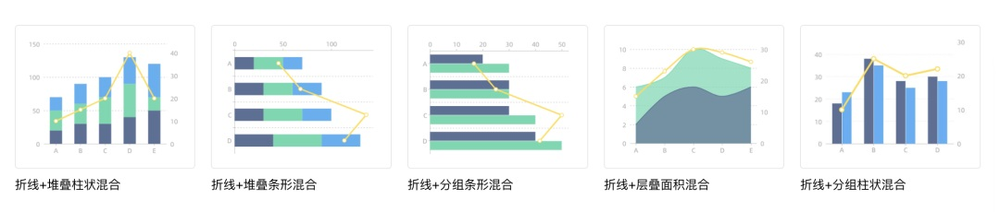

折线图和堆叠柱状图的组合图表。同时显示两个坐标轴，用于展示两种不同类型的数据。

适用于带有细分分类的累计数据大小以及与之相关的趋势数据，例如在过去十年全国三大产业的具体产值，以及 GDP 增长率。

面积图

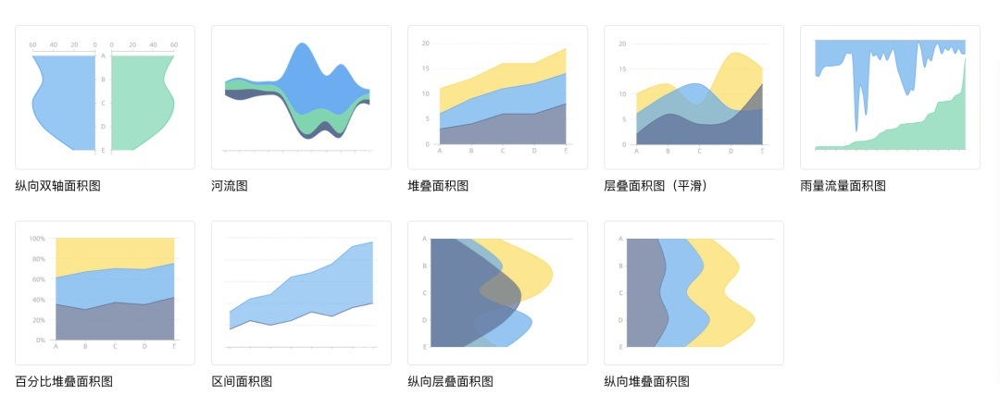

面积图强调数量随时间而变化的程度，也可用于引起人们对总值趋势的注意。适合于比较多个变量随时间间隔变化趋势。

散点图
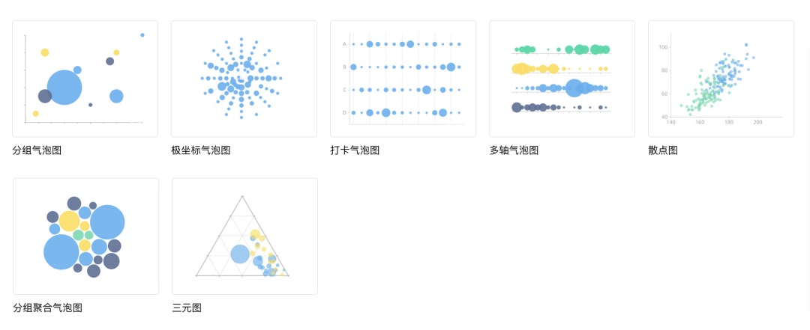

散点图是一种使用直角坐标来显示一组数据的两个变量值的图表。数据显示为一个点的集合，每个点都有一个变量的值决定水平轴上的位置，另一个变量的值决定垂直轴上的位置。

通常用于显示和比较数值，不光可以显示趋势，还能显示数据集群的形状，以及在数据云团中各数据点的关系。

极坐标图
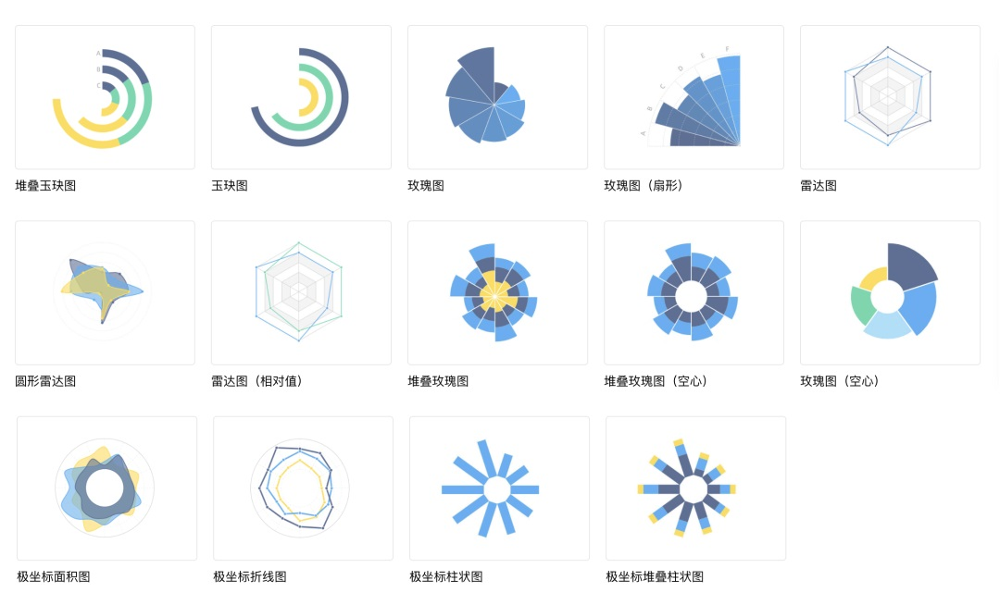

基于直角坐标系的径向变形（相当于把直角坐标卷起来）。适用于显示三个或更多的维度的变量对比或者部分与整体的趋势。

关系图
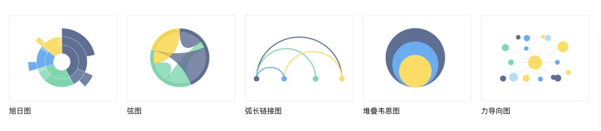

可以展示数据的占比情况，还能厘清多级数据之间的关系。 通常用于可视化大量元素之间的复杂关系。

树图
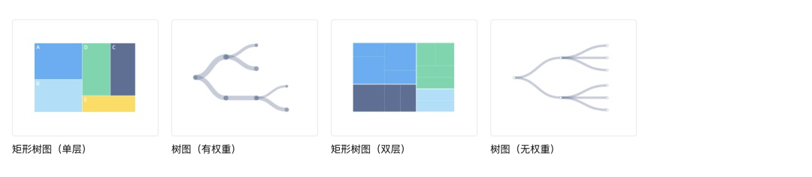

树图是一种流行的利用包含关系表达层次化数据的可视化方法，是研究多元目标问题的一般工具。 适合展示数据之间的层级关系，适合 6 条以上数据。

桑基图
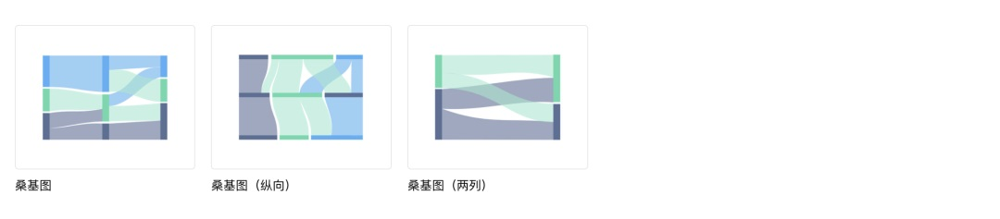

一种特定类型的流程图，用于描述一组值到另一组值的流向，图中延伸的分支的宽度对应数据流量的大小。用以展示数据的层级关系。常用于可视化能源或成本转移，也帮助我们确定各部分流量在总体中的大概占比情况。

漏斗图
<!--  -->

一种直观表现业务流程中转化情况的分析工具，总是开始于一个 100%的数量，结束于一个较小的数量。通过漏斗各环节业务数据的比较能够直观地发现和说明问题所在的环节，进而做出决策。 适用于业务流程比较规范、周期长、环节多的流程分析，比如流程流量分析、转化率分析。

热力图
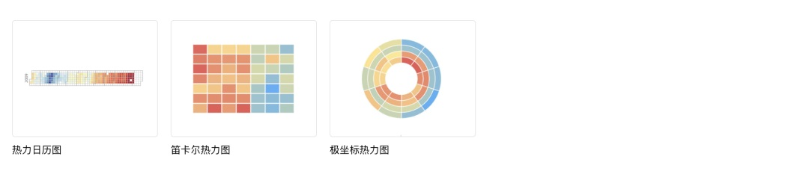

将数值大小通过色块有序且紧凑地在坐标系中呈现。 适合呈现多组数据连续的数值分布，适合做数据的预测统计，可以在图片上直接展示热度。例如展示城市在不同时间段打车热度情况。

其他图表
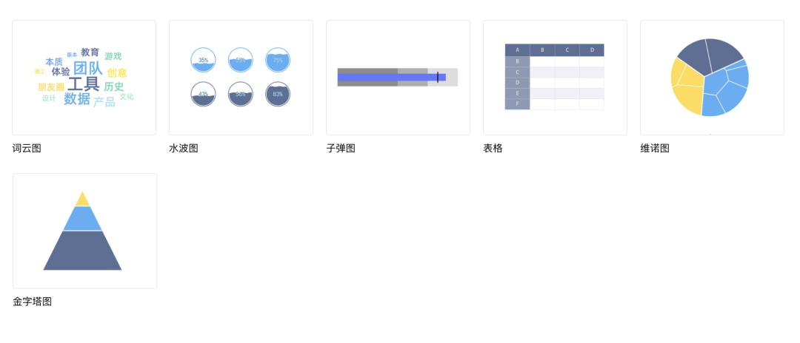

词云图适用于对比大量文本或绘制特定形状的词云。水球图适用于多个百分百数据呈现。子弹图用于表达多项同类数据的对比，可以表达一项数据与不同目标的校对结果。 维诺图适用于层级数据比较大小，同时能看到各层级之间的情况。金字塔图适合展示分类的占比情况，不适合展示分类过多或者差别不明显的场景。

### 5. 字体
文字是可视化展示中最重要的构成要素之一，可视化大屏设计中字体的运用其实原理跟网页 app 的逻辑基本一致。在字体选择上会基于业务需求选择对应的字体，与设计风格相结合。这里要注意的是字体有无衬线、字重、字距等。

大屏设计中，中文字体一般会采用浏览器默认字体（微软雅黑、思源黑体、苹方等）页面中标题会采用特殊字体处理，常用的字体有：优设标题黑、时尚中黑简体、方正正中黑体等。英文数字字体推荐：Din、Ds-Digtal、Bebas、Acens、DS-DIGIB、Roboto 等。

### 6. 规范
建立规范的主要目的是：保证设计的一致性、提高开发效率和还原度、方便迭代 ，辅助设计和开发更好地完成设计的协作。

可视化设计中规范一般会分为：色彩、文字、图表、标题控件等，跟网页端规范同理，这里就不一一赘述了。

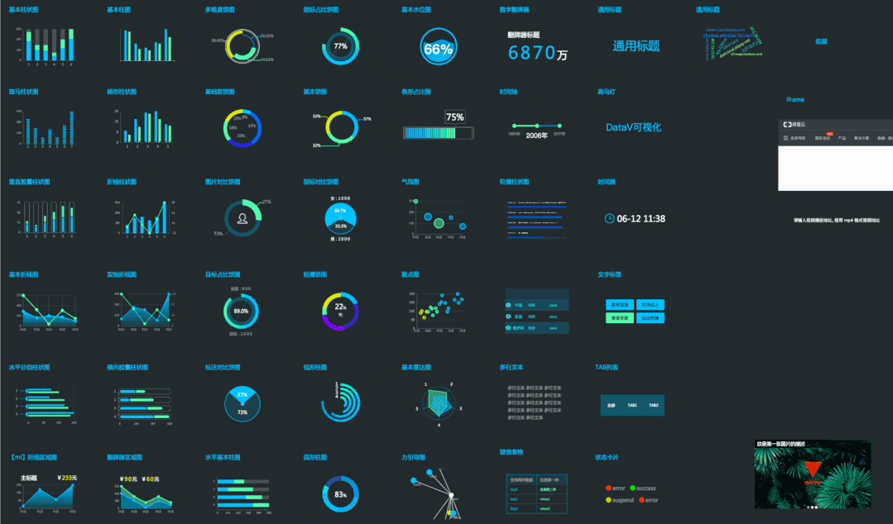

### 7. 动效
大数据可视化大屏设计少不了动效，动效是可视化重要的组成部分，动效能增加观感体验，凸显关键产品内容、强调功能信息关联，帮助用户理解产品、情感化互动。但过分的动效极其容易喧宾夺主，影响用户阅读，反而弱化了数据的展示。

动效的设计原则
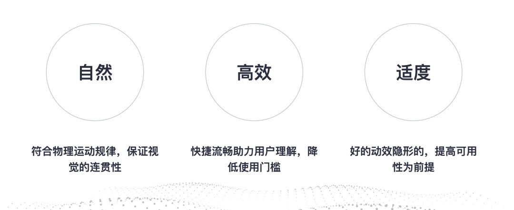

动效应优先满足核心内容、故事线。常见的大屏动效 – 展示类，用于突出产品核心功能和特点。界面信息按照一定的规律呈现，引导用户的视觉流向。

好的大屏设计应该是数据展示模块最好动效不宜过多，要有一定的主次关系变化，例如一个动画表现的视觉强，另一个就表现稍弱化，有强有弱、有主有次节奏才会舒服，同时动效要结合数据变化，考虑极端情况的展示效果，最终输出一套完整的动效方案。

- [https://www.uisdc.com/visual-design-guide-2?utm_source=tuicool&utm_medium=referral](https://www.uisdc.com/visual-design-guide-2?utm_source=tuicool&utm_medium=referral)