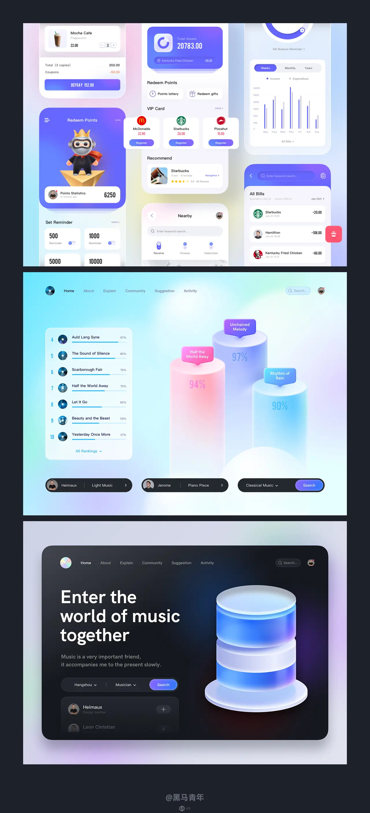

### UI 场景中的极光风设计
由于在众多落地产品中被广泛运用，形成了近些年影响 UI 设计趋势的风格。极光风和弥散光在表现形式上类似，也有设计师将该风格归类为弥散光，下面就看一下具体的运用场景。

2.1、强化导航栏设计的视觉感

如果想要强化顶部导航栏的视觉感，通常是利用品牌色作为背景颜色，这样也会显得顶部比重较大。通过白色或者浅灰色作为背景属于比较弱化的处理方式，而极光风的处理形式处于轻重之间的理想状态。不仅可以丰富视觉表现力，也能使得整体风格更加年轻化。

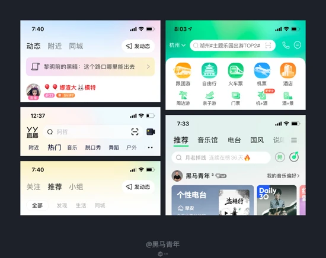

2.2、强化个人中心顶部视觉区域

随着互联网用户年轻化的趋势，在配色上面逐步趋近于年轻化，众多产品在个人中心界面的设计上面亦是如此。利用极光风效果呈现出的设计比较符合年轻化的趋势，可以是同色系的饱和度变化，也可以是不同色相的相互融合。利用低饱和度高明度的配色原则，使得整体的视觉感更加轻量化，视觉效果清新自然且通透力更强。

也有基于品牌色结合极光风进行融合，相对单色来说效果更加丰富自然，使得背景的变化更加多样。

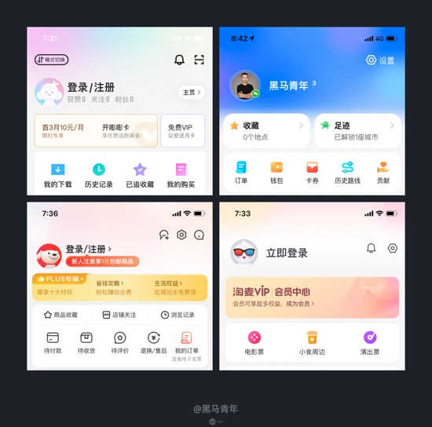

2.3、丰富背景设计的视觉感

除了在顶部区域进行运用以外，也有一些产品会在背景层面进行强化，相较于白色或者浅灰色的背景来说色彩感更丰富。运用到整个界面背景层相对比较少，在局部背景层上的运用比较多些，可以强化局部模块的视觉感。

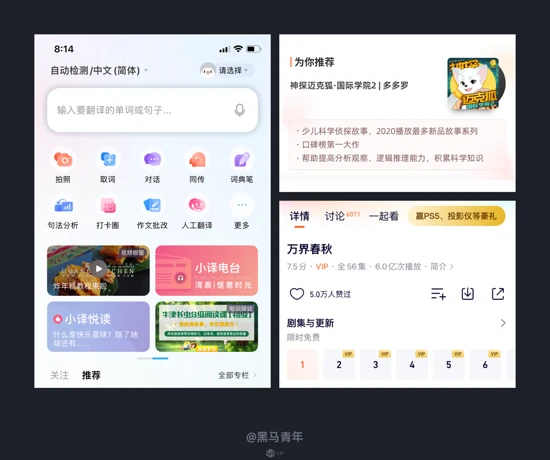

2.4、点缀弹窗设计局部

极光风的设计表现也会出现在一些局部功能的细节处，比如运用到弹窗的色彩处理中，作为背景局部或者插画部分等的衬托。带来的视觉感更加亲和自然，也不会过度干扰其他元素的呈现。

2.5、强化卡片式设计局部

卡片式设计也是近些年运用比较多的设计趋势之一，基本是以白色卡片居多，具有整合信息的好处。在卡片的边缘位置强化色彩，可以使得卡片色彩更加丰富，也有一些电商产品是起到与商品形成色彩呼应的作用。

2.6、突出搜索设计的差异化

搜索框的设计在大部分的认知里面都是白色或者浅灰色，也有一些是带有边框的形式，利用低饱和度高明度的配色原则来进行设计，带来的效果更加年轻化。也是一种差异化设计的尝试，打破常规的设计认知。也可以举一反三，在一些按钮或者标签设计中运用。

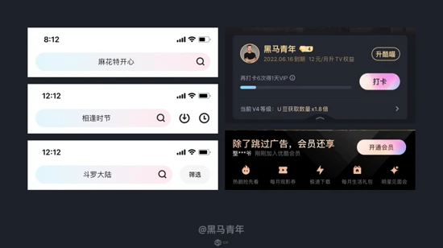

2.7、分类标签的装饰设计

这是一个装饰性的设计尝试，在突出模块分类的当前状态时，通常都会通过装饰元素来进一步强化。可以通过字体粗细、颜色深浅、字体大小和装饰元素来强化，装饰元素除了线段和一些图形元素以外，极光风的背景元素也是一种不错的表现手法。

2.8、图标设计中的运用

运用到图标设计中通常是出现在质感类图标，辅助强化图标的色彩感和层次感。有时候无法通过常规的渐变形式达到要求，就可以尝试运用极光风的处理技巧，将颜色通过模糊和剪切蒙版的形式融入到图标中，可以使得图标色彩丰富和强化光影变化。

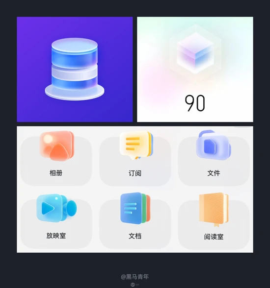

2.9、深色卡片色彩强化

以上案例属于在浅色或者白色的环境中运用，在深色主题中依然会用到极光风进行设计强化。在界面背景和卡片背景中运用，效果也是非常不错的，可以给深色的卡片一些色彩感和丰富度。

2.10、作品包装中的背景强化

除了在 UI 设计场景中运用以外，最近发现在设计师作品包装中的运用也是非常普遍，用于背景层的渲染带来的视觉体验度也是非常不错的。在作品包装环节中作为背景运用和局部装饰，也有在封面设计中重点运用，使得作品集紧贴设计趋势，提高作品的打开率。

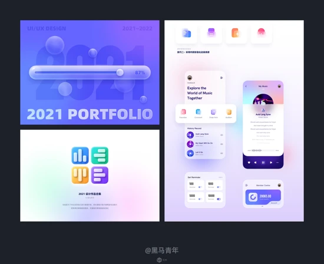

2.11、其他场景中的应用普及

在 UI 场景还有很多运用场景，这里仅为抛砖引玉，无论是作为背景强化还是元素装饰，都能带给用户更加年轻化的感官体验。

除了在 UI 场景中呈现以外，极光风的设计也会出现在更多其它场景中。在 Banner 设计、海报设计、专题页设计等视觉设计层面也是运用广泛，是一个影响范围比较广的设计趋势之一。
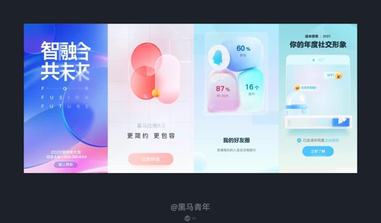

### 三、实现极光风设计的方法
通过一些线上的案例欣赏和分析，相信大家对于极光风在 UI 场景中运用都有一定的了解，在项目设计中也能轻松尝试。这一类风格从技法实现的角度来说并不难，关键因素在于控制好配色原理，下面就为大家总结几种实现的方法。

方法 01 ：利用不透明度渐变融合

不透明度渐变在设计中的运用比较普遍，利用的是不透明度从 100%-0% 之间形成渐变，让色彩逐渐消失或者淡化。

画一个圆形，选择径向渐变，渐变两端的颜色选择同一个色相。然后设置中间颜色不透明度为 100%，另一个颜色不透明度设置为 0%，这里颜色适合选择低饱和度的范围。同样的方法反复绘制几个不同颜色的圆形进行组合，即可完成极光风背景设计。
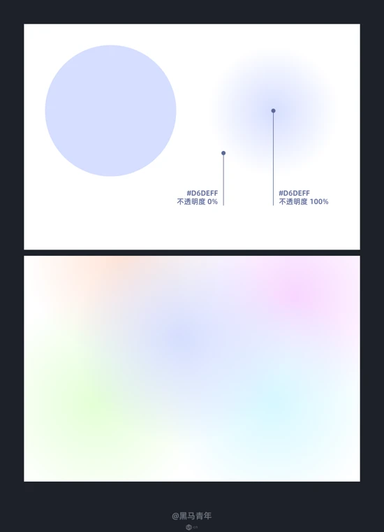

方法 02 ：利用模糊度变化融合

这个方法是结合了形状和模糊设置（高斯模糊等），绘制几个大小不等的圆形进行排版组合，然后选择所有圆形一起进行模糊设置。形状的绘制上面最好是有大小差异，排版错落有致，这样形成的效果比较富有变化。

在颜色的选择上面需要根据背景的强化程度选择，低饱和度的颜色融合性更高，适合作为弱化性质的背景使用。

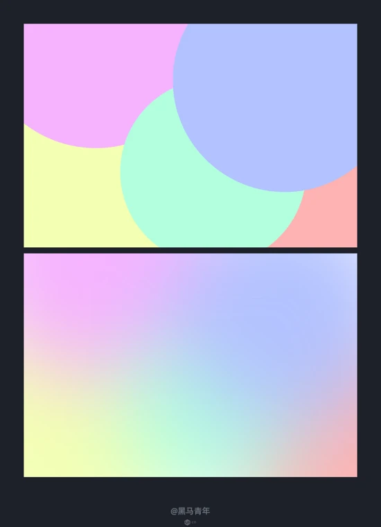

方法 03 ：利用背景模糊融合

背景模糊在 Sketch、Figma 等设计软件中有该功能，是一个影响设计趋势较为常用的功能，特别是在实现玻璃质感和一些质感图标上面非常实用。

在背景层绘制图形，颜色和形状均可自由发挥，然后再绘制一个形状作为调节层，调节层是用于控制模糊效果的。在调节层的形状上面设置一个带有透明度的颜色（必须要带有透明度），然后再设置背景模糊，背景模糊数值的大小决定模糊的程度，不透明度的大小决定整体效果的亮度。

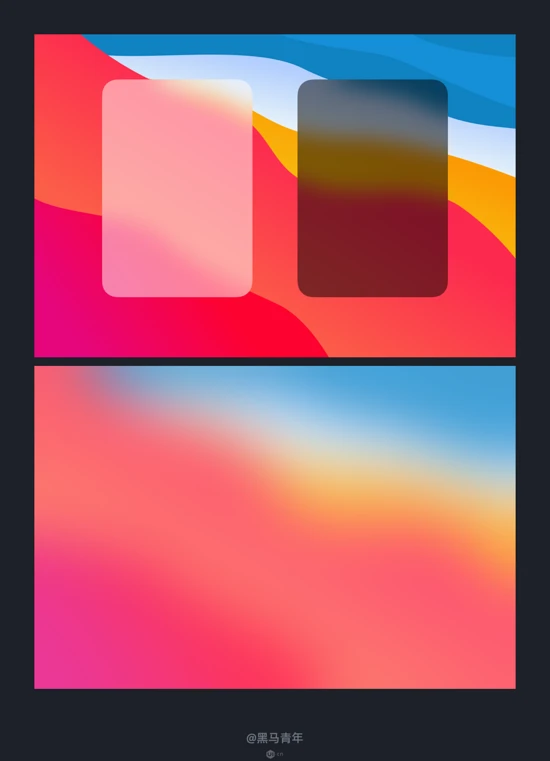

方法 04 ：利用图片模糊融合

以上的方法都需要进行配色处理，如果色感方面比较薄弱的设计师，也可以挑选一些不错的图片来实现极光风效果。

挑选一张色彩符合要求的图片，然后在 Photoshop 等设计软件中执行高斯模糊，半径值的多少决定了模糊之后的自然度。我们在选择图片的过程中除了整张图片进行操作以外，也可以截取其中的一部分，也许可以带来意想不到的效果。

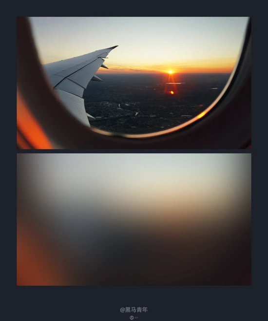

除了这几个方法以外还有更多不一样的实现方法，大家可以根据自己的探索选择最适合自己的方法。根据使用软件的差别选择最简单的形式，根据想要实现的效果选择最灵活的方法，这样才能便于后期的反复调整。

### 四、极光风案例实战
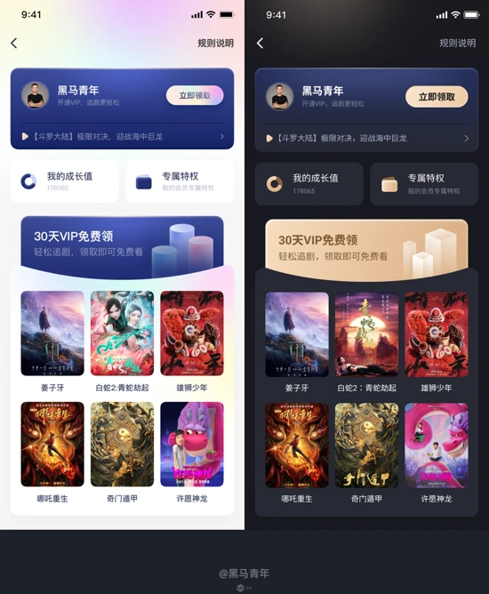

- [https://www.ui.cn/detail/622089.html?utm_source=tuicool&utm_medium=referral](https://www.ui.cn/detail/622089.html?utm_source=tuicool&utm_medium=referral)