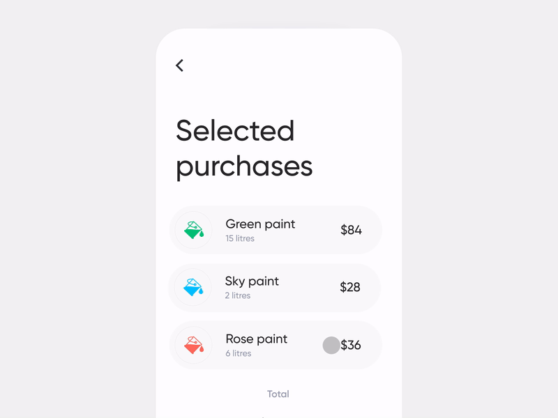
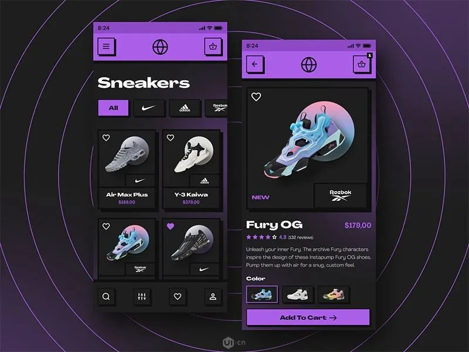
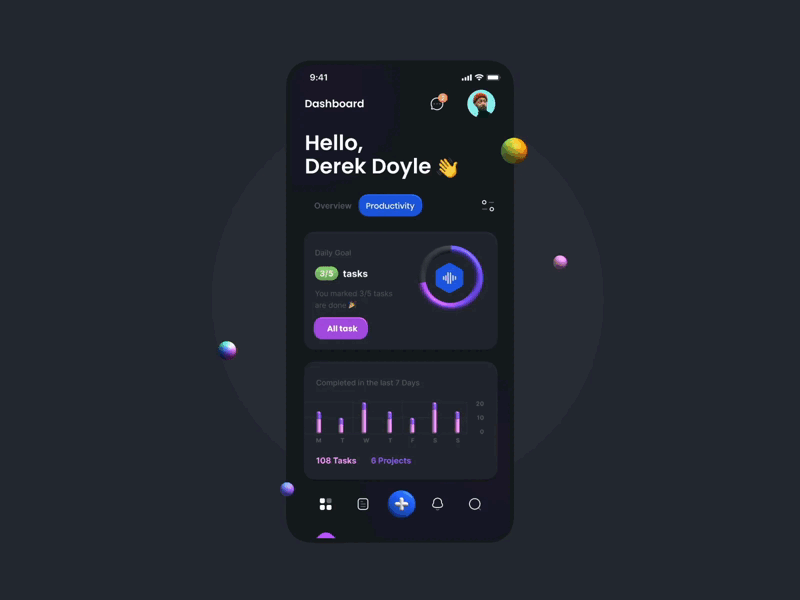
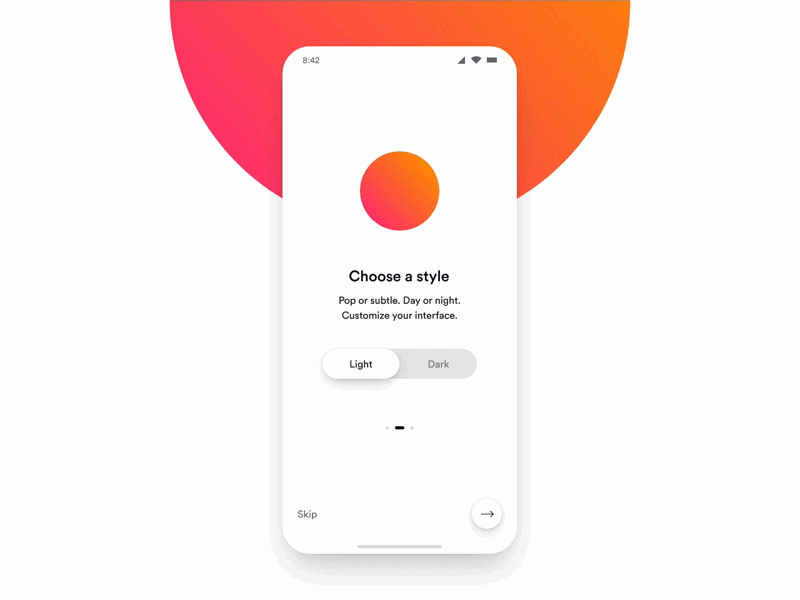
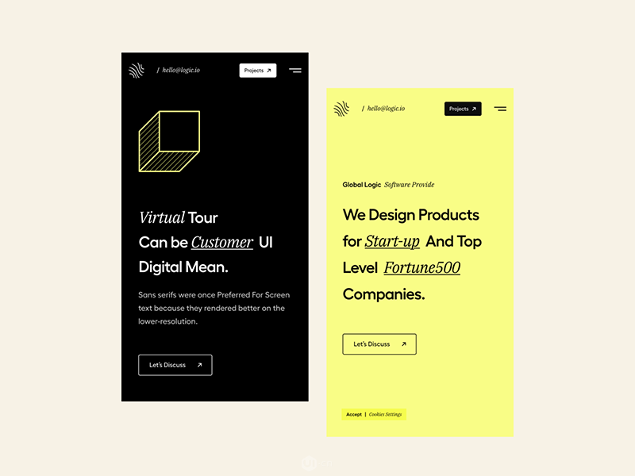
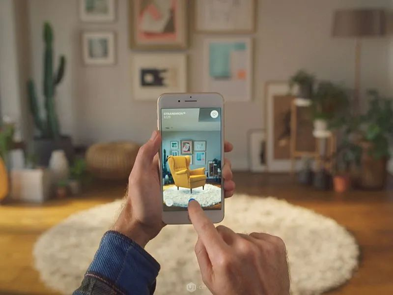
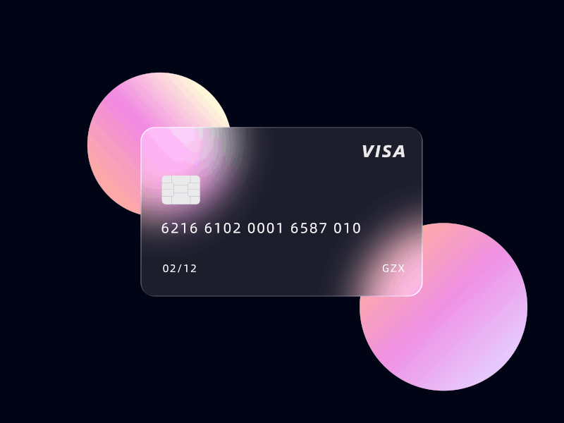
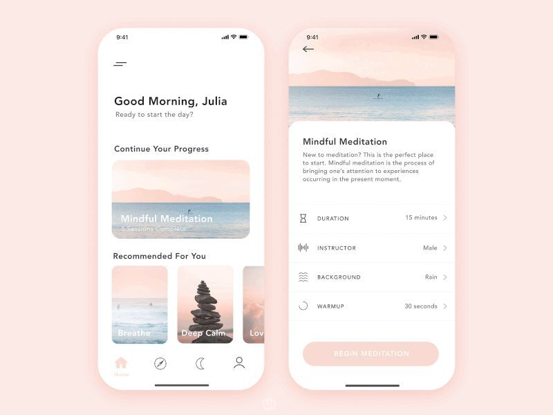

这是我们总结出的 2022 年移动应用 UI 设计趋势

- 1、运动和动画
- 2、手势和滑动体验
- 3、90年代风格
- 4、图形深度
- 5、黑暗模式
- 6、排版
- 7、增强现实和虚拟现实
- 8、渐变和透明元素
- 9、舒适的视觉效果

### 1、动效和动画

我们都喜欢看视频，并在 TikTok 或 YouTube 上花费大量时间。视频内容和动画更具吸引力和互动性。统计数据显示，大多数人在使用应用程序之前都会观看说明视频。动画和动作设计使内容更具吸引力。
与具有长描述的静态内容不同，动画可以保留用户的注意力并使应用程序更具吸引力。用动画突出重要的东西是一个好主意。例如，您可以为应用程序中的按钮设置动画，以使用户与应用程序的交互更好、更直接。像图标动画这样的微动可以显著改变您的应用程序的体验。
借助动画，您可以强调应用功能、提高转化率甚至销售数据。

### 2、手势和滑动体验

与电脑上的网页端相反，手势和滑动体验使移动设备更具吸引力。我们每天花费数小时滚动和滑动操作。按钮和其他动作可能会刺激和分散注意力。这种设计趋势成为现代应用程序设计的最高优先事项之一。一些应用程序创建者甚至根本不支持按钮的使用。按钮会造成混乱并占用过多的屏幕空间。
建议用滑动功能替换按钮。尝试滑动动作的动画会很有帮助。例如，图书应用程序通常使用动画来翻页。

### 3、90年代怀旧风格

90 年代的风格影响了所有领域，甚至是移动应用程序的设计。
设计师使用类似于 90 年代流行的 PlayStation 游戏（例如，马里奥或吃豆人）的复古字体、图像、图形。拥有 90 年代的氛围，您有机会获得两代人的兴趣：年轻人喜欢复古的东西，而老年人则喜欢怀旧。
这种趋势并不适合所有产品，但如果复古风格适合您的应用程序，尝试一下也不错。

### 4、赋予图形深度

扁平化设计看多了用户会觉得很沉闷。人们喜欢看到更真实和互动的内容。图形中的阴影和图层赋予它们 3D 效果、体积和深度，使人们可以享受更逼真的图像。
这种趋势可以与任何元素一起使用，在屏幕上创建对象层次结构并帮助用户更轻松地浏览应用程序。
然后，关于3D效果，我们来聊聊。3D 是一项革命性的技术。3D 图形几乎可以在任何应用程序中使用。例如，开发人员可以使用 3D 成像技术来构建存储建筑物和房间内部地图的应用程序。它可以非常适用于游戏并改变玩家的整体体验。因此，在您的应用程序中为图形添加深度时，请考虑 3D 趋势。

### 5、黑暗模式

暗模式是已在许多应用程序中高度使用的最大设计趋势之一。最近，设计师也提供了在应用程序中在标准模式和暗模式之间切换的机会。所以用户可以选择他们最喜欢的任何模式。
深色主题设计将背景变为深色模式，并使字体和其他元素变为浅色/白色。
例如，现在在 Facebook 等最受欢迎的应用程序中都可以使用深色模式。切换到深色模式有助于人们减轻眼睛疲劳并更方便地浏览。

### 6、排版

选择正确的字体是移动应用程序设计中必不可少的一步。用户在浏览页面的时候不是一个字一个字的读的，而是成行的“扫描”方式来浏览。因此，使用能够正确设置重点的字体非常重要。
设计师已经开始使用不寻常的字体。文字不再看起来那么无聊，也不会迷失在背景中。其目的是使设计更明亮、更新颖。
正确选择的字体将有助于：

1、定下产品调性；

2、提高品牌知名度；

3、提供更好的视觉体验；

4、提高可读性。

通过组织排版为您的用户提供愉悦且可读的用户体验：设置点大小、行距和层次结构。
请记住，不寻常的“疯狂”排版并不适合所有产品。定义文本在您的应用程序中的具体功能。如果它提供了额外的信息功能，请不要对字体进行太多实验。但是，例如，在在线杂志中，您可以使用各种版式，使布局更有趣。

### 7、增强现实和虚拟现实

虚拟现实和增强现实为用户提供了一个难得的机会，让您只需通过手机即可获得互动体验。
在新一年中，这种神奇的 UI 移动设计趋势趋于增长和传播。这种设计趋势的关键在于应用程序的界面让您感觉自己置身于应用程序中。引人入胜的设计元素和游戏化是这种体验的关键。
这是一个结合我们之前讨论过的趋势的绝佳机会，例如动画和 3D 效果。首先，精心制作的动画和 3D 触摸可以在您的应用设计中支持 VR。
你还记得那些来自 Instagram 的功能吗？让我们可以通过应用程序和移动相机将不同的角色放置在我们想要的任何地方吗？然后你就知道这有多有趣了。此外，它不仅有趣而且高效。例如，宜家使用 AR 来展示一件家具在您家中不同位置的外观。

### 8、渐变和透明元素

这个UI设计趋势是关于渐变和透明度的。设计师通常在按钮和应用程序的背景上使用渐变。移动渐变趋势突出了应用程序的基本部分，并使人们专注于特定方面，从而赋予他们层次感。
移动应用程序设计中的透明元素表达了对某些应用程序部分的深度和驱动力，使设计更清晰、更具吸引力。
您可以使用从浅色到深色主题的过渡，从而将屏幕分成两个逻辑部分。此外，您可以在按钮上使用渐变主题，使它们在屏幕上弹出。
玻璃拟态的概念也值得一提。glassmorphism 背后的想法是柔化明暗设计元素之间的对比。设计理念使用类似于磨砂玻璃表面的透明模糊背景。
玻璃态的主要特点：

1、透明度和背景模糊；

2、透明物体上的细光边框；

3、分层;

4、鲜艳的色彩。 

### 9、舒适的视觉效果

舒适的视觉效果是大部分用户都喜欢的。用户和应用程序开发人员都喜欢这种最近的移动应用程序设计趋势。
移动应用程序设计不应该只是美观。它应该让我们的眼睛看起来更舒适。因为一整天，我们可能都会盯着屏幕看，但看多了，我们会感到疲劳和眼睛疲劳。为了减少这种不利影响，应用程序开发人员创建了一种我们可以舒适使用的设计。
舒适视觉设计趋势的概念是为您的应用程序使用自然的色彩、舒缓的图像和简单的布局。这些技巧通常可以在冥想应用程序中找到。它们包括自然的真实照片，具有平静的色彩和结构简单的轻元素，很少有深色主题设计。

如果让你的UI设计更好呢？

这里有一些建议：

1. 多看别人的优秀设计分析它们的优缺点，从他们的经验中学习。

2. 使用标准导航不要使用异型的导航栏，这会让你的用户迷失在应用中。

3. 使用优质的配图抽象艺术、插图、真实照片趋势——一切都有助于吸引用户的注意力。

4. 多看前瞻设计趋势实时更新自己的设计知识库，使设计水平使用保持一流。

5. 擅于总结与回顾可以计划，三个月或半年总结回顾之前设计，总结不足之处。

6. 多于他人分享做设计不要怕被人看，或许有时候别人顺口一说，就点开了难题。

7. 保持良好的心情遇到事不要慌，掌握好自己心情，才能掌握好你的设计。

- [https://www.ui.cn/detail/615962.html?utm_source=tuicool&utm_medium=referral](https://www.ui.cn/detail/615962.html?utm_source=tuicool&utm_medium=referral)