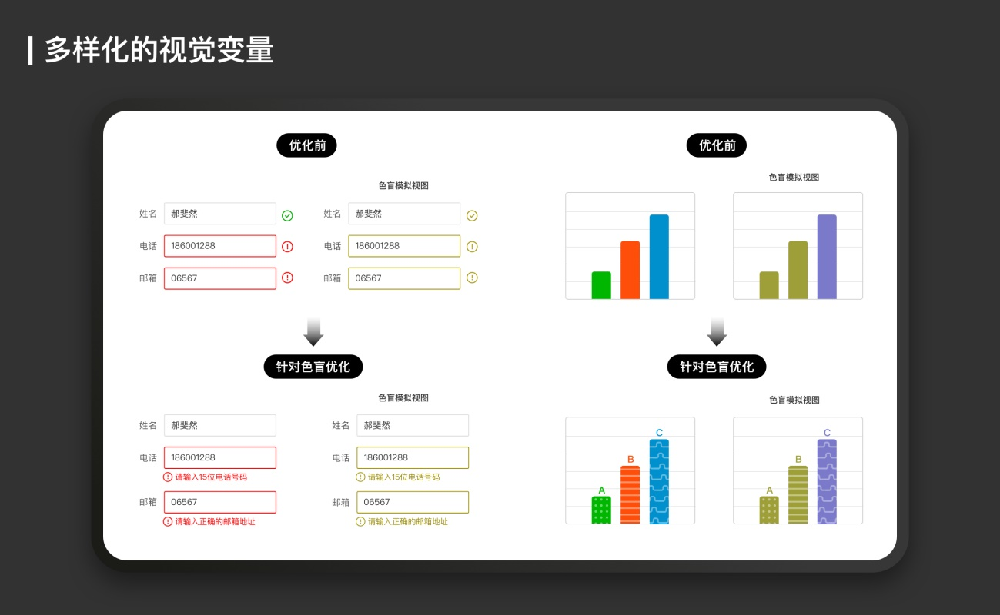

互联网设计师如何着手发起无障碍优化？

信息无障碍，是指任何人在任何情况下都能平等地、方便地、无障碍地获取信息和利用信息。随着互联网覆盖越来越广，对于身体有局限的群体而言，更加迫切通过互联网获取信息，而这就需要互联网产品进行信息无障碍的优化。在我国其受益人群至少包括：8500多万残障人士，2亿多60岁以上的老年人，数量庞大。率先考虑信息无障碍能为产品增加优势而带来更多用户。

如今智能手机掀起了一场无障碍辅助工具的革命，而站在这个关键点的互联网设计师，也要开始行动起来，先从以下这几个容易实现的事情开始着手进行无障碍的优化吧。

### 关于读屏
对视障用户来说，是用听取读屏语音来了解你设计的界面信息的。读屏软件就像他们了解互联网世界的眼睛，它的原理是直接读出界面里的文字，如果icon按钮未加无障碍标签读屏会读为”无法发音”，那么视障者就无法获取这些信息，自然也就无法使用你设计的功能。

解决的办法是:

- 需要在产品代码中添加无障碍标签(Android :contentDescription ; iOS:accessibilityLabel在对应的开发者文档里很容易找到，可以发给你合作的研发同学)。
- 装饰性icon可隐藏标签不读，提升读屏效率。不建议不做处理也不加标签，那么用户听到的就是“无标签”，这样会让用户以为这里有什么重要信息读不到而感到不安。
- 标签语义简短准确，尽可能使用动词。
- 必要时需要走查焦点顺序，确保不会被错误的焦点顺序误导页面含义。

并且最好由设计师进行语义的标注，因为设计师才是对页面里图形应用最了解的人。避免出现“搜索”被写成“放大镜”、或者是“searchBtn_123”之类的情况。

### 关于色彩
颜色可以用来区分信息数据的类别和维度，也可以帮助传达情绪等重要信息。然而，世界上有超过8%的男性和0.4%的女性都被色觉障碍的问题困扰。我们通常笼统的称这类人群为“色盲”，他们是典型的识别颜色有问题的群体。

“色彩”的目标是”易于感知”，指的是互联网产品的内容信息的色彩对任何人来说，都应该拥有足够高的辨识度和舒适度，我从以下4个方向进行介绍。

1. 更安全的配色

色盲人群：

设计师在进行设计配色时应时刻自测，避免明度相似的橙黄绿两两配色和明度相似的红绿配色，因为这样的配色势必会造成色盲用户的可读性问题。并且，红色在红绿色盲眼中并不是一种明亮醒目的颜色。相反红色对他们来说显得非常深，而暗红色则几乎接近黑色。因此色盲人士很难分辨出文章内的深红色的强调字，从而遗漏关键信息（设计时，可利用此插件模拟色盲眼中的颜色：Color Oracle） 。

文化差异：

因为色彩在不同国家文化中代表不同含义,所以对于国际用户来说也是存在障碍的。在西方文化里，红色通常用于表示消极趋势，而绿色则表示积极趋势，但在东方文化中却正相反。

特殊群体：

临床医学研究表明对于部分自闭症患者来说，高饱和高对比度的颜色，甚至只是黄色都会让他们感到不舒服和不安，因此在自闭症康复中心是不会出现过于对比刺激的颜色的。

另外，老年群体随着年龄的增长，晶状体变黄变浑浊，会选择性的吸收蓝光，从而导致老年人对蓝色的鉴别能力下降明显，如果你的主流用户是老年人，请尽量避免将蓝色运用到重要的按键中去。

2. 更强的文本对比度

文本对比度与可读性息息相关，它测量的文本颜色和背景色之间的明度差。WCAG AA对于文本对比度的规范是：4.5:1，若字号够大（>18pt，或粗体>14pt）时，标准可降到3:1。如果满足4.5:1这个标准会让你的页面视觉看起来不那么优雅，可以尝试局部加强可视性的方法：

关于可读性其他需要注意的点：尽量不要在图片上叠加文字，除非你能保证图片背景颜色单一且对比度足够高。

Material Design设计规范建议，需要淡淡的遮罩确保上层文字的可读性；并且不建议极高对比度的文本，因为这样会使一部分视障者看到的字旋转模糊。

3. 更多样的视觉变量

颜色是数据可视化中最常用的视觉变量之一。但是对于无法辨别颜色的用户，如果颜色作为的唯一的提示信息，他们可能将无法理解你传达的信息。那么有什么改善的方法呢?

不让颜色成为唯一的视觉变量：除颜色外，我们可以追加图标、纹理或者文字来加以标注。

色盲模式：Trello作为一款工具产品，在标注信息时，提供色盲模式可打开和关闭，并用不同纹理加以区别，色盲友好模式是一个很好的范例，它可以有效帮助色盲，又不会妨碍非色盲用户。

以明度饱和度为度量：虽然色盲人士对色相的辨识能力较弱，但却对明度、饱和度非常敏感。我们可以使用明度或饱和度区分信息。看这个例子：传统热力图习惯用暖色代表热力高冷色代表热力低，Google Analaytics的热力图采用深蓝色显示热度高的时段、浅蓝色显示热度低的时段，简单有效。

### 关于控件
控件可以是按钮、链接、输入框或任何带有事件监听器的HTML元素。控件太小或彼此太靠近可能会给用户带来糟糕的体验问题。

比如对于无法用指尖精确定位的用户（有颤抖疾病的用户），或因年龄而导致灵活性降低的老年用户，都会难以点击过小控件。

为了给用户足够的间距来准确选择控件，Material Design建议至少48×48dp，iOS设计系统将目标热区尺寸最小值定为44 x 44pt，而WCAG对WEB的规范则建议至少44×44px。一个控件可以在视觉上是24 x 24px，但是在所有边上都会有一个额外的填充使它达到44×44px。并且太靠近的控件可能会因误点击而带来挫败感，所以同时还建议控件之间的空间足够远以减少误触。Microsoft给pc的建议是至少有8px的间距，而Material Design推荐的控件至少间隔8dp。我们可根据以上规范来审视自己设计的控件。

### 关于文字
1. 文字大小：

有视觉障碍的用户可能会把字号调得很大。你需要保证你的设计在大字号的情况下内容不会溢出或排版错乱。做设计的时候，可以使用2倍以上的字体测试你的设计。

在互联网早期，设计了字号在9-14px之间的网页，如今已与20年前不同，浏览器已经可以在任何尺寸设备上使用，小到智能手表大到4K荧幕，我们不能再使用固定的字号来设计产品了。字号应该与设计本身一样具有响应性。例如可以允许用户自定义字号、行高或字间距等以达到舒适的阅读水平。

2. 文字样式:

文字作为传达信息的重要载体，对于许多用户来说，装饰字体或草书字体都是比较难阅读的。且用过细的、过小的、斜体和全大写文本，也会降低识别度。

### 关于动效
有效的动画可以给页面带来生命感，但如果滥用动效不仅会分散用户注意力，严重的话对某些用户来说来说可能是致命的（光敏性癫痫的临床诱因之一就是闪光图像的刺激）。

1997年的一天，日本电视台正在播放《精灵宝可梦》第38集“电脑战士3D龙”，但就在这天晚上发生了600多名儿童昏倒在家中集体送医事件，轰动了动画界，任天堂的股价也随之大跌。原来，为了达到震撼效果，3D龙的背景运用了“蓝-红-蓝”的快速闪烁来表现爆炸，这样高频率的闪烁刺激了孩子们脆弱的眼睛，导致他们集体患上了急性光敏症。也因为这件事日本开始着手对动画片的制作制定规范。Twitter在2019年为了保护对闪烁图像敏感的人员安全，也采取了禁用APNG动图格式的措施。

另外WCAG 2.3.3官方说明，一些用户会因滚动页面的动效（例如缓动和视差滚动）而触发大脑前庭疾病从而产生头晕的症状，所以iOS、Mac、Windows 10都具有关闭动效的功能。

为了避免给特殊人群造成困扰，设计师在开始做动效之前，应该看看以下四条是否满足：

- 动效每秒闪动不超过3次，发生的闪光区域不超过超过25％否则，光敏癫痫患者会有发病的风险。
- 避免过于夸张的视差和运动效果，因为大脑前庭失调者会引发眩晕。
- 避免有多个元素通过不断移动、闪烁而分散注意力，因为这可能会让注意力缺陷者产生困扰 。
- 如果有上述情况，需提供一些控件或选项来暂停、隐藏或者更改任何动画或效果的频率。

### 结语
作为体验设计师，研究无障碍会让我们收获良多。当然，目前所做的改进并非一劳永逸，而是我们与更广范围的用户保持持续对话的开端。不断改进产品的无障碍体验，让产品更友善，让美妙的互联网的世界变得更平等，我们希望能不断向这一目标前进。

- [https://www.uisdc.com/accessible-design](https://www.uisdc.com/accessible-design)