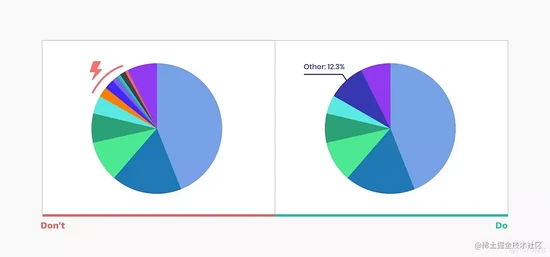
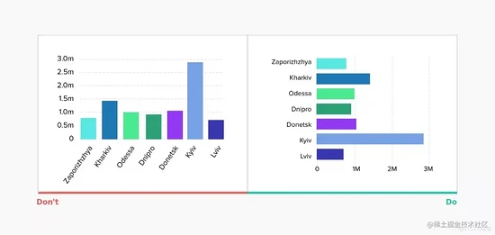

### 1. 正负值的绘图方向
当数据存在正负值时，注意要在基线的对应两侧绘制，而不是在基线的同一侧绘制正负值；

比如，使用水平柱状图，要在基线左侧绘制负值，在右侧绘制正值。

### 2. 柱状图基线从 0 开始
如下图所示，左边柱状图基线是从 375 开始，B 柱是 D 柱的 3 倍多高，这显得它们之间存在很大的差距；

然而，再看右边的柱状图，基线从 0 值开始，B 柱和 D 柱的差异就没有那么大了，这样能更准确的反应数据；

柱状图 截断数据 会导致错误的分析结论。

### 3. 折线图调整 y 轴刻度
折线图的主要目的是为了表达 趋势 ，所以像下图左边，y 轴刻度从 0 开始的话，趋势变化很小，几乎是平的。

而右边，调整 y 轴刻度基准的折线图，让数据集合尽量保持在 y 轴范围的三分之二，趋势变化一目了然。

### 4. 选择正确的图表类型
有 xdm 可能就会问了，为什么柱状图基准要从 0 开始，而折线图基准要动态调整？

原因是：不同类型的图表，本身就有它特定的数据展示功能的；

柱状图主要是用于比较数据的、折线图主要用于表达整体趋势的、散点图主要表达数据相关性的、饼图主要表达组成成分的......

数据可视化，选择正确的图标类型，合适最重要。

### 5. 注意长时间段的折线图
折线图通过连接“标记点”组成线，通常用于展示在一段时间间隔内的数据趋势。

它有助于解释值随着时间是如何发生变化的，如果时间间隔较短，它的展示更准确，而当时间间隔长，数据更新不频繁时，它可能会造成一些“误会”。

比如，使用折线图来表示年收入，如果值是每月更新，折线图没有柱状图准确。

### 6. 不要使用“平滑”折线图
平滑的折线图可能在视觉上令人愉悦，但它们有可能会歪曲背后的实际数据（不过此点还是要以平滑曲线实际使用表现来确认）。

### 7. 避免混淆折线图的双轴
通常，为了节省可视化空间，当有两个具有相同度量但幅度不同的数据系列时，我们可能倾向于使用双轴图表。

但这些图表不仅难以阅读，而且还以错误的方式误导了用户：其代表的是两个数据系列之间的比较。

### 8. 限制饼图的切片数量
饼图不要超过 5-7 个切片，尽量让其保持简单；
可以将超出的最小段分组到 “其它” 切片中；

### 9. 请直接在饼图上标注
如果在饼图旁使用 lable 标签会大大降低可读性，用户不得不一一去对比得出结论，这是非常耗时耗精力的，所以请直接在饼图上进行标注。

### 10. 标注不要贴在饼图里面
接上一点，说要把标注直接放在饼图上，但是并不指：把标注直接贴在饼图里面。因为如果切片较小，根本就无法进行标注；

可以为每个部分添加带有清晰连接线的标签，这样既清晰，又解决了比对的问题；

### 11. 顺时针从大到小设置饼图
按序设置饼图切片大小位置更利于阅读：

将最大的切片放在 12 点钟位置，然后按顺时针方向的降序放置下一个切片；

### 12. 避免柱状图随机排列
和饼图同理，同样的建议也适用于许多其他图表~

不要默认按字母排序，而需将最大值放在顶部（对于水平柱状图）或左侧（对于垂直柱状图），以确保最重要的值占据最显眼的空间，从而减少眼球运动和阅读图表所需的时间。

### 13. 环形图的环不能太细
环形图，比饼图有更清晰的表现，中间空出来的空白可以写入更多其它信息；但是环形图的环，不能太细，否则整个展示都将失去饼图的优势了；

### 14. 避免图标样式花里胡哨
我们不应该采用过多的样式来影响数据的展示，比如：使用阴影、3D 效果、渐变、斑马纹、过多网格线、斜体、粗体等；

### 15. 选用不同类型的配色
分享一个采色工具：​ ​colorbrewer2.org​ ​

它将颜色分为三类：1. 定性不同的；2. 渐变的；3. 从中心向两侧扩散的；

根据需要，选用合理的配色，让图表更清晰。

### 16. 无障碍设计关爱色盲用户
根据国家眼科研究所的数据，大约每 12 个人中就有 1 人是色盲。让数据可视化覆盖更多人群，才更有可能取得成功；

解决方法就是：图表色彩使用不同饱和度和亮度，可以通过黑白打印来检测这一点。

### 17. 让排版专注于数据本身
确保图表的排版能够准确传达信息，帮助用户专注于数据，而不是在其它方面被分散注意力。

比如：避免使用高度装饰的字体、避免全部大写、确保文字信息与背景有高对比度、避免旋转文字等。

### 18. 使用水平柱状图而非旋转标签
比如下图所示情况，将旋转标签改为使用水平柱状图更优，不会让用户扭伤脖子。。

### 19. 选择适合自己的图表库
如果你负责 web 前端开发或者移动端开发的图表功能，那么第一问题就是选择一款好的图标库。

现代第三方图标库有很多前文已经提到的交互设计和规则，基于它们，我们将更易实施图表功能；

### 20. 让用户自己生成自定义图表
我们可以参照 IOS Health 应用程序，可以通过更改参数、可视化的类型、时间线等帮助用户自己进行探索，得到自己想要看的数据展示，这种用户体验就很友好~

- [https://blog.51cto.com/u_13961087/5167747?utm_source=tuicool&utm_medium=referral](https://blog.51cto.com/u_13961087/5167747?utm_source=tuicool&utm_medium=referral)