### 1.卡片圆角方法

卡片圆角看起来很简单，但是如果稍有不慎就会出现看着不和谐的现象。如果单纯卡片布局，其实圆角比较好定义，如下这种方式。

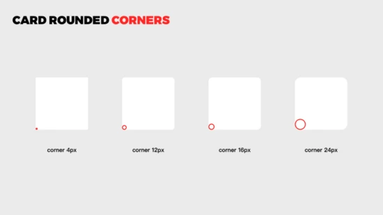

常规的卡片圆角，我们可以根据产品设计中，所需要的圆角数量来定义几种大小就可以了， 一般推荐3~5个就够了，不宜过多。 可以用在小卡片、按钮、卡片和其他需要圆角的控件上。

另外一种情况，卡片内继续嵌套卡片，这时候一般都会有圆角。那么两个卡片的圆角要怎么计算？

面对这种情况，相对好用的方法是： 内矩形的圆角是外矩形的1/2，比如内矩形圆角是16px，那么外矩形圆角是32px。 下面来看看两个案例。

案例1：

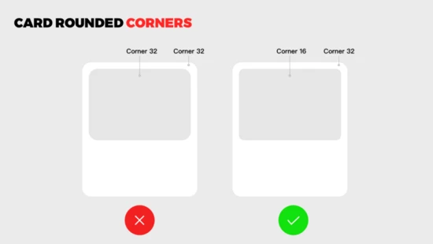

上图，在大卡片情况下，左侧外卡片和内卡片圆角一致，这样设计出来效果，看着有些不和谐。

右侧的方法内卡片圆角是外卡圆角的一半，这样的视觉看上去整体会和谐很多。

下面看个实际应用案例。
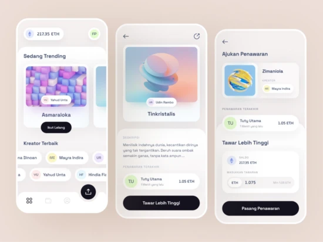

案例2：

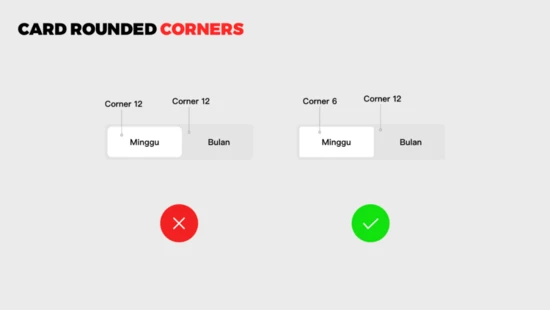

在分段导航控件场景下，左侧案例，内矩形和外矩形圆角相等，看着视觉感受不舒适。 右侧，内矩形圆角是外矩形的一半，效果会好很多。 下面看下这种导航的应用案例。

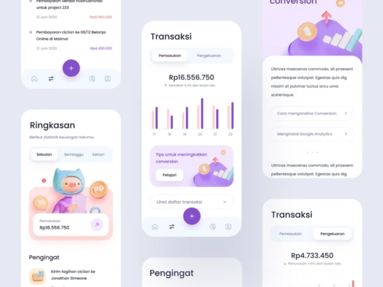

### 2.卡片描边

在一些场景下，如果我们整个产品界面的底色是白色，这时要添加白色卡片容器，同时只是单纯添加投影来区分层级，那么会显得有些模糊。

白色背景下， 如果添加投影的同时，再增加一描边效果，那么效果会好很多。

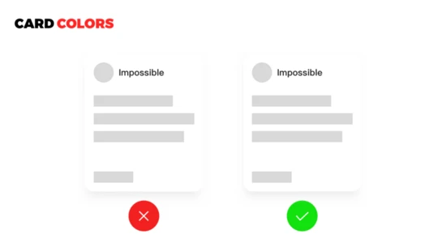

上图，在白色背景的项目中， 我们给卡片边缘加0.5px的线，色值#E9E9E9， 这样就会清晰的轮廓，卡片层级会更清晰一些。

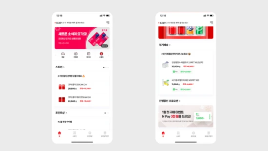

上面这个应用，在白色背景情况下，定义卡片，为了让信息层级清晰，特意在卡片上添加了描边效果。

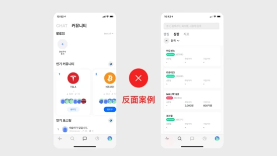

上图反面案例，同样的卡片设计，这个应用，卡片颜色和底部背景色一致，导致卡片几乎和背景融为一体，这样信息层级就会很弱，不推荐大家这样大面积使用。

### 3.卡片组合版式

卡片的组合版式，这个词也许你第一次听，因为是我发明的。到底什么是卡片组合版式？我这里指的是卡片与卡片之间的组合排版。

上图案例中，这种组合版式，在设计中最常见，也是用得多一些，所以会显得比较常规。

我们在前期做概念探索阶段，其实是可以打破这种布局模式的，挑战下其他思路。

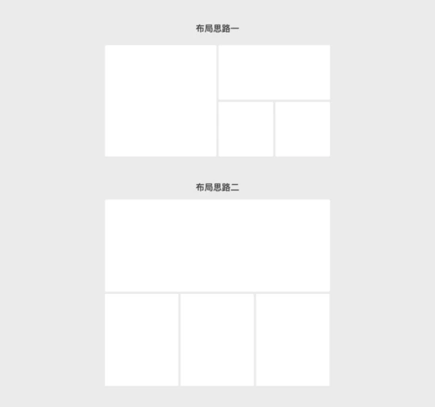

上图中，就是打破了原有的那种思路，尝试多卡片组合设计。

下面，我们 来看一些实际的设计案例。

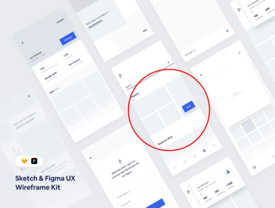

大 家留意下我红圈标记的地方， 这种卡片组合，就是我前面的那种多卡组合思路。

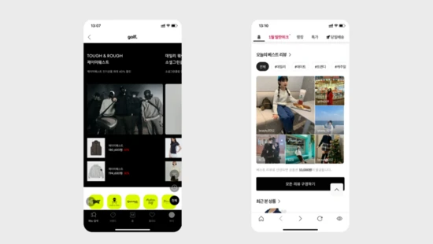

上面两个上线的应用，通过卡片的组合排版设计，让画面更有张力和新鲜感

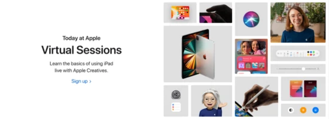

### 4. 异形 卡片

异形 卡片，很少有设计师会想到这样去布局，毕竟存在一定的风险。如果设计出来，效果还是蛮有惊喜的。我们今天讲的异形是除去圆形、方形的卡片。

异形 卡片的特点 ：不规则中有统一的规律，形式感强、张力、杂志感。

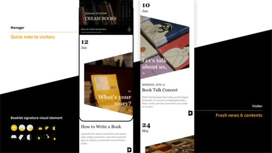

IF设计大奖作品，Booklet 采用异形设计，增强了页面视觉张力。

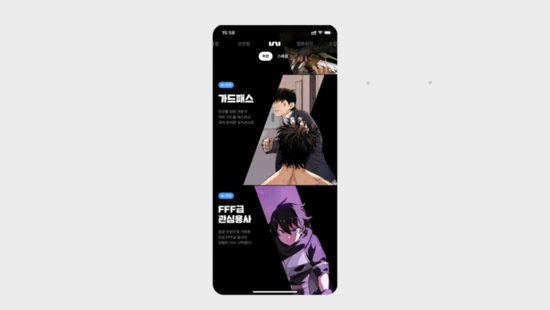

这个动漫类APP 应用设计，采用异形作为漫画人物容器承载，凸显画面趣味性和可玩性。

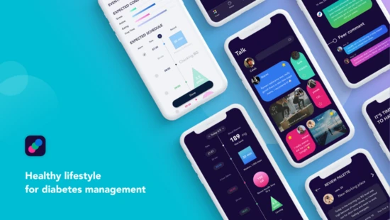

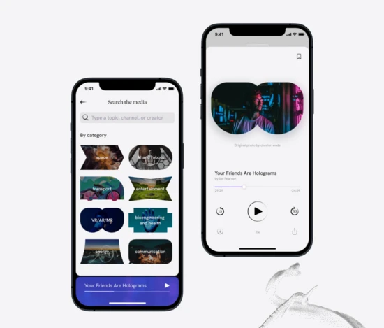

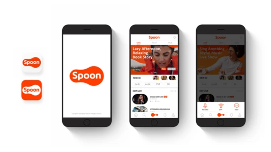

如果想打破现有模式，走创新方向，异形卡片可以作为一个切入点，毕竟异形卡片可以和品牌符号衔接起来，做创新拓展。

### 5.写在最后

卡片，在多形态业务中都频频出现，例如C端、B端、Web端、车载等，它的灵活性和适应性，受到广大设计师的青睐，对于开发人员来讲，适配性也很强。所以，既然这么重要的一个卡片容器，是值得我们去细致研究，以便于做出更好的卡片布局。

- [https://mp.weixin.qq.com/s?__biz=MzkxNzIxMjY2Mg==&mid=2247508675&idx=1&sn=ea73583050ea0963b2fa4374a1c3d4c8&utm_source=tuicool&utm_medium=referral](https://mp.weixin.qq.com/s?__biz=MzkxNzIxMjY2Mg==&mid=2247508675&idx=1&sn=ea73583050ea0963b2fa4374a1c3d4c8&utm_source=tuicool&utm_medium=referral)