- [https://material.io/resources](https://material.io/resources)
- [https://m3.material.io/styles/color/overview](https://m3.material.io/styles/color/overview)

### 1. 安卓布局规范

安卓和 iOS 类似，也包含状态栏、头部标题、底部导航栏以及 …… 底部指示器，我们简单对它们做个介绍。

首先，顶部状态栏在 MD2 中，是有背景色的，而在 MD3 则改成了和 iOS 一样的透明背景。它的高是 52dp（安卓的单位，和 PT 就名字的差别），使用方式和 iOS 状态栏基本一致。

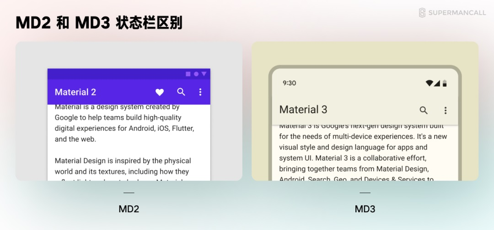

顶部标题栏上，MD 提供了 4 种模式，依次为 center-aligned, small, medium, large，在实际界面中可以根据自己的需要选择。

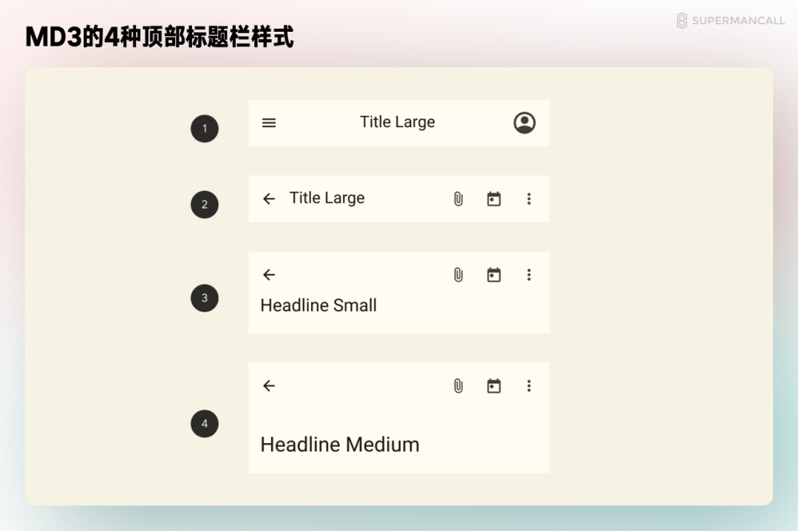

在 MD3 中，基本取消了安卓过去在顶部放导航的 “优良传统”，所以原先 MD2 中的 Bottom navigation 改名成 Navigation bar，不过我们依然可以用中文称呼它为底部导航栏。

它和 iOS 底部导航类似，提供了 3-5 个选项的不同版本，可以根据自己的需要选择。并且使用底部指示器的过程中，需要将导航底部延长，覆盖底部指示器的高 28dp。

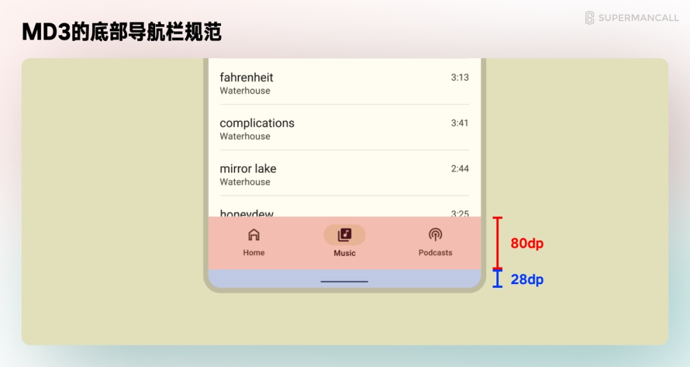

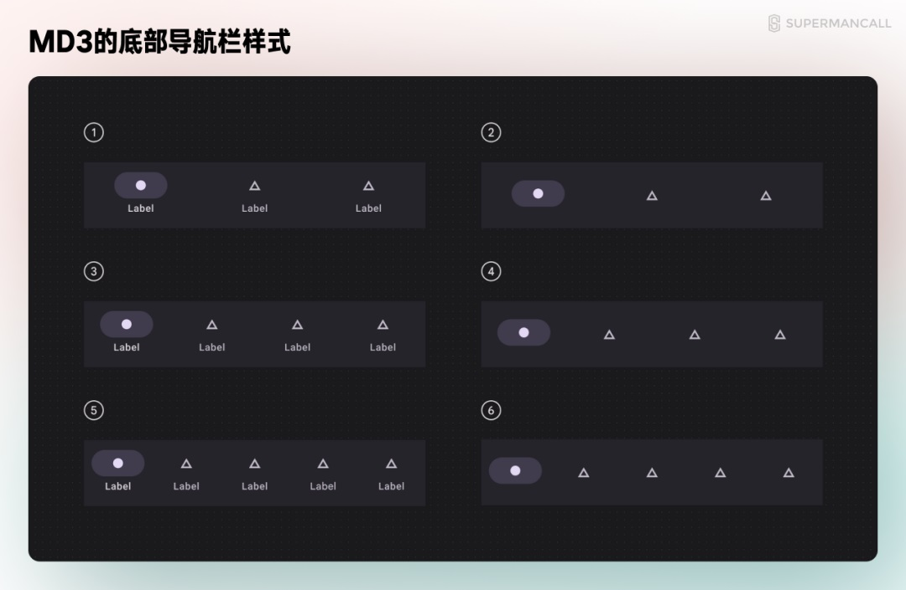

在 MD3 中，官方默认使用的画布是 412*892，左右页边距默认为 24。所以如果我们要创建一个以 MD3 规范为标准的页面，就可以通过置入所需的官方元素完成基础布局，进行后续设计。

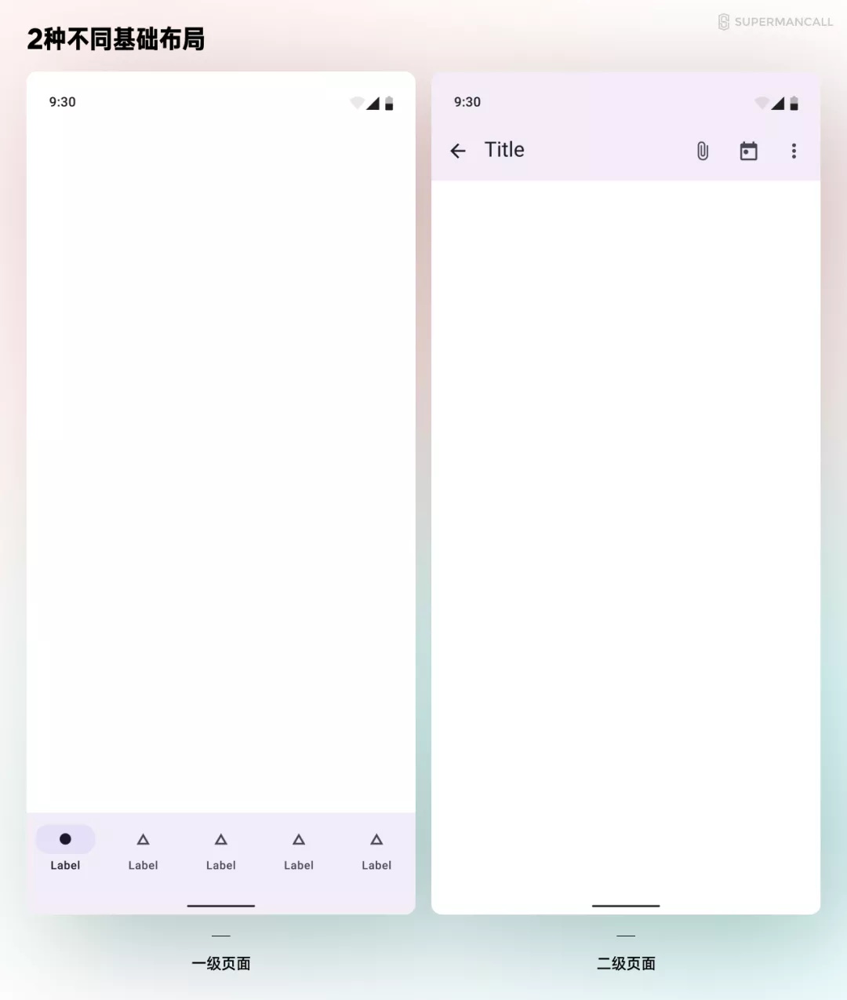

至于其它的官方组件，可以在源文件和官方的规范文档中查看，就不在这里展开了。

### 2. 安卓规范细节

MD3 和 MD2 看起来完全像 2 套规范，原因就在于细节层面变化太大。MD3 一改以往直男的设计风格和配色，摇身一变成年轻人喜闻乐见的网红风……

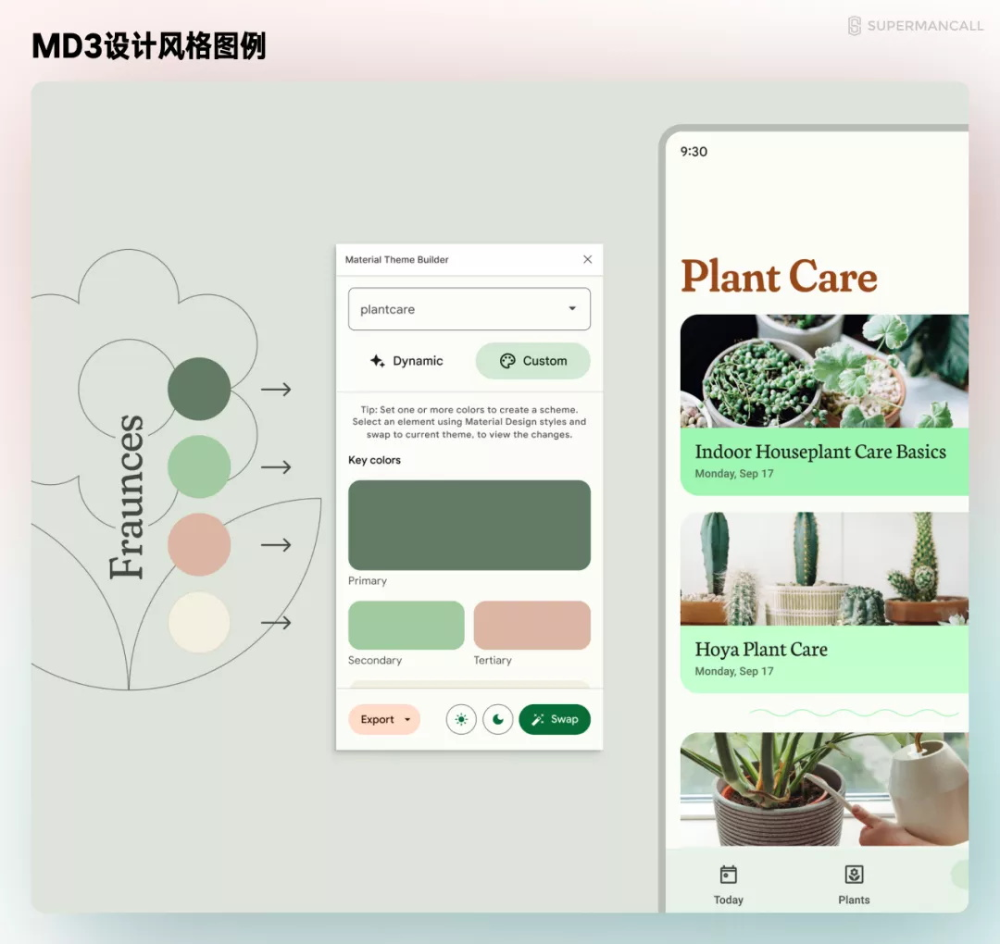

而相比起来，颜色填充的逻辑比色彩风格的变化更大。在安卓 12 中，提供了用户自定义系统色彩风格，和色彩根据场景自动化生成和填充的强大特性……

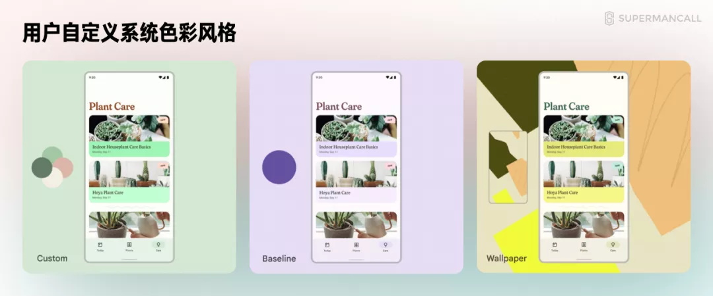

这套规范异常的复杂，这是一个针对 MD3 色彩配置的万字干货才能讲清楚的特性，我只在这边做一些最基本的讲解。

首先就是 MD3 中，也强调了色彩的角色：

- 主色 Primary Key Color
- 二级主色 Secondary Key Color
- 三级主色 Tertiary Key Color
- 中性色 Neutral Color
- 错误色 Error Color

只要这些角色的色值被确定，系统就会自动帮助我们生成不同的明度等级，并应用在不同的场景，比如下方左侧是我们设置的角色色值，右侧是系统会自动生成的关联色彩。

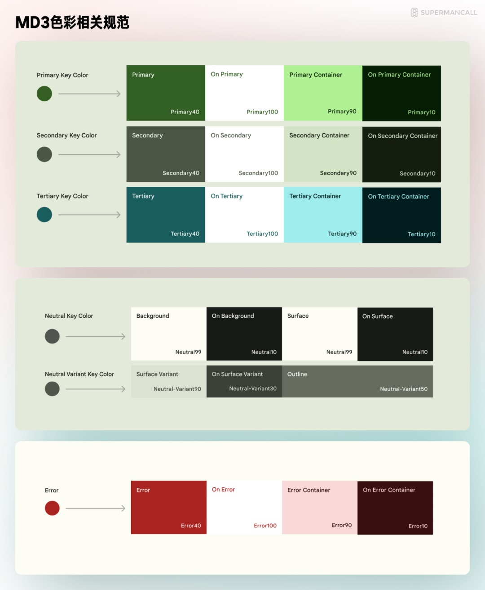

下面是色彩应用的示例：

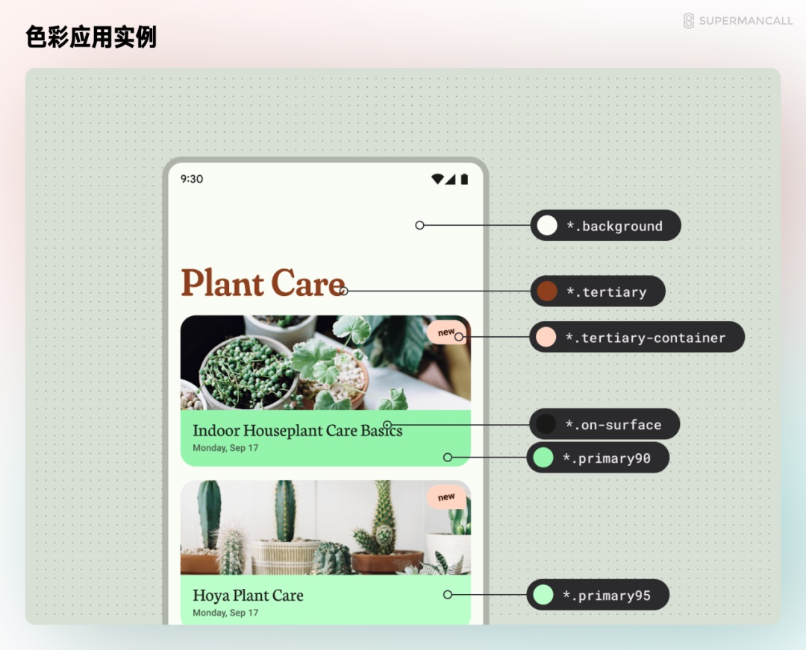

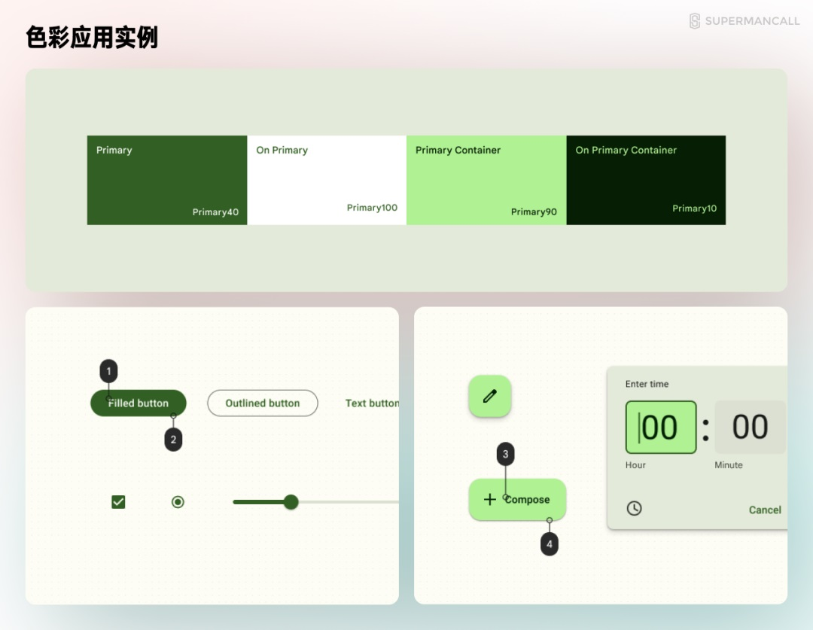

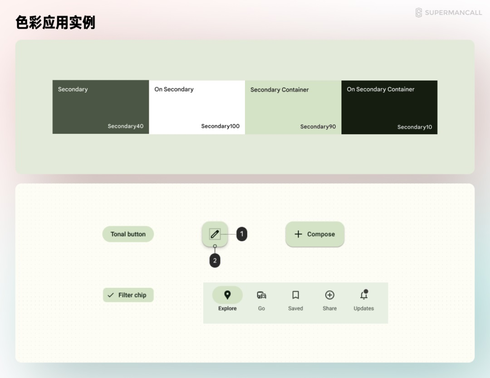

这些角色的具体色值，可是是我们作为 APP 开发方定义的，也可以完全交给客户端自动生成（独立设置或背景生成）。

所以当我们使用 MD3 规范做设计的时候，就要借助官方的插件来完成角色色值的生成。感兴趣的同学可以在 Figma 官方社区搜索 Material Theme Builder 插件，并根据下方介绍了解它的使用方法。

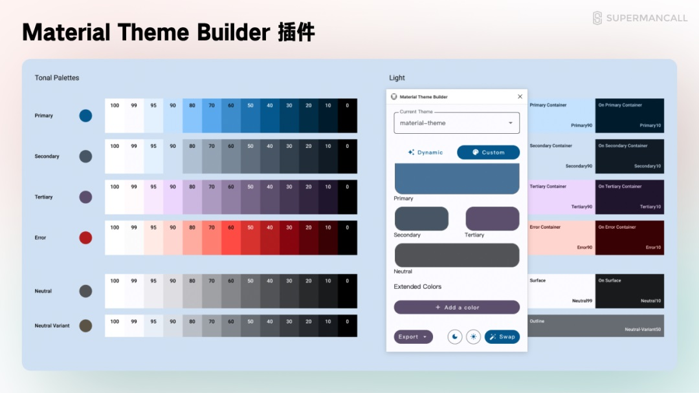

除色彩外，MD3 使用了更多、更大的圆角，让界面元素变得更圆润。圆角使用 4 的倍数，根据元素尺寸分别应用了 4、8、12、16、28 等圆角。

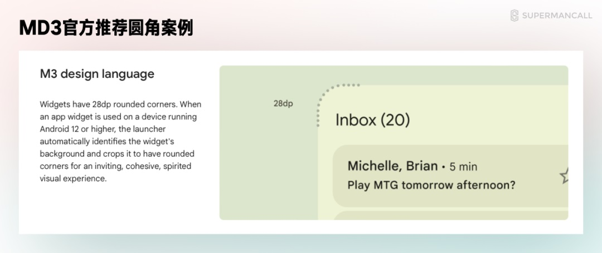

在使用了圆角的同时，还弃用了 MD2 中核心材质 —— 投影（我忍它很久了）。让元素之间通过色彩的对比来实现分隔，而不是应用一大堆厚重的投影来突出元素。

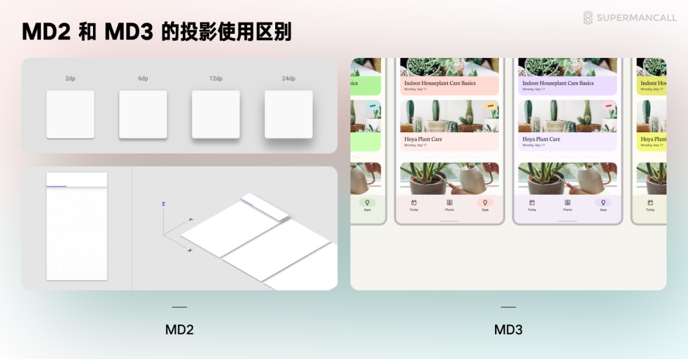

除此之外，MD3 中篇幅最多的还包括设备适配有关的规范，就不在这边介绍，留到后面的分享中讲解。

如果是面向国内市场的 UI 设计师，针对 MD3 只需要停留在了解的层面就行，在真实的工作环境里基本没有应用场景。

### 3. 国产安卓设计现状

为什么我们作为 UI 设计师可以对 MD3 停留在了解的层面，而不是真实的实践？

因为面向国内市场的安卓界面设计，基本不遵守谷歌官方的设计规范！这里面包含了非常多复杂的历史问题，有谷歌自己规范做的不清不楚（对比 iOS）的关系，也有每个厂商各自为战推出自己的设计系统的原因。

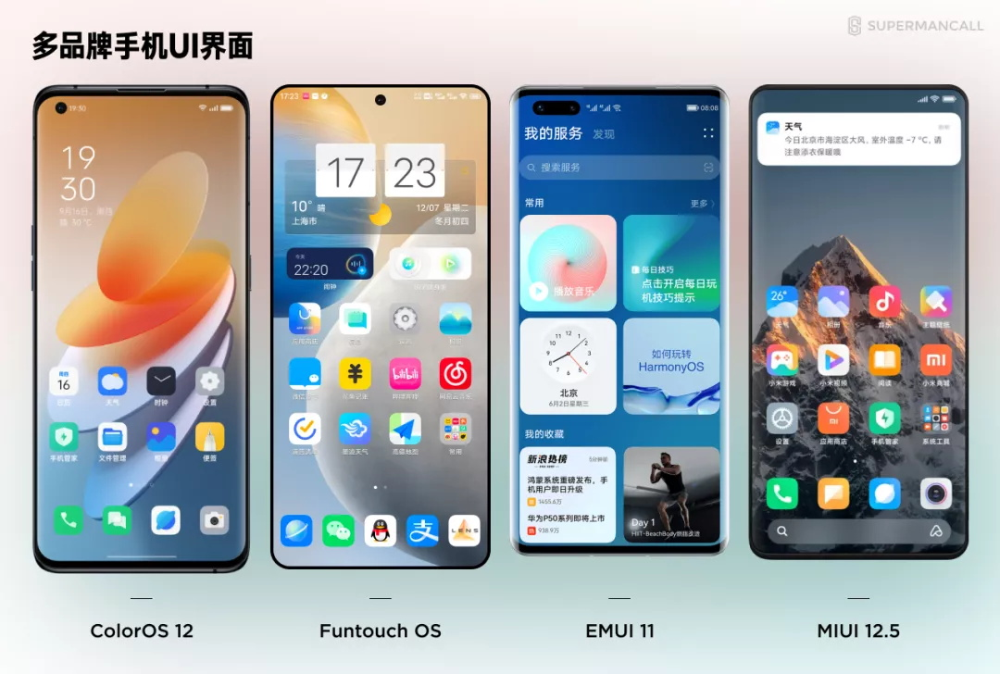

更底层的因素，是谷歌系统在国外才能获取完整的体验，没有进入国内（被墙），缺乏了厂商去支持和适配它的基本动力。同时在商业层面上，如果我们每设计一个 APP，iOS 和 Andorid 使用各自的规范，会对产品规划、设计、开发和测试都造成非常大的压力，是一般公司完全承受不起的。

再者，国内的安卓项目，多数是在完成 iOS 端的设计后，安卓工程师直接参照该设计稿适配到安卓端中。只有少数安卓特定的需求需要为其设计独立的页面。

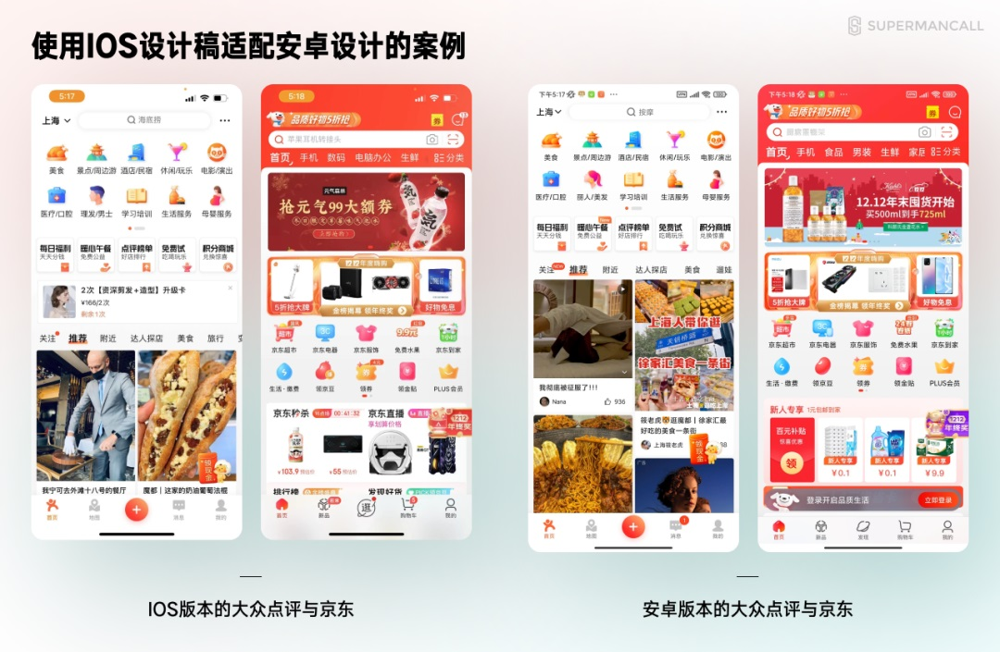

所以常规情况下，我们只需要提供标准的 iOS 界面即可。只有在产品经理提供的特殊需求和页面，要根据它输出安卓尺寸的对应界面，但设计风格、元素依旧可以保持 iOS 版本的样式。

要提升对安卓官方系统的理解，就一定要在你们的安卓手机上刷原生的系统，同时安装 Google 三件套，否则你们体验的就只有魔改版 iOS。

- [https://www.uisdc.com/android-12-rule](https://www.uisdc.com/android-12-rule)

