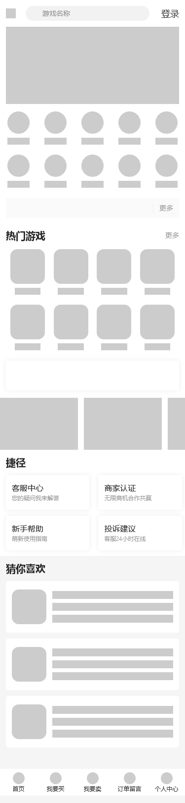

链接： [https://m.dd373.com/](https://m.dd373.com/)

### 首页


```html title=html
<header class="mobileHeader">
  <div class="headerBar">
    <div class="headerLeft">
      <i></i>
    </div>
    <div class="headerSearch">
      <input type="text" placeholder="游戏名称" readonly="readonly" />
    </div>
    <div class="headerRight">登录</div>
  </div>
</header>

<main class="mobileContent">
  <section class="bannerContainer">
    <div class="sliderItem"></div>
  </section>

  <section class="menuContainer">
    <ul>
      <li>
        <div>
          <a>
            <i></i>
            <p>
              <span></span>
            </p>
          </a>
        </div>
      </li>
      <li>
        <div>
          <a>
            <i></i>
            <p>
              <span></span>
            </p>
          </a>
        </div>
      </li>
      <li>
        <div>
          <a>
            <i></i>
            <p>
              <span></span>
            </p>
          </a>
        </div>
      </li>
      <li>
        <div>
          <a>
            <i></i>
            <p>
              <span></span>
            </p>
          </a>
        </div>
      </li>
      <li>
        <div>
          <a>
            <i></i>
            <p>
              <span></span>
            </p>
          </a>
        </div>
      </li>
      <li>
        <div>
          <a>
            <i></i>
            <p>
              <span></span>
            </p>
          </a>
        </div>
      </li>
      <li>
        <div>
          <a>
            <i></i>
            <p>
              <span></span>
            </p>
          </a>
        </div>
      </li>
      <li>
        <div>
          <a>
            <i></i>
            <p>
              <span></span>
            </p>
          </a>
        </div>
      </li>
      <li>
        <div>
          <a>
            <i></i>
            <p>
              <span></span>
            </p>
          </a>
        </div>
      </li>
      <li>
        <div>
          <a>
            <i></i>
            <p>
              <span></span>
            </p>
          </a>
        </div>
      </li>
    </ul>
  </section>

  <section class="noticeContainer">
    <div>
      <div class="noticeList"></div>
      <div class="noticeMoreBtn">
        <a>更多</a>
      </div>
    </div>
  </section>

  <section class="hotContainer">
    <div class="hotTop">
      <h3>热门游戏</h3>
      <div class="hotTopRight">
        <a>更多</a>
      </div>
    </div>
    <div class="hotList">
      <ul>
        <li>
          <div>
            <a>
              <i></i>
              <p>
                <span></span>
              </p>
            </a>
          </div>
        </li>
        <li>
          <div>
            <a>
              <i></i>
              <p>
                <span></span>
              </p>
            </a>
          </div>
        </li>
        <li>
          <div>
            <a>
              <i></i>
              <p>
                <span></span>
              </p>
            </a>
          </div>
        </li>
        <li>
          <div>
            <a>
              <i></i>
              <p>
                <span></span>
              </p>
            </a>
          </div>
        </li>
        <li>
          <div>
            <a>
              <i></i>
              <p>
                <span></span>
              </p>
            </a>
          </div>
        </li>
        <li>
          <div>
            <a>
              <i></i>
              <p>
                <span></span>
              </p>
            </a>
          </div>
        </li>
        <li>
          <div>
            <a>
              <i></i>
              <p>
                <span></span>
              </p>
            </a>
          </div>
        </li>
        <li>
          <div>
            <a>
              <i></i>
              <p>
                <span></span>
              </p>
            </a>
          </div>
        </li>
      </ul>
    </div>
  </section>

  <section class="dealContainer">
    <div></div>
  </section>
  <section class="adContainer">
    <div>
      <ul>
        <li></li>
        <li></li>
        <li></li>
      </ul>
    </div>
  </section>
  <section class="shortcutContainer">
    <div class="shortcutTop">
      <h3>捷径</h3>
    </div>
    <div class="shortcutList">
      <ul>
        <li>
          <div>
            <h4>客服中心</h4>
            <p>您的疑问我来解答</p>
          </div>
        </li>
        <li>
          <div>
            <h4>商家认证</h4>
            <p>无限商机合作共赢</p>
          </div>
        </li>
        <li>
          <div>
            <h4>新手帮助</h4>
            <p>萌新使用指南</p>
          </div>
        </li>
        <li>
          <div>
            <h4>投诉建议</h4>
            <p>客服24小时在线</p>
          </div>
        </li>
      </ul>
    </div>
  </section>
  <section class="recommendContainer">
    <div class="recommendTop">
      <h3>猜你喜欢</h3>
    </div>
    <div class="recommendList">
      <ul>
        <li>
          <div>
            <div class="recommendItemLeft"></div>
            <div class="recommendItemRight">
              <p></p>
              <p></p>
              <p></p>
            </div>
          </div>
        </li>
        <li>
          <div>
            <div class="recommendItemLeft"></div>
            <div class="recommendItemRight">
              <p></p>
              <p></p>
              <p></p>
            </div>
          </div>
        </li>
        <li>
          <div>
            <div class="recommendItemLeft"></div>
            <div class="recommendItemRight">
              <p></p>
              <p></p>
              <p></p>
            </div>
          </div>
        </li>
      </ul>
    </div>
  </section>
</main>
<footer class="mobileFooter">
  <ul>
    <li>
      <div>
        <i></i>
        <p>
          <span>首页</span>
        </p>
      </div>
    </li>
    <li>
      <div>
        <i></i>
        <p>
          <span>我要买</span>
        </p>
      </div>
    </li>
    <li>
      <div>
        <i></i>
        <p>
          <span>我要卖</span>
        </p>
      </div>
    </li>
    <li>
      <div>
        <i></i>
        <p>
          <span>订单留言</span>
        </p>
      </div>
    </li>
    <li>
      <div>
        <i></i>
        <p>
          <span>个人中心</span>
        </p>
      </div>
    </li>
  </ul>
</footer>
```

```css title=css
html {
  font-size: calc(100vw / 7.5);
  font-size: -webkit-calc(100vw/7.5);
  -webkit-text-size-adjust: 100%;
}
body {
  background: #f5f5f5;
  font-size: 0.24rem;
  max-width: 750px;
  margin-right: auto;
  margin-left: auto;
  cursor: pointer;
  -webkit-tap-highlight-color: rgba 255, 255, 255, 0;
  -webkit-tap-highlight-color: transparent;
  color: #333;
  font-family: "微软雅黑";
}

.mobileHeader {
  width: 100%;
  max-width: 750px;
  margin: 0 auto;
  position: fixed;
  top: 0;
  z-index: 10000;
  font-size: 0.36rem;
  color: #333;
}
.headerBar {
  background: #fff;
  padding: 0 0.24rem;
  height: 1.08rem;
  display: flex;
  align-items: center;
}
.headerLeft {
  display: flex;
  width: 40px;
  i {
    width: 20px;
    height: 20px;
    display: inline-block;
    background: #ccc;
  }
}
.headerSearch {
  display: flex;
  justify-content: center;
  align-items: center;
  position: relative;
  flex: 1;

  input {
    border: none;
    outline: none;
    background: #f2f2f2;
    border-radius: 30px;
    height: 0.6rem;
    font-size: 0.28rem;
    padding-left: 0.68rem;
    padding-right: 0.68rem;
    width: 100%;
  }
}
.headerRight {
  display: flex;
  justify-content: flex-end;
  position: relative;
  width: 60px;
}

.mobileContent {
  margin-top: 1.08rem;
}

.bannerContainer {
  padding: 0 0.24rem;
  background-color: #ffffff;

  .sliderItem {
    background: #ccc;
    height: 156px;
  }
}

.menuContainer {
  background-color: #ffffff;

  ul {
    overflow: hidden;
    padding-bottom: 0.3rem;
  }
  li {
    width: 20%;
    float: left;
    padding-top: 0.3rem;
    text-align: center;
    list-style-type: none;
  }

  li > div {
    display: flex;
    justify-content: center;
    align-items: center;

    > a {
      display: block;
      width: 100%;
      position: relative;

      i {
        width: 0.9rem;
        height: 0.9rem;
        border-radius: 50%;
        background: #ccc;
        display: inline-block;
      }
      span {
        background: #ccc;
        width: 60%;
        line-height: 0.28rem;
        text-align: center;
        font-size: 0.24rem;
        color: #333333;
        overflow: hidden;
        text-overflow: ellipsis;
        white-space: nowrap;
        display: inline-block;
        height: 0.28rem;
      }
    }
  }
}

.noticeContainer {
  background-color: #ffffff;
  padding: 0 0.24rem;
  padding-bottom: 0.44rem;
  > div {
    height: 0.8rem;
    background-color: #fafafa;
    overflow: hidden;
    padding: 0.26rem 0.24rem;
    font-size: 0.28rem;
    line-height: 0.3rem;
    border-radius: 0.05rem;
    display: flex;
    align-items: center;
  }
  .noticeList {
    flex: 1;
  }
  .noticeMoreBtn {
    padding-left: 0.24rem;
    a {
      color: #999999;
      padding-left: 0.24rem;
      border-left: 1px solid #ededed;
    }
  }
}

.hotContainer {
  background-color: #ffffff;
  padding: 0 0.24rem;
}
.hotTop {
  height: 0.52rem;
  line-height: 0.52rem;
  overflow: hidden;
  display: flex;
  justify-content: center;
  align-items: center;
  h3 {
    font-size: 0.4rem;
    font-weight: bold;
    flex: 1;
  }
}
.hotTopRight {
  a {
    font-size: 0.28rem;
    color: #999999;
  }
}
.hotList {
  ul {
    overflow: hidden;
    padding-bottom: 0.3rem;
  }
  li {
    width: 25%;
    float: left;
    padding-top: 0.3rem;
    text-align: center;

    > div {
      display: flex;
      justify-content: center;
      align-items: center;

      > a {
        display: block;
        width: 100%;
        position: relative;

        i {
          width: 1.4rem;
          height: 1.4rem;
          border-radius: 0.28rem;
          background: #ccc;
          display: inline-block;
        }
        span {
          background: #ccc;
          width: 60%;
          line-height: 0.28rem;
          text-align: center;
          font-size: 0.24rem;
          color: #333333;
          overflow: hidden;
          text-overflow: ellipsis;
          white-space: nowrap;
          display: inline-block;
          height: 0.28rem;
        }
      }
    }
  }
}

.dealContainer {
  padding: 0 0.24rem;
  padding-bottom: 0.3rem;
  background-color: #ffffff;
  > div {
    height: 1.2rem;
    padding: 0.3rem 0;
    padding-left: 0.3rem;
    padding-right: 0.24rem;
    border-radius: 0.05rem;
    box-shadow: 0px 0px 10px #ededed;
    overflow: hidden;
  }
}

.adContainer {
  padding-right: 0;
  background-color: #ffffff;
  padding-bottom: 0.2rem;
  width: 100%;
  overflow: hidden;

  > div {
    width: 510px;

    ul {
      width: 100%;
      height: 2.2rem;
    }
    li {
      margin-right: 12px;
      height: 2.1rem;
      padding-bottom: 0.3rem;
      width: 158px;
      float: left;
      background: #ccc;
    }
  }
}
.shortcutContainer {
  background-color: #ffffff;
}
.shortcutTop {
  h3 {
    font-size: 0.4rem;
    line-height: 0.4rem;
    font-weight: bold;
    padding: 0 0.24rem;
    padding-bottom: 0.08rem;
  }
}
.shortcutList {
  overflow: hidden;
  height: 3.5rem;
  li {
    width: 3.39rem;
    height: 1.4rem;
    margin-top: 0.24rem;
    margin-left: 0.24rem;
    box-shadow: 0px 0px 10px #ededed;
    border-radius: 0.1rem;
    padding: 0.35rem 0.24rem;
    float: left;
    overflow: hidden;

    h4 {
      font-size: 0.32rem;
      line-height: 0.32rem;
      overflow: hidden;
      text-overflow: ellipsis;
      white-space: nowrap;
    }
    p {
      margin-top: 0.14rem;
      font-size: 0.24rem;
      line-height: 0.24rem;
      color: #999999;
      overflow: hidden;
      text-overflow: ellipsis;
      white-space: nowrap;
    }
  }
  li:nth-child(odd) {
    margin-right: 0.12rem;
  }
}
.recommendContainer {
}
.recommendTop {
  h3 {
    font-size: 0.4rem;
    line-height: 0.4rem;
    font-weight: bold;
    padding: 0 0.24rem;
    padding-top: 0.3rem;
    padding-bottom: 0.08rem;
  }
}
.recommendList {
  ul {
    padding: 0 0.24rem;

    li {
      overflow: hidden;
      border-radius: 0.1rem;
      background-color: #ffffff;
      margin-top: 0.24rem;
      padding: 0.24rem;
      > div {
        display: flex;
        justify-content: center;
        align-items: center;
      }
    }
  }
}
.recommendItemLeft {
  margin-right: 0.24rem;
  float: left;
  width: 1.4rem;
  height: 1.4rem;
  border-radius: 0.28rem;
  background: #ccc;
}
.recommendItemRight {
  flex: 1;
  p {
    font-size: 0.32rem;
    line-height: 0.32rem;
    height: 0.32rem;
    color: #333333;
    background: #ccc;
    margin: 8px 0;
  }
}
.mobileFooter {
  background: #fff;
  width: 100%;
  max-width: 750px;
  margin: 0 auto;
  position: fixed;
  bottom: 0;
  z-index: 10000;
  font-size: 0.2rem;
  color: #666;

  ul {
    display: flex;
    justify-content: center;
    align-items: center;
  }
  li {
    flex: 1;
    height: 1.08rem;
    width: 20%;
    display: flex;
    text-align: center;
    justify-content: center;
    align-items: center;
    > div {
      flex: 1;
      i {
        width: 0.48rem;
        height: 0.48rem;
        border-radius: 50%;
        background: #ccc;
        display: inline-block;
      }
      p {
        line-height: 1;
      }
      span {
        text-align: center;
        font-size: 0.24rem;
        color: #333333;
        overflow: hidden;
        text-overflow: ellipsis;
        white-space: nowrap;
        display: inline-block;
      }
    }
  }
}
```

效果：


