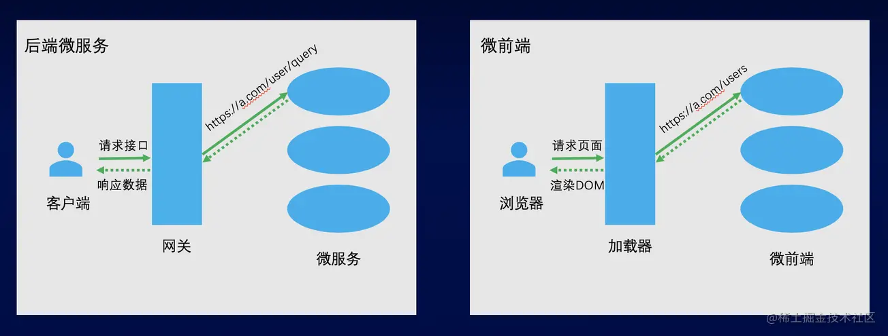

<!--truncate-->

在 toB 的前端开发工作中，我们往往就会遇到如下困境：

- 工程越来越大，打包越来越慢
- 团队人员多，产品功能复杂，代码冲突频繁、影响面大
- 内心想做 SaaS 产品，但客户总是要做定制化

不同的团队可能有不同的方法去解决这些问题。在前端开发日新月异、前端工程化蓬勃发展的今天，我想给大家介绍下另一种尝试——微前端。

### 微前端是什么
那什么是微前端？微前端主要是借鉴后端微服务的概念。简单地说，就是将一个巨无霸（Monolith）的前端工程拆分成一个一个的小工程。别小看这些小工程，它们也是“麻雀虽小，五脏俱全”，完全具备独立的开发、运行能力。整个系统就将由这些小工程协同合作，实现所有页面的展示与交互。



可以跟微服务这么对比着去理解：

|   微服务    |   微前端  |
|--|--|
|一个微服务就是由一组接口构成，接口地址一般是 URL。当微服务收到一个接口的请求时，会进行路由找到相应的逻辑，输出响应内容。 | 一个微前端则是由一组页面构成，页面地址也是 URL。当微前端收到一个页面 URL 的请求时，会进行路由找到相应的组件，渲染页面内容。
|   后端微服务会有一个网关，作为单一入口接收所有的客户端接口请求，根据接口 URL 与服务的匹配关系，路由到对应的服务。 |   微前端则会有一个加载器，作为单一入口接收所有页面 URL 的访问，根据页面 URL 与微前端的匹配关系，选择加载对应的微前端，由该微前端进行进行路由响应 URL。

### 为什么要用微前端
在介绍具体的改造方式之前，我想跟大家先说明下我们当时面临的问题，以及改造后的对比，以便大家以此为对照，评判或决定使用。主要包括打包速度、页面加载速度、多人多地协作、SaaS 产品定制化、产品拆分这几个角度。  

首先是打包速度。在 6 个月前，我们的 B 端工程那会儿还是一个 Monolith。当时已经有 20 多个依赖、60 多个公共组件、200 多个页面，对接 700 多个接口。我们使用了 Webpack 2，并启用 DLL Plugin、HappyPack 4。在我的个人主机上使用 4 线程编译，大概要 5 分钟。而如果不拆分，算下来现在我们已经有近 400 个页面，对接1000 多个接口。  

这个时间意味着什么？它不仅会耽误我们开发人员的时间，还会影响整个团队的效率。上线时，在 Docker、CI 等环境下，耗时还会被延长。如果部署后出几个 Bug，要线上立即修复，那就不知道要熬到几点了。  

在使用微前端改造后，目前我们已经有 26 个微前端工程，平均打包时间在 30-45 秒之间（注意，这里还没有应用 DLL + HappyPack）。  

页面加载速度其实影响到并不是很大，因为经过 CDN、gzip 后，资源的大小还能接受。这里只是给大家看一些直观的数据变化。6 个月前，打包生成的 app.js 有 5MB（gzip 后 1MB），vendor.js 有 2MB（gzip 后 700KB），app.css 有 1.5MB（gzip 后 250KB）。这样首屏大概要传输 2MB 的内容。拆分后，目前首屏只需要传输 800KB 左右。    

在协作上，我们在全国有三个地方的前端团队，这么多人在同一个工程里开发，遭遇代码冲突的概率会很频繁，而且冲突的影响面比较大。如果代码中出现问题，导致 CI 失败，所有其他人的代码提交与更新也都会被阻塞。使用微前端后，这样的风险就平摊到各个工程上去了。  

再者就是定制化了。我们做的额是一款 toB 的产品，做成 SaaS 标准版产品大概是所有从业者的愿望。但整体市场环境与产品功能所限，经常要面临一些客户要求做本地化与定制化的要求。本地化就会有代码安全方面的考量，最好是不给客户源代码，最差则是只给客户购买功能的源代码。而定制化从易到难则可以分为独立新模块、改造现有模块、替换现有模块。 

通过微前端技术，我们可以很容易达到本地化代码安全的下限——只给客户他所购买的模块的前端源码。定制化里最简单的独立新模块也变得简单：交付团队增加一个新的微前端工程即可，不需要揉进现有研发工程中，不占用研发团队资源。而定制化中的改造现有模块也可以比较好地实现：比如说某个标准版的页面中需要增加一个面板，则可以通过一个新的微前端工程，同样响应该页面的 URL（当然要控制好顺序），在页面的恰当位置插入一个新的 DOM 节点即可。  

最后就是产品拆分方面的考量了。我们的产品比较大，有几块功能比较独立、有特色。如果说将来需要独立成一个子产品，有微前端拆分作为铺垫，腾挪组合也会变得更加容易些。

### 其他目标
有了以上的一些原因与诉求，在决定进行微前端改造前，还需要设定一些额外的小目标：

- 不能对现有的前端开发方式带来太大变化，至少要有平滑过渡的机制。
- 每个为前端工程都要求可以独立运行，至少在本地开发时要能做到。
- 微前端在加载时，要实现预加载，并可以自由调整预加载顺序，甚至是根据用户的偏好来实现智能化、个性化的加载顺序。

### 如何改造现有工程

“Talk is cheap，show me the code“。下面就让我们一起来看看具体的改造吧！我们的微前端工程可以划分为 portal 工程、业务工程、common 工程这几类。

**portal 工程**  

portal，顾名思义，就是入口。这也就是上面所说的微前端加载器。当用户打开浏览器，首次进入我们的页面时，不管是什么 URL，首先加载的就是 portal。portal 里会配置所有业务工程的地址、匹配哪些 URL、需要加载哪些资源。如：
```javascript
// 业务工程的名称
customer: {
    // URL 匹配模式
    matchUrlHash: ['^/customer'],
    // 微前端地址
    target: 'http://localhost:8101/mfe-customer/index.html',
    // 资源匹配模式
    resourcePatterns: ['/app.*.css$', '/vendor.*.css$', '/manifest.*.js$', '/vendor.*.js$', '/app.*.js$'],
}
```
portal 会定时、异步、并发地下载业务工程的资源，并将它们进行注册，此时并不会加载这些业务工程。这里之所以要业务工程的地址（target）、资源（resourcePatterns），是为了加载时确定地知道其所包含的 app.js、vendor.js、app.css 等资源的路径。因为业务工程每次有变更，app.js 等资源路径上都会带有新的文件内容哈希值（Hash），导致路径不可预测。而它的 index.html 的路径是固定的。我们读取该 HTML，解析其内容，通过正则就能匹配到 app.js 等资源的路径。

portal 在运行时，会监听 URL 变化。目前我们只支持 URL Hash（如 #/customer）。当 Hash 发生变更时，匹配到业务工程，然后执行卸载、加载的工作。这个机制主要是利用 single-spa 来实现，但原理就是这么简单。
```javascript
import { registerApplication } from 'single-spa';
registerApplication('customer', 
    // 下载微前端工程，获取三个函数钩子：bootstrap、mount、unmount
    () => {
        const html = fetch(mfeConfig.target);
        const {cssUrls, jsUrls} = match(html, mfeConfig.resourcePatterns);
        loadCss(cssUrls);
        loadJs(jsUrls);
        return windows['mfe:customer'];
    },
    // 对当前浏览器 URL Hash 进行匹配，如果匹配（返回 true），则加载该微前端（调用 mount）；否则卸载（调用 unmount）
    () => {
        return match(window.location.hash, mfeConfig.matchUrlHash);
    },
    mfeConfig.customProps
);
```
**业务工程**  

业务工程就是普通的微前端工程，一般一个模块一个工程。业务工程要扮演两个角色，一个是可独立运行的前端工程，一个是受 portal 控制的运行时。前者主要用于我们本地开发，后者则是线上集成时使用。在独立运行时，它跟原来的前端工程没有什么区别。以 Vue 工程为例，照样使用 new Vue({el: '#app'}) 来启动、渲染页面。
```javascript
new Vue({
    el: '#app',
    i18n,
    router,
    store,
    template: '<App/>',
    components: { App }
});
```
而当受控运行时，则是利用 UMD 方式输出几个钩子函数，包括初始化、加载、卸载。
```javascript
if(!window.IS_IN_MFE){ // 独立运行时
    new Vue({...})
} else { // 受控运行时
    module.exports = {
        bootstrap(){ // 注册时执行
        },
        mount(customProps){ // 加载时执行
            return Promise.resolve().then(()=>{
            instance = new Vue({...})
            })
        },
        unmount(){ // 卸载时执行
            return Promise.resolve().then(()=>{
            instance.$destroy()
            })
        }
    }
}
```
线上环境的 Webpack 配置：
```javascript
output: {
    libraryTarget: "umd",
    library: 'mfe:customer'
}
```
而区分是否受控，则可以通过判断一个全局变量来实现。如 window.IS_IN_MFE，portal 工程在运行时会将其设置为 true。
为了支持本地多个工程同时开发，我们需要为每个微前端工程指定一个确定的、独占的端口号。比如从 8100 开始，逐一递增。同时，为了支持线上部署，我们还需要给每个微前端工程指定一个确定的、独占的基础路径（前缀）。这样相同域名下可以用不同路径进行独立访问。路径统一以 /mfe- 开头，如 /mfe-customer。这也就是上面 portal 里业务工程的配置示例里所展现的那样。

### 特殊业务工程：mfe-navs
我们产品的页面结构分为顶部栏、侧边栏、中间内容区三大块。顶部栏和侧边栏在页面跳转过程中，基本上保持不变。所以我们也将它们剥离出来作为一个独立的微前端业务工程，叫做 mfe-navs。它会匹配所有的 URL，也就是说访问任意 URL 时，都会加载它，而且还要保证先加载它。当它加载完毕后，会在页面内提供一个中间内容区的锚点 DOM（#app：），供其他业务工程加载时挂载。

### Common 工程
上面可以看到，每一个业务工程都是一个独立的前端工程，所以里面会有一些相同的依赖，如 Vue、moment、lodash 等。如果将这些内容都打包到各自的 vendor.js 里，则势必会导致代码冗余太多，浏览器运行内存压力增大。我们把这些公共依赖、公共组件、CSS、Fonts 等都放到一个工程里，由该工程进行打包，将依赖、组件 export，并以 UMD 的方式注入到全局。
```javascript
main.js：
import Vue from 'vue'; // 公共依赖
import VueRouter from 'vue-router';
import VueI18n from 'vue-i18n';
import '@/css/icon-font/iconfont.css';
import ContentSelector from '@/components/ContentSelector'; // 公共组件

Vue.use(VueI18n); // 大家都要这么做，我们就代劳吧！

module.exports = {
    'vue': Vue,
    'vue-router': VueRouter,
    'content-selector': ContentSelector,
};
```
Webpack 配置：
```javascript
output: {
    libraryTarget: "umd",
    library: 'mfe:common'
}
```
业务工程则通过 Webpack 外部依赖（external）的方式引入到工程中。这样业务工程打包时就不会包含这些公共代码了。
```javascript
var externalModules = ['vue', 'vue-router', 'content-selector'];

module.exports = { // webpack 配置项
    // ...
    externals: (context, request, callback)=>{
        if(externalModules.includes(request)){
            callback(null, 'root window["mfe:common"]["'+request+'"]')
        } else {
            callback();
        }
    },
}
```
### 结语
以上就是我们微前端改造与实践方面的一些经验。前路漫漫，这里面还存在很多待完善的地方，如 History 模式支持、i18n 更好地集成、各个业务工程的加载顺序优化及个性化等。除了这些纯粹技术上的探索，在拥有微前端、微服务这些架构的基础上，团队也可以考虑进行垂直拆分：一个小组独立负责一块业务，它有自己的微前端工程和微服务工程。从技术管理到人员管理，将它们糅合在一起统一考虑，这也是我们软件工程的探索方向。期待这些能够对大家带来一些思考和帮助！  

作者：kiliwalk   
链接：https://juejin.cn/post/6844903816295350279  
来源：稀土掘金  
著作权归作者所有。商业转载请联系作者获得授权，非商业转载请注明出处。  


