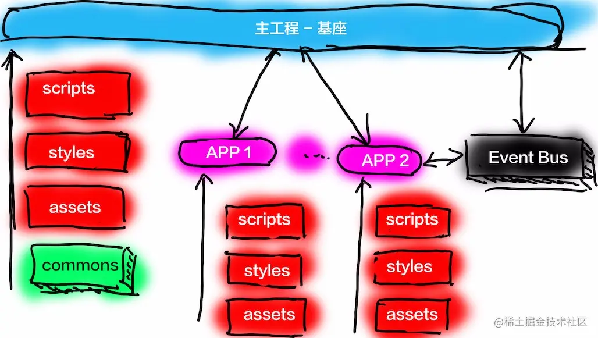

<!--truncate-->

微前端目前为止还是比较年轻的架构模式，从如何实现应用自治、满足单一职责的原则、实现技术栈无关的重要特性到微前端的技术拆分方式，再到微前端业务拆分方式行业内都还没有实现统一和规范化。值得欣慰的是，在一些大厂的探索下，也已经涌现了不少相对成熟的方案：

- 阿里UmiJS团队孵化的qiankun
- single-spa
- nut(网易出品)
- [微前端在美团外卖的实践](https://tech.meituan.com/2020/02/27/meituan-waimai-micro-frontends-practice.html)
- [微前端在小米CRM的实践](https://xiaomi-info.github.io/2020/04/14/fe-microfrontends-practice/)
- [标准微前端架构在蚂蚁的落地实践](https://developer.aliyun.com/article/742576)

  

微前端的实现意味着对前端应用的拆分，拆分应用的目的并不是为了在架构上好看，它还可以提升开发效率和降低项目维护成本。把架构师、程序员从臃肿的单体应用中解放出来。微前端是一种代码组织模式，更是一种软件架构思想。微前端也不只可以应用在 Web 开发，在 App 开发中也大有用武之地，近几年炒的很热的小程序理论上也属于微前端的架构模式。

可以参考的技术主题

- 遗留系统微前端化
- 微应用化实践与应用
- 前端微服务化实践与应用
- 微前端下的工程化与治理
- 实战场景分析
- 微前端架构下的CI/CD
- 微前端框架实践与应用

