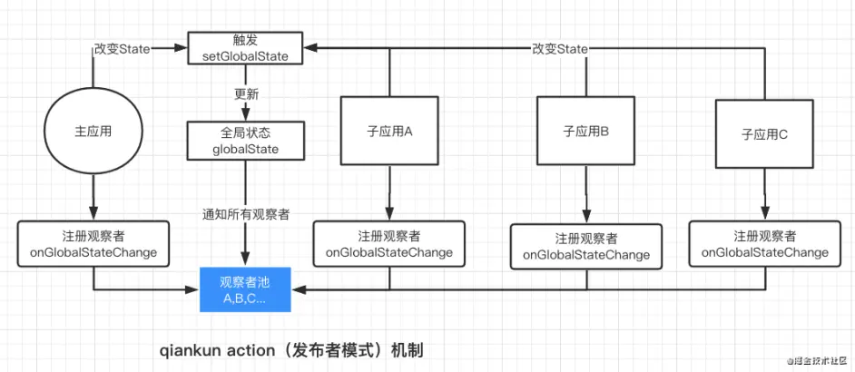

### 什么是微前端，解决了什么

目前开发的前端产品主要有两个方向:MPA和SPA。

MPA： 应用独立通过域名实现应用之间的跳转，优点天生具备了技术栈无关，独立部署，独立开发的优势。缺点：应用跳转会导致浏览器重刷，流程体验上就会造成断点。

SPA：天生体验上的优势，应用内的跳转，无需刷新。缺点就是技术栈强耦合，以及项目会越积越大。

微前端可以说是这两者优势的合集，微前端架构可以吧一个应用拆分成多个互相独立的子应用，保证了应用的独立性，同时也保证了产品的完整体验流程。

### 解决的问题:

1. 业务不断扩大，业务模块之间耦合加剧

2. 开发团队面临拆分、解耦才能达到并行开发

3. 新的框架、方案如何适用现有的工程环境（构建工具）等

4. 旧的框架如何平稳升级

 

### 微前端中应用的预加载 
> [详细参考](https://zhuanlan.zhihu.com/p/144287783?from_voters_page=true)

qiankun提供了开启预加载的字段(prefetch)，通过setDefaultMountApp方法设置需要默认加载的字应用。

预加载的思路： 在浏览器提供的requsetIdleCallback事件里面执行import-html-entry。 加载的资源会根据url缓存起来。

### 子应用的加载

> [详细参考](https://juejin.cn/post/6891888458919641096)

### 服务通信

> [详细参考](https://juejin.cn/post/6844904151231496200)

首先微前端不建议应用之间过多的的通信。

**1.localStorage**

qiankun提供initGlobalState方法来在全局注册一个实例用于通信。这个实例有三个方法：

1. setGlobalState: 来修改全局的状态（globalState）,内部会对globalState进行浅比较，如果发生改变，会通知所有的观察者。

2. onGlobalStateChange: 注册观察者的函数，子组件通过这个方法注册成观察者，当全局的globalState发生变化，就会触发该函数。

3. offGlobalStateChange: 取消成为观察者。

下图可以看出整个流程就是，子组件通过注册成为观察者到观察者池中，通过修改globalState通知观察者函数，达到组件之间通信的效果。 

  

**3.shared通信**

思路：主应用通过基于redux维护一个状态池，暴露一些方法给子应用。

### 微前端中菜单路由的管理

qiankun是基于singe-spa实现的：主的思路是主应用里面维护一个路由规则表，每个子应用对应一个唯一的路由（比如商品应用goods）,qiankun会劫持window.histroy相关的路由跳转事件，每次发生路由跳转时根据路由规则匹配到对应的子应用。匹配到后的路由交给子应用自己的路由系统。

### 为什么选择qiankun而不是飞冰

1.之前是因为飞冰的文档没乾坤全，乾坤可以参考singe-spa（现在的飞冰文档比乾坤好很多）。

2.沙盒模型： 在应用加载前对window对象做一个快照（拷贝），在应用卸载的时候恢复这个快照。这样可以实现每次进入应用都有一个全新的window对象环境。其实大致原理就是记录window对象在子系统运行期间新增、修改和删除的属性和方法，然后会在子系统卸载的时候复原这些操作。

qiankun: 在应用的 bootstrap 及 mount 两个生命周期开始之前分别给全局状态打下快照，然后当应用切出/卸载时，将状态回滚至 bootstrap 开始之前的阶段，确保应用对全局状态的污染全部清零。而当应用二次进入时则再恢复至 mount 前的状态的，从而确保应用在 remount 时拥有跟第一次 mount 时一致的全局上下文。

ice：  可在主应用钩子函数中按需记录全局状态

```
onAppLeave={(appConfig) => {
// 按需恢复全局状态
}}
```

 


