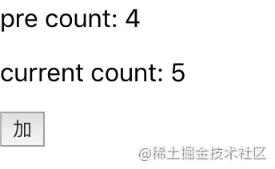

<!--truncate-->

### 函数式组件的使用
```tsx
import React from 'react'

type UserInfo = {
  name: string,
  age: number,
}

export const User = ({ name, age }: UserInfo) => {
  return (
    <div className="App">
      <p>{ name }</p>
      <p>{ age }</p>
    </div>
  )
}

const user = <User name='vortesnail' age={25} />
```

也可以通过以下方式使用有类型约束的函数式组件：

```tsx
import React from 'react'

type UserInfo = {
  name: string,
  age: number,
}

export const User:React.FC<UserInfo> = ({ name, age }) => {
  return (
    <div className="User">
      <p>{ name }</p>
      <p>{ age }</p>
    </div>
  )
}

const user = <User name='vortesnail' age={25} />
```
上述代码中不同之处在于：

```tsx
export const User = ({ name, age }: UserInfo)  => {}
export const User:React.FC<UserInfo> = ({ name, age }) => {}
```

使用函数式组件时需要将组件申明为React.FC类型，也就是 Functional Component 的意思，另外props需要申明各个参数的类型，然后通过泛型传递给React.FC。

虽然两种方式都差不多，但我个人更喜欢使用 React.FC 的方式来创建我的有类型约束的函数式组件，它还支持 children 的传入，即使在我们的类型中并没有定义它：

```tsx
export const User:React.FC<UserInfo> = ({ name, age, children }) => {
  return (
    <div className="User">
      <p>{ name }</p>
      <p>{ age }</p>
      <div>
        { children }
      </div>
    </div>
  )
}

const user = <User name='vortesnail' age={25}>I am children text!</User>
```

我们也并不需要把所有参数都显示地解构：

```tsx
export const User:React.FC<UserInfo> = (props) => {
  return (
    <div className="User">
      <p>{ props.name }</p>
      <p>{ props.age }</p>
      <div>
        { /* 仍可以拿到 children */ }
        { props.children }
      </div>
    </div>
  )
}

const user = <User name='vortesnail' age={25}>I am children text!</User>
```

### useState
怎么使用useState?
```tsx
const [count, setCount] = useState<number>(0)
```

**场景举例**

1.参数为基本类型时的常规使用：
```tsx
import React, { useState } from 'react'

const Counter:React.FC<{ initial: number }> = ({ initial = 0 }) => {
  const [count, setCount] = useState<number>(initial)

  return (
    <div>
      <p>Count: {count}</p>
      <button onClick={() => setCount(count+1)}>加</button>
      <button onClick={() => setCount(count-1)}>减</button>
    </div>
  )
}

export default Counter
```
2.参数为对象类型时的使用：
```tsx
import React, { useState } from 'react'

type ArticleInfo = {
  title: string,
  content: string
}

const Article:React.FC<ArticleInfo> = ({ title, content }) => {
  const [article, setArticle] = useState<ArticleInfo>({ title, content })

  return (
    <div>
      <p>Title: { article.title }</p>
      <section>{ article.content }</section>
      <button onClick={() => setArticle({
        title: '下一篇',
        content: '下一篇的内容',
      })}>
        下一篇
      </button>
    </div>
  )
}

export default Article
```
在我们的参数为对象类型时，需要特别注意的是， setXxx 并不会像 this.setState 合并旧的状态，它是完全替代了旧的状态，所以我们要实现合并，可以这样写（虽然我们以上例子不需要）:

```tsx
setArticle({
  title: '下一篇',
  content: '下一篇的内容',
  ...article
})
```

### useEffect
怎么使用useEffect?
```tsx
useEffect(() => {
  ...
  return () => {...}
},[...])
```
**场景举例**

1.每当状态改变时，都要重新执行 useEffect 的逻辑：
```tsx
import React, { useState, useEffect } from 'react'

let switchCount: number = 0

const User = () => {
  const [name, setName] = useState<string>('')
  useEffect(() => {
    switchCount += 1
  })

  return (
    <div>
      <p>Current Name: { name }</p>
      <p>switchCount: { switchCount }</p>
      <button onClick={() => setName('Jack')}>Jack</button>
      <button onClick={() => setName('Marry')}>Marry</button>
    </div>
  )
}

export default User
```
2.即使每次状态都改变，也只执行第一次 useEffect 的逻辑：
```tsx
useEffect(() => {
  switchCount += 1
}, [])
```
3.根据某个状态是否变化来决定要不要重新执行：
```tsx
const [value, setValue] = useState<string>('I never change')
useEffect(() => {
  switchCount += 1
}, [value])
```
因为 value 我们不会去任何地方改变它的值，所以在末尾加了 [value] 后， useEffect 内的逻辑也只会执行第一次，相当于在 class 组件中执行了 componentDidMount ，后续的 shouldComponentUpdate 返回全部是 false 。

4.组件卸载时处理一些内存问题，比如清除定时器、清除事件监听：
```tsx
useEffect(() => {
  const handler = () => {
    document.title = Math.random().toString()
  }

  window.addEventListener('resize', handler)

  return () => {
    window.removeEventListener('resize', handler)
  }
}, [])
```

### useRef
为啥使用useRef?

它不仅仅是用来管理 DOM ref 的，它还相当于 this , 可以存放任何变量，很好的解决闭包带来的不方便性。

怎么使用useRef?
```tsx
const [count, setCount] = useState<number>(0)
const countRef = useRef<number>(count)
```
**场景举例**

1.闭包问题：
想想看，我们先点击 加 按钮 3 次，再点 弹框显示 1次，再点 加 按钮 2 次，最终 alert 会是什么结果？
```tsx
import React, { useState, useEffect, useRef } from 'react'

const Counter = () => {
  const [count, setCount] = useState<number>(0)

  const handleCount = () => {
    setTimeout(() => {
      alert('current count: ' + count)
    }, 3000);
  }

  return (
    <div>
      <p>current count: { count }</p>
      <button onClick={() => setCount(count + 1)}>加</button>
      <button onClick={() => handleCount()}>弹框显示</button>
    </div>
  )
}

export default Counter
```
结果是弹框内容为 current count: 3 ，为什么？

> 当我们更新状态的时候, React 会重新渲染组件, 每一次渲染都会拿到独立的 count 状态,  并重新渲染一个  handleCount 函数.  每一个 handleCount 里面都有它自己的 count 。

那如何显示最新的当前 count 呢？
```tsx
const Counter = () => {
  const [count, setCount] = useState<number>(0)
  const countRef = useRef<number>(count)

  useEffect(() => {
    countRef.current = count
  })

  const handleCount = () => {
    setTimeout(() => {
      alert('current count: ' + countRef.current)
    }, 3000);
  }

  //...
}

export default Counter
```
2.因为变更 .current 属性不会引发组件重新渲染，根据这个特性可以获取状态的前一个值：
```tsx
const Counter = () => {
  const [count, setCount] = useState<number>(0)
  const preCountRef = useRef<number>(count)

  useEffect(() => {
    preCountRef.current = count
  })

  return (
    <div>
      <p>pre count: { preCountRef.current }</p>
      <p>current count: { count }</p>
      <button onClick={() => setCount(count + 1)}>加</button>
    </div>
  )
}
```
我们可以看到，显示的总是状态的前一个值：



3.操作 Dom 节点，类似 createRef()：
```tsx
import React, { useRef } from 'react'

const TextInput = () => {
  const inputEl = useRef<HTMLInputElement>(null)

  const onFocusClick = () => {
    if(inputEl && inputEl.current) {
      inputEl.current.focus()
    } 
  }

  return (
    <div>
      <input type="text" ref={inputEl}/>
      <button onClick={onFocusClick}>Focus the input</button>
    </div>
  )
}

export default TextInput
```

### useMemo
为啥使用useMemo?

从 useEffect 可以知道，可以通过向其传递一些参数来影响某些函数的执行。 React 检查这些参数是否已更改，并且只有在存在差异的情况下才会执行此。

useMemo 做类似的事情，假设有大量方法，并且只想在其参数更改时运行它们，而不是每次组件更新时都运行它们，那就可以使用 useMemo 来进行性能优化。

> 记住，传入 useMemo 的函数会在渲染期间执行。请不要在这个函数内部执行与渲染无关的操作，诸如副作用这类的操作属于 useEffect 的适用范畴，而不是 useMemo 。

怎么使用useMemo?
```tsx
function changeName(name) {
  return name + '给name做点操作返回新name'
}

const newName = useMemo(() => {
	return changeName(name)
}, [name])
```

**场景举例**

1.常规使用，避免重复执行没必要的方法：

我们先来看一个很简单的例子，以下是还未使用 useMemo 的代码：
```tsx
import React, { useState, useMemo } from 'react'

// 父组件
const Example = () => {
  const [time, setTime] = useState<number>(0)
  const [random, setRandom] = useState<number>(0)

  return (
    <div>
      <button onClick={() => setTime(new Date().getTime())}>获取当前时间</button>
      <button onClick={() => setRandom(Math.random())}>获取当前随机数</button>
      <Show time={time}>{random}</Show>
    </div>
  )
}

type Data = {
  time: number
}

// 子组件
const Show:React.FC<Data> = ({ time, children }) => {
  function changeTime(time: number): string {
    console.log('changeTime excuted...')
    return new Date(time).toISOString()
  }

  return (
    <div>
      <p>Time is: { changeTime(time) }</p>
      <p>Random is: { children }</p>
    </div>
  )
}

export default Example
```
在这个例子中，无论你点击的是 获取当前时间 按钮还是 获取当前随机数 按钮， `<Show />` 这个组件中的方法 changeTime 都会执行。

但事实上，点击 获取当前随机数 按钮改变的只会是 children 这个参数，但我们的 changeTime 也会因为子组件的重新渲染而重新执行，这个操作是很没必要的，消耗了无关的性能。
使用 useMemo 改造我们的 `<Show />` 子组件：
```tsx
const Show:React.FC<Data> = ({ time, children }) => {
  function changeTime(time: number): string {
    console.log('changeTime excuted...')
    return new Date(time).toISOString()
  }

  const newTime: string = useMemo(() => {
    return changeTime(time)
  }, [time])

  return (
    <div>
      <p>Time is: { newTime }</p>
      <p>Random is: { children }</p>
    </div>
  )
}
```
这个时候只有点击 获取当前时间 才会执行 changeTime 这个函数，而点击 获取当前随机数 已经不会触发该函数执行了。

2.你可能会好奇， useMemo 能做的难道不能用 useEffect 来做吗？
答案是否定的！如果你在子组件中加入以下代码：
```tsx
const Show:React.FC<Data> = ({ time, children }) => {
	//...
  
  useEffect(() => {
    console.log('effect function here...')
  }, [time])

  const newTime: string = useMemo(() => {
    return changeTime(time)
  }, [time])
  
	//...
}
```
你会发现，控制台会打印如下信息：
```
> changeTime excuted...
> effect function here...
```
正如我们一开始说的：传入 useMemo 的函数会在渲染期间执行。

在此不得不提 React.memo ，它的作用是实现整个组件的 Pure 功能：
```tsx
const Show:React.FC<Data> = React.memo(({ time, children }) => {...}
```
所以简单用一句话来概括 useMemo 和 React.memo 的区别就是：前者在某些情况下不希望组件对所有 props 做浅比较，只想实现局部 Pure 功能，即只想对特定的 props 做比较，并决定是否局部更新。

### useCallback
**为啥使用useCallback?**

useMemo 和 useCallback 接收的参数都是一样，都是在其依赖项发生变化后才执行，都是返回缓存的值，区别在于 useMemo 返回的是函数运行的结果， useCallback 返回的是函数。

useCallback(fn, deps) 相当于 useMemo(() => fn, deps)

**怎么使用useCallback?**
```tsx
function changeName(name) {
  return name + '给name做点操作返回新name'
}

const getNewName = useMemo(() => {
  return changeName(name)
}, [name])
```
**场景举例**

将之前 useMemo 的例子，改一下子组件以下地方就OK了：
```tsx
const Show:React.FC<Data> = ({ time, children }) => {
  //...
  const getNewTime = useCallback(() => {
    return changeTime(time)
  }, [time])

  return (
    <div>
      <p>Time is: { getNewTime() }</p>
      <p>Random is: { children }</p>
    </div>
  )
}
```

### useReducer
**为什么使用useReducer?**

有没有想过你在某个组件里写了很多很多的 useState 是什么观感？比如以下：
```tsx
const [name, setName] = useState<string>('')
const [islogin, setIsLogin] = useState<boolean>(false)
const [avatar, setAvatar] = useState<string>('')
const [age, setAge] = useState<number>(0)
//...
复制代码怎么使用useReducer?
import React, { useState, useReducer } from 'react'

type StateType = {
  count: number
}

type ActionType = {
  type: 'reset' | 'decrement' | 'increment'
}

const initialState = { count: 0 }

function reducer(state: StateType, action: ActionType) {
  switch (action.type) {
    case 'reset':
      return initialState
    case 'increment':
      return { count: state.count + 1 }
    case 'decrement':
      return { count: state.count - 1 }
    default:
      return state
  }
}

function Counter({ initialCount = 0}) {
  const [state, dispatch] = useReducer(reducer, { count: initialCount })

  return (
    <div>
      Count: {state.count}
      <button onClick={() => dispatch({ type: 'reset' })}>Reset</button>
      <button onClick={() => dispatch({ type: 'increment' })}>+</button>
      <button onClick={() => dispatch({ type: 'decrement' })}>-</button>
    </div>
  )
}

export default Counter
```
**场景举例：**

与 useContext 结合代替 Redux 方案，往下阅读。

### useContext
**为啥使用useContext?**

简单来说 Context 的作用就是对它所包含的组件树提供全局共享数据的一种技术。

**怎么使用useContext？**

```tsx
export const ColorContext = React.createContext({ color: '#1890ff' })
const { color } = useContext(ColorContext)
// 或
export const ColorContext = React.createContext(null)
<ColorContext.Provider value='#1890ff'>
  <App />
</ColorContext.Provider>
// App 或以下的所有子组件都可拿到 value
const color = useContext(ColorContext) // '#1890ff'
```

**场景举例**

1.根组件注册，所有子组件都可拿到注册的值：
```tsx
import React, { useContext } from 'react'

const ColorContext = React.createContext<string>('')

const App = () => {
  return (
    <ColorContext.Provider value='#1890ff'>
      <Father />
    </ColorContext.Provider>
  )
}

const Father = () => {
  return (
    <Child />
  )
}

const Child = () => {
  const color = useContext(ColorContext)
  return (
    <div style={{ backgroundColor: color }}>Background color is: { color }</div>
  )
}

export default App
```
2.配合 useReducer 实现 Redux 的代替方案：
```tsx
import React, { useReducer, useContext } from 'react'

const UPDATE_COLOR = 'UPDATE_COLOR'

type StateType = {
  color: string
}

type ActionType = {
  type: string,
  color: string
}

type MixStateAndDispatch = {
  state: StateType,
  dispatch?: React.Dispatch<ActionType>
}

const reducer = (state: StateType, action: ActionType) => {
  switch(action.type) {
    case UPDATE_COLOR:
      return { color: action.color }
    default:
      return state  
  }
}

const ColorContext = React.createContext<MixStateAndDispatch>({
  state: { color: 'black' },
})

const Show = () => {
  const { state, dispatch } = useContext(ColorContext)
  return (
    <div style={{ color: state.color }}>
      当前字体颜色为: {state.color}
      <button onClick={() => dispatch && dispatch({type: UPDATE_COLOR, color: 'red'})}>红色</button>
      <button onClick={() => dispatch && dispatch({type: UPDATE_COLOR, color: 'green'})}>绿色</button>
    </div>
  )
}

const Example = ({ initialColor = '#000000' }) => {
  const [state, dispatch] = useReducer(reducer, { color: initialColor })
  return (
    <ColorContext.Provider value={{state, dispatch}}>
      <div>
        <Show />
        <button onClick={() => dispatch && dispatch({type: UPDATE_COLOR, color: 'blue'})}>蓝色</button>
        <button onClick={() => dispatch && dispatch({type: UPDATE_COLOR, color: 'lightblue'})}>轻绿色</button>
      </div>
    </ColorContext.Provider>
  )
}

export default Example
```

作者：vortesnail  
链接：https://juejin.cn/post/6844904085024407566  
来源：稀土掘金  
著作权归作者所有。商业转载请联系作者获得授权，非商业转载请注明出处。


